<!-- source: https://palantir.com/docs/foundry/workshop/scenarios-getting-started/ · mirrored 2026-08-18 from Palantir Foundry docs -->

# Getting started

:::callout{theme="neutral"}
This tutorial covers **temporary scenarios** (also called dynamic scenarios), which exist only within the current session and are not persisted. For a more comprehensive tutorial including scenario-aware widgets like Scenario Summary, Chart: XY with scenario comparison, and Metric Cards with scenario variables, see [Temporary scenarios](/docs/foundry/ontology/temporary-scenario/). To learn about persisting scenario metadata as Ontology objects, see [Store scenario metadata as objects](/docs/foundry/ontology/persisted-scenario/).
:::

In this tutorial we will walk through building a basic Scenario-powered module.

To begin, let’s create a brand-new Workshop module.

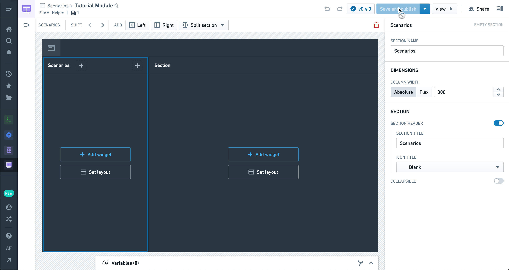

First, navigate to the **Settings** panel on the left and ensure Scenarios are enabled in **Advanced Functionalities**.

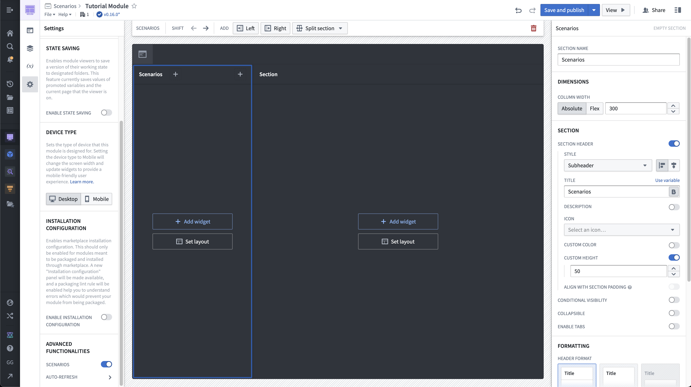

In the sidebar section, let’s add a Scenario Manager widget.

This is one of the Scenario-specific widgets in Workshop and is used to create and manage Scenarios that will be used throughout the module.

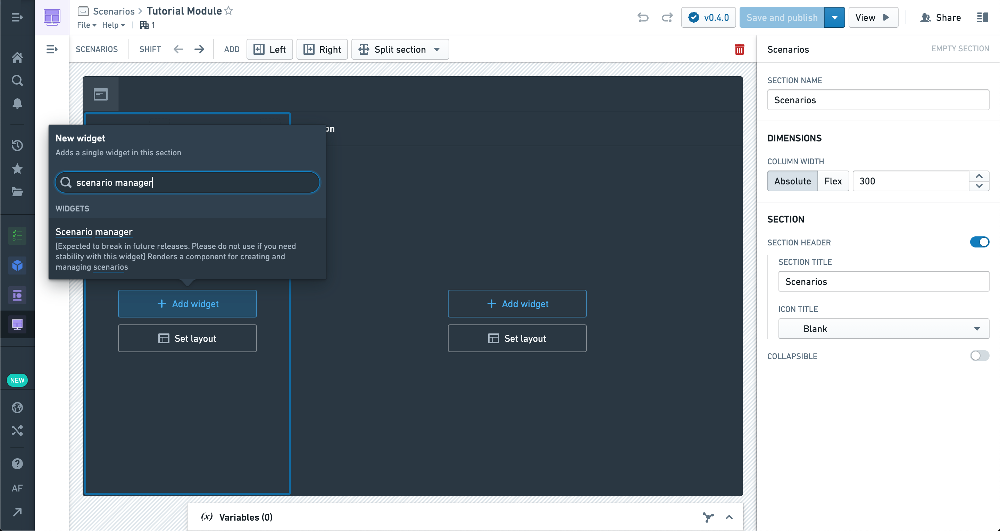

The configuration options can be left alone for now; we will come back to them later.

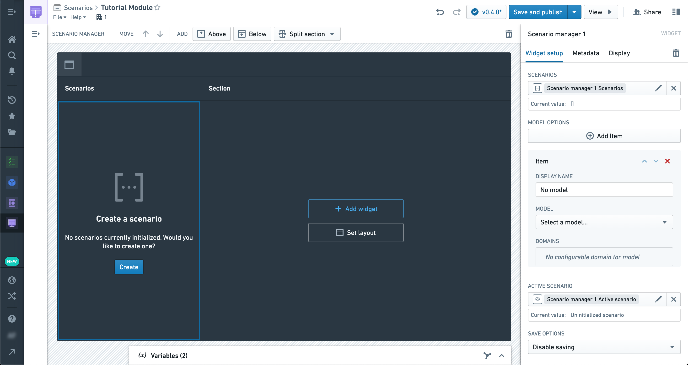

In the body of the module, let’s add an [Object table](/docs/foundry/workshop/widgets-object-table/).

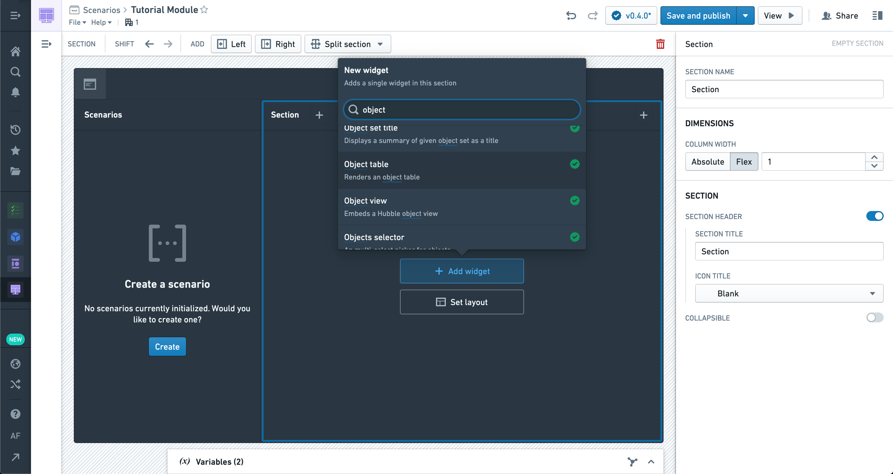

You can use any Object set to populate the table, but we recommend starting with an Object type that already has at least one associated [Action](/docs/foundry/action-types/overview/) configured.

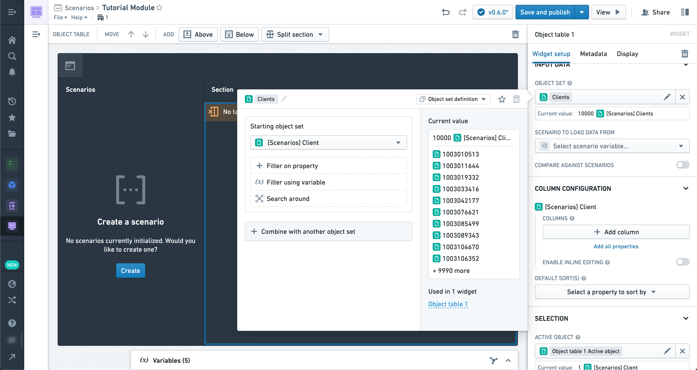

Now, let’s add a few properties to display in the table.

Just below the properties you’ll see the option to enable Scenario comparison in this widget (that is, the Object table is a Scenario-aware widget).

Once enabled, you can select the Scenario array variable produced by the Scenario Manager widget. This will cause the data in the table to reflect any modifications to Scenarios in the Manager rather than the raw Ontology.

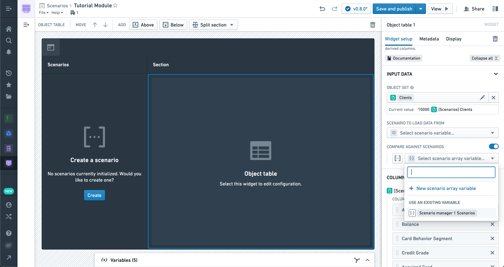

However, at this point we haven’t applied any modifications to our Scenario, so the data should be the same.

Let’s add a [Button Group](/docs/foundry/workshop/widgets-button-group/) widget so we can configure an Action to apply to our Scenarios.

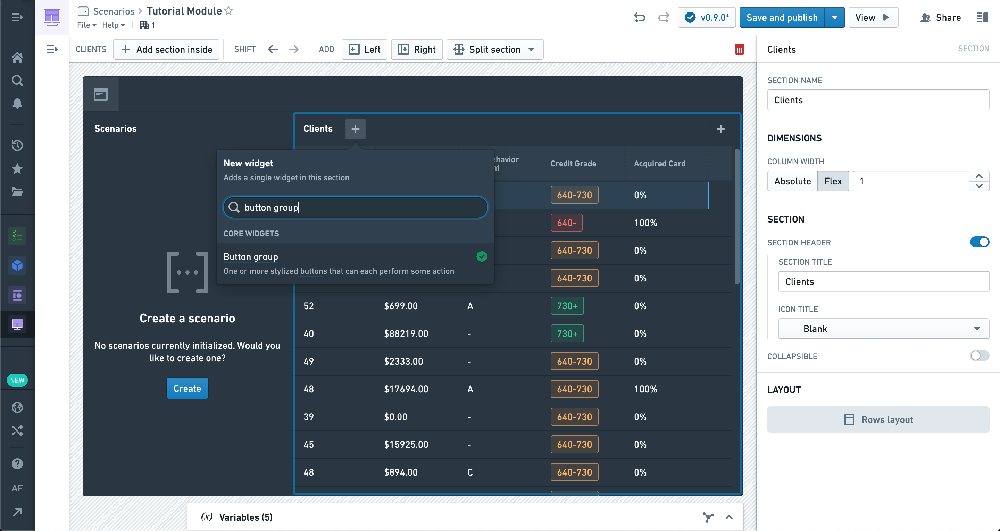

We're selecting an Action that modifies Objects of the type in our table.

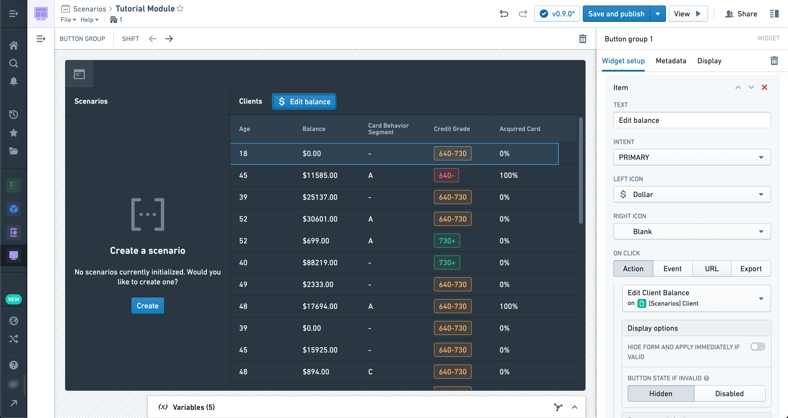

In order to apply this action to a Scenario instead of the real ontology, we're going to enable the "Apply to Scenario" option and select the active Scenario variable from the manager.

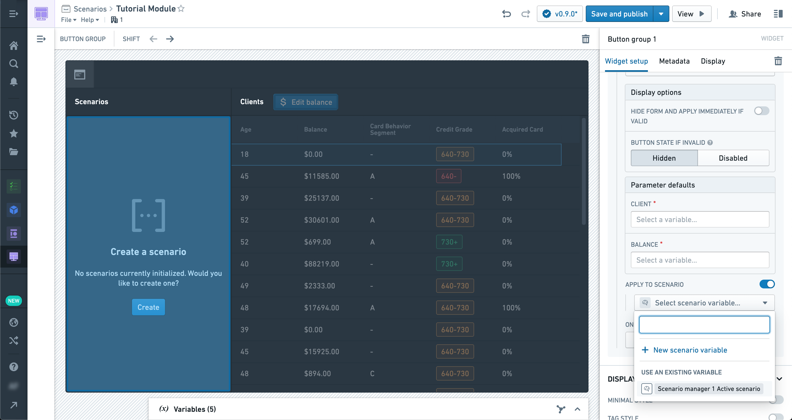

Using the newly configured Action, let's try changing the property of any object in the table to a new value.

However, before we can apply the action we'll need to create a new scenario in the manager widget by clicking the "Create" button.

In this example, we're updating the `Balance` for a client in the table.

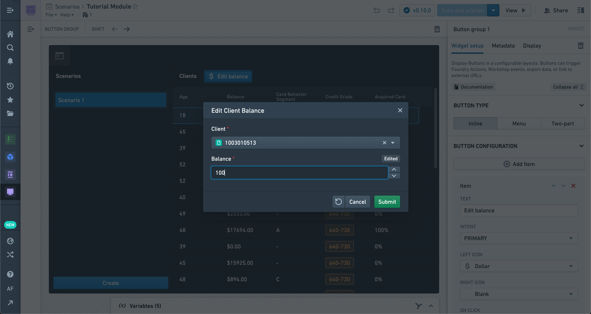

You should see the Object table refresh with the new data, including the modification you just made.

It’s important to note that this Action has *not* been applied to the Ontology and exists only within the Scenario.

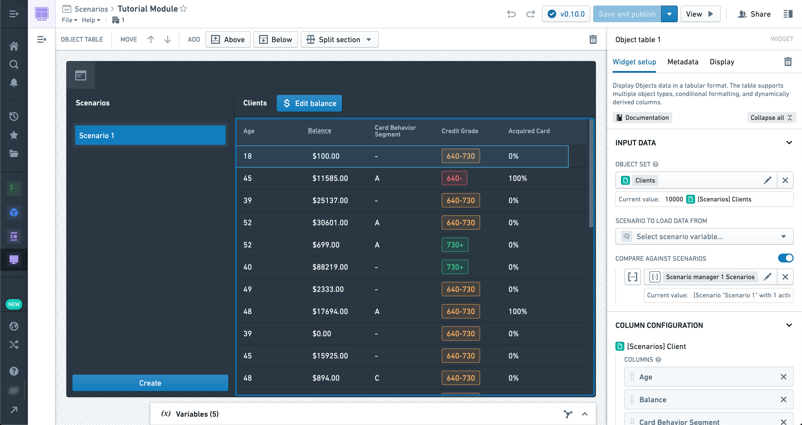

We can also create another Scenario for comparison by selecting the **Create** button in the manager again. Once created, you’ll see the values from the second Scenario side-by-side with the first in the Object table, but only in columns that differ. Since the second Scenario has not been modified yet, it should show the values from the Ontology.

Some widgets, like the table, can take an arbitrary number of Scenarios and display the results.

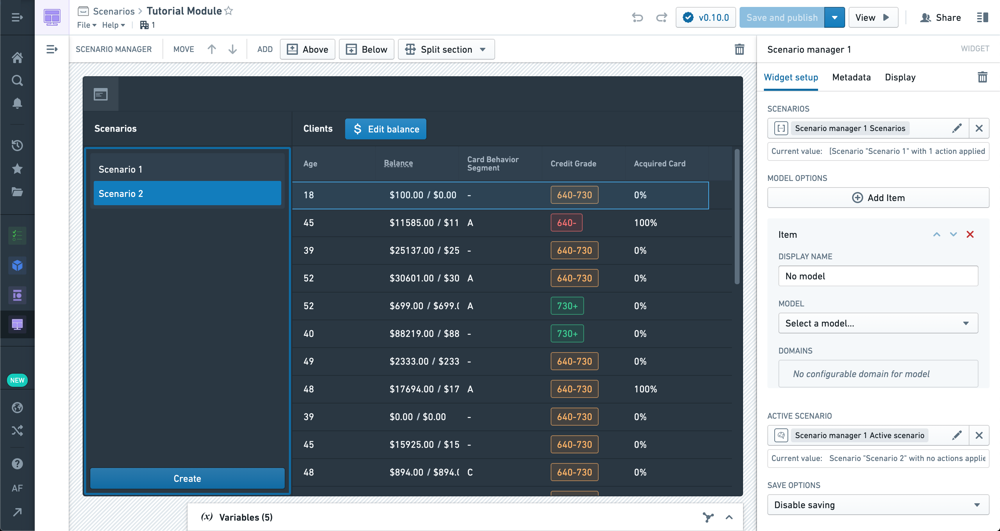

Now let’s add a section above the table with a [Chart: XY](/docs/foundry/workshop/widgets-chart/) widget.

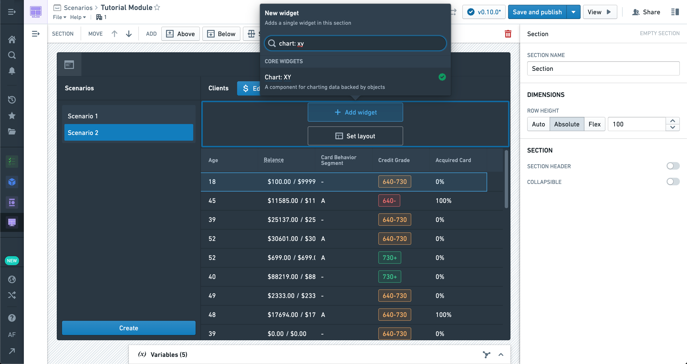

The Chart: XY widget supports an arbitrary number of Scenarios like the table, and different Scenarios can be configured in different layers.

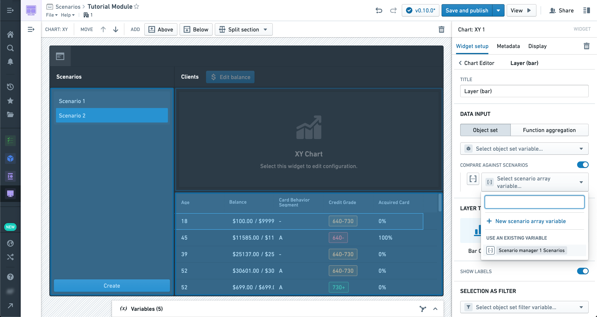

Try exploring the various layer types to see how multiple Scenarios are visualized in them.

You can also configure Group Bys and Aggregates which will properly respect Scenario values.

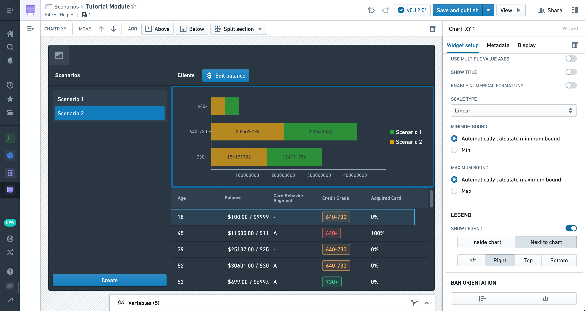

We can also populate values in Metric cards from Scenarios.
Let’s add a new Metric card widget now.

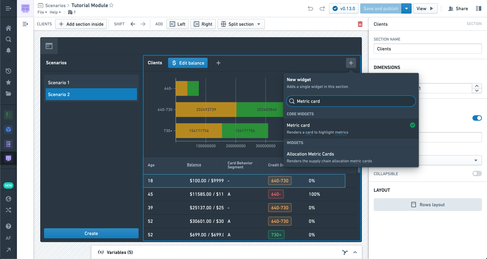

In the Metric card configuration, we’re creating a new numeric metric with a value defined by a new Object set aggregation variable.

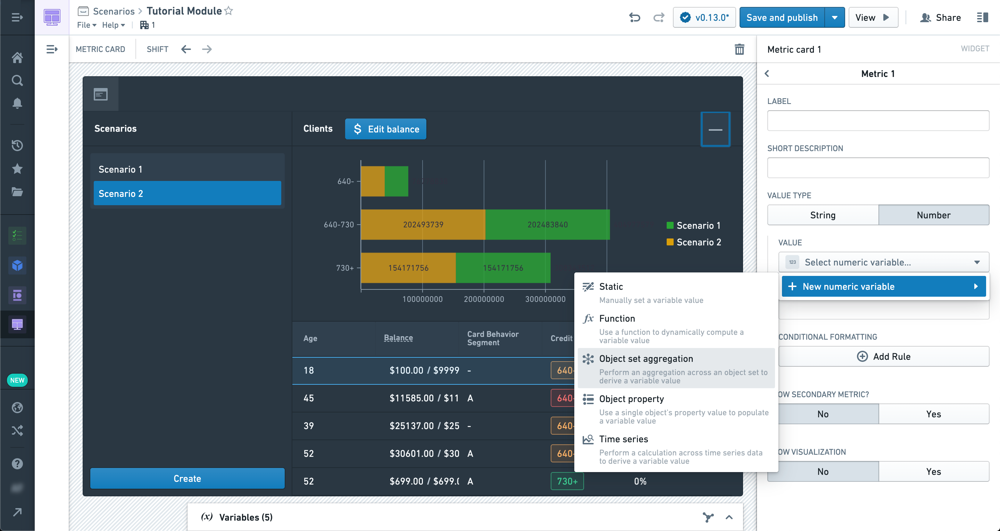

In the Object set aggregation variable configuration pane, there is a Scenario config section which will accept a Scenario variable.
If selected, the object set aggregation will be performed with modifications from the Scenario applied.

Similarly, Object property variables also have a Scenario configuration section.
In this way, you can configure variable values from Scenarios to be used in widgets that are not inherently Scenario-aware (like the metric card, which does not have an explicit Scenario configuration section).

We’ve chosen the Scenario Selector output variable here, so we can see the aggregate change based on the selection.

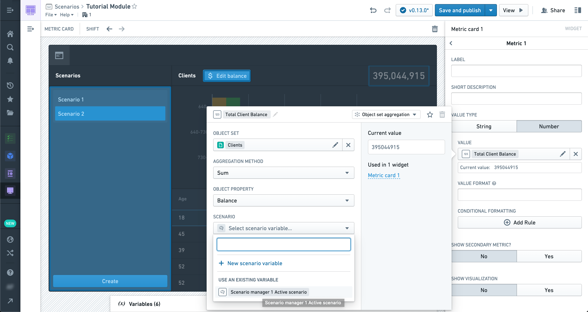

Congratulations, you’ve reached the end of your first Scenario tutorial!
We recommend experimenting with various configurations and layouts of all the widgets we’ve covered here.

While the layout shown in this tutorial is a common approach to a straightforward Scenario-powered application, it is not the only one.

Many powerful interactions are possible given the tools at your disposal, especially when combined with Actions; experimentation and practice will lead to better results.

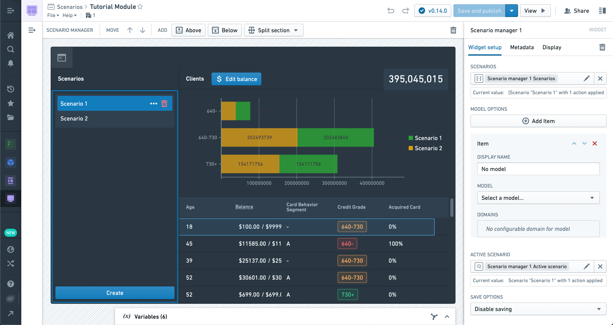
