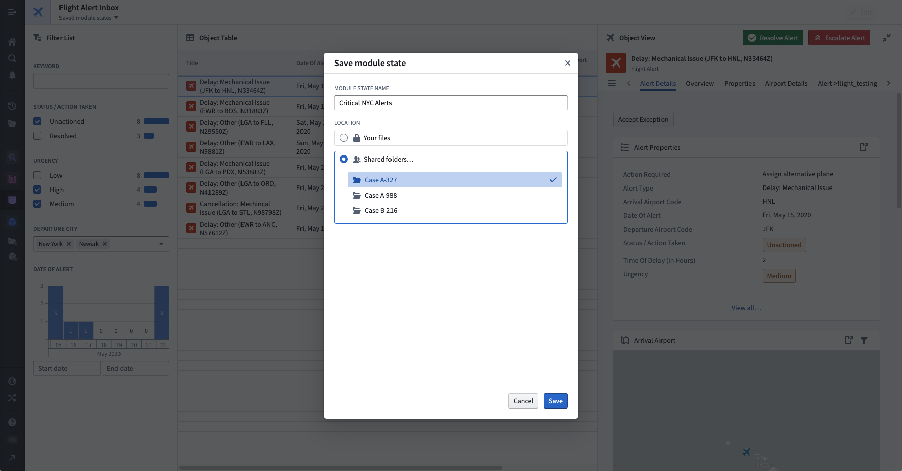
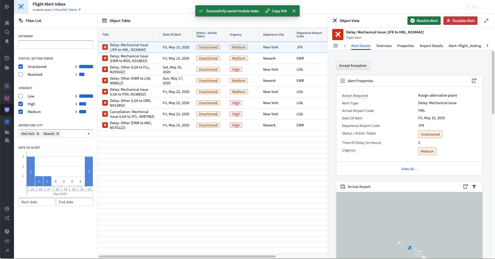
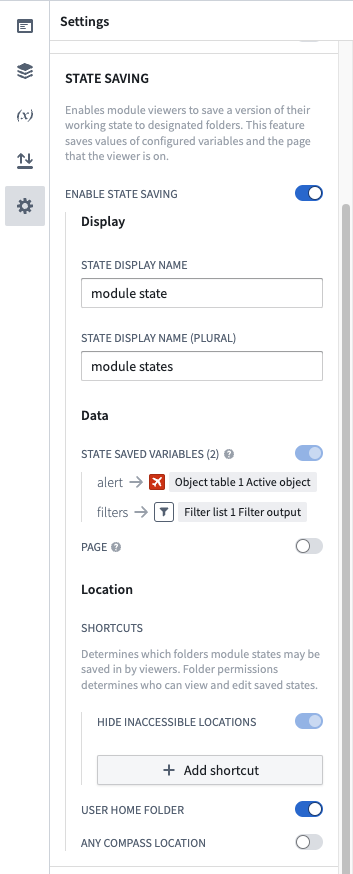
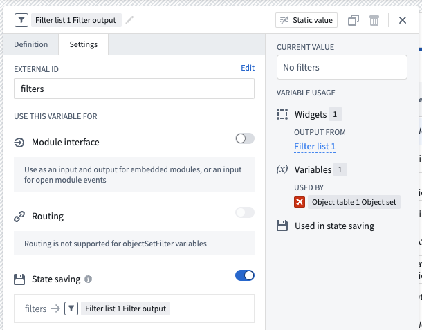

<!-- source: https://palantir.com/docs/foundry/workshop/state-saving/ · mirrored 2026-08-03 from Palantir Foundry docs -->

# State saving

State saving is a powerful Workshop feature that allows module consumers to store the current state of their work within a module and then either return to that saved state or share the saved state with other users.

State saving makes it easier to construct complex, long-running workflows in Workshop and facilitates collaboration between users. Example use cases for state saving include:

* Filtering for Alert objects with a `Status` property of "Unresolved" and a `Location` property of "Zurich" and then saving that state for future reference.
* Selecting a specific object of interest and then saving that view to share with a coworker.
* Partially completing an input form built of native Workshop widgets (e.g. the Text input widget or Date input widget) and saving state in order to return later to finish the data entry.

When a state is saved, Workshop is preserving two things: (1) the current values ("states") of variables enabled for use with state saving and (2) optionally, the current page that a user is viewing. In Workshop’s Edit Mode, module builders can [decide which variables to use with state saving](#how-to-enable-state-saving) and also [configure other state saving options](#configuration-options). Module consumers in Workshop’s View Mode can then save, open, and share states as needed for their workflow.

The following screenshots display an example of state saving. In this case, a module builder has configured state saving to preserve Object Set Filter variable output by the Filter List, which will save the user’s selected filtering criteria for high- and medium-priority unactioned alerts from NYC airports. The module builder has also configured the active Object Set variable output by the Object Table widget, which will save the currently highlighted alert in the table and then displayed in the Object View widget on the right-side of this module. Once this state is saved, the module consumer can easily return to this specific view of NYC flight alerts in the future or share the view with other users as a link.

## How to enable state saving

In Workshop’s Edit Mode, a builder user can enable state saving with the following three steps, explained in detail below:

1. [Open the module settings panel and toggle on **Enable State Saving**](#toggle-on-state-saving).
2. [Enable state saving for variables which should have their state saved](#configure-state-saving-for-variables).
3. [Optionally, configure allowed save locations and shortcuts for this module's saved states](#configure-optional-settings).

### Toggle on state saving

Open the **Settings** panel by selecting the settings icon (). Within this panel, enable the **Enable State Saving** toggle as seen below.

### Configure state saving for variables

Open the Variables panel and enable state saving for variables which should have their state saved. To do so, select a variable and then navigate to the settings tab and add an external ID to the variable. The screenshot below shows an example of enabling state saving for an `Object Set Filter` variable output by a Filter List widget, which will save the user’s selected filtering criteria:

For more information about configuring object set filter variables, including default filters and filter value extraction, see [Object set filter variables](/docs/foundry/workshop/object-set-filter-variables/).

:::callout{theme="neutral"}
Variable values are stored within a saved state via their external ID. As a result, modifying a variable's external ID after state saving has been configured may cause previously configured states to reload unsuccessfully.

Modifying a variable's external ID allows a module's configuration to change over time while supporting state saving. For instance, if a module that was initially configured with an Object Dropdown widget (which allows a user to select a single object) is later replaced with an Object Selection widget (which allows a user to select multiple objects), state saving will continue to work as long as the output object set from those widgets uses the same external ID.
:::

### Configure optional settings

Within the **Settings** panel under the **State Saving** section, you can configure settings for preserving the user's current page within a saved state. You can also set the allowed save location and folder shortcuts for this module's saved states. Folder shortcuts can make it easier to ensure that all shareable states for this module will be saved to the same location.

## Configuration options

For state saving, the core configuration options are the following:

* **Enable state saving:** This toggle controls whether state saving is enabled for the current module. If true, module consumers can save the state of enabled variables and the current page within the module. If false, module consumers will not see any state saving options.
* **Display**
  * **State display name:** This field determines how a singular saved state is referenced within this module to consumer users and is meant to adapt on-screen language to a specific application’s need. By default, this is set to **module state**. If set to a value of **inbox**, module consumers will see on-screen references to a **saved inbox** rather than a **saved module state**.
  * **State display name (plural):** This field determines how multiple saved states are referenced within this module to consumer users and is meant to adapt on-screen language to a specific application’s need. By default, this is set to **module states**. If set to a value of **inboxes**, module consumers will see on-screen references to **saved inboxes** rather than to **saved module states**.
* **Data**
  * **State saving variables:** Saving state will preserve the current values of any state saving enabled variables within the module.
  * **Page:** If enabled, saving state will preserve the currently active page within the module.
* **Location**
  * **Add shortcut:** This option allows a builder to configure shortcuts to specific Project folders into which states can be saved for this module. A custom display name can be optionally configured for each folder shortcut.
  * **User home folder:** If enabled, states can be saved to a user’s private home folder.
  * **Any Compass location:** If enabled, states can be saved to any Project folder chosen by a module consumer.

## Supported variable types and widgets

With state saving, you can preserve values for the following Workshop variable types:

* Array, of Boolean, date, numeric, string, or timestamp values
* Boolean
* Date
* Object Set
* Object Set Filter
* Numeric
* String
* Timestamp

State saving is also supported by widgets which output one of the variable types listed above. Some of the supported widgets include:

* Checkbox
* Date Input
* Date Time Picker
* Filter List
* Numeric Input
* Object Dropdown
* Object List
* Object Table
* String Dropdown

## Limitations

### No inheritance of state saving configuration from embedded modules

[Embedding a Workshop module](/docs/foundry/workshop/embedding-workshop-modules-overview/) does not carry over the state saving configuration of the embedded module. To save variable values of an embedded module to a saved state, add the desired variables to the child module's [module interface](/docs/foundry/workshop/module-interface/) and pass in saved state variables from the parent module in the embedded module configuration.

### State saving is only available for users with platform access

State saving is only available for end-users when platform access is enabled for that user. Users that do not have platform access will not have the ability to access state saving components. Learn more about [platform access restrictions](/docs/foundry/administration/configure-application-access/).

### Module header visibility required

For module consumers to access state saving options in View Mode, the module header must be visible. If the module header is hidden, the state saving dropdown will not appear in the interface, even if state saving has been properly configured for the module.
