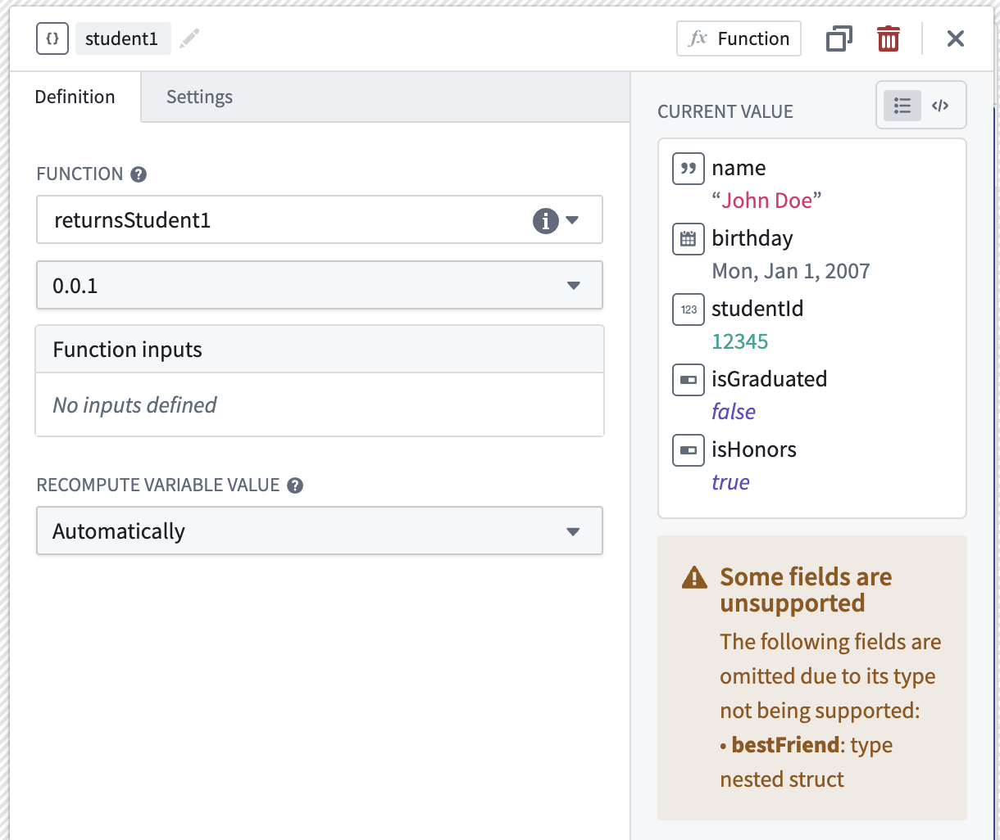
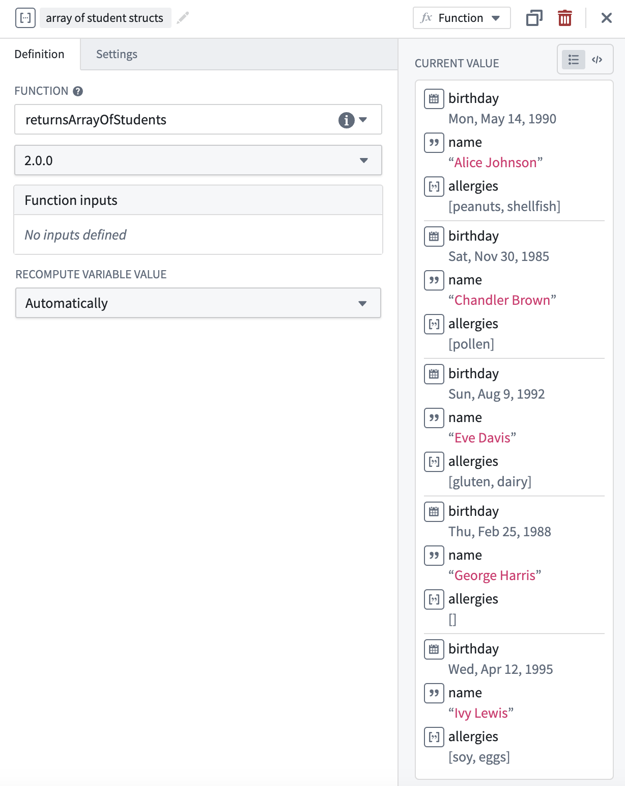
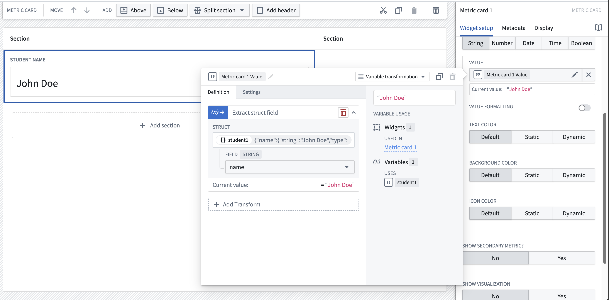
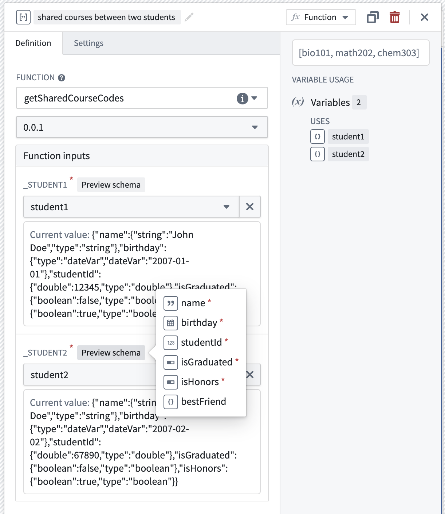

<!-- source: https://palantir.com/docs/foundry/workshop/struct-variables/ · mirrored 2026-08-18 from Palantir Foundry docs -->

# Struct variables

A **struct variable** is a composite variable containing fields of other Workshop-supported [variable types](/docs/foundry/workshop/concepts-variables/#variable-types). Nested structs are currently not supported.

## Create a struct variable

A struct variable can be initialized statically within Workshop, using an object's struct property, or with a function that returns a `CustomType`. Refer to the [custom types documentation](/docs/foundry/functions/types-reference/#structcustom-type) to learn more. If a field's type is not supported in Workshop, it will be ignored and omitted from the initialized variable.

### Create a struct array variable

Similarly, a struct array variable containing multiple structs can be initialized using an object's struct array property, or a function.

#### Looping over struct arrays

Struct array variables may be used in loop layouts to enable more performant looping setups in applications with fewer load calls needed to display objects data, or in workflows where a builder may want to display non-ontologized data outputted with a function. To learn more about looping over arrays, refer to [loop layout documentation](/docs/foundry/workshop/loop-layouts/).

## Extract a field from a struct

Widgets and variable transformation operations cannot use structs as a whole, so individual struct fields must be extracted for use. The image below shows how the string type `name` field is extracted from the `person` struct variable using an [extract struct field variable transform](/docs/foundry/workshop/variable-transformations/), and then used in a [Metric card widget](/docs/foundry/workshop/widgets-metric-card/).

## Use structs as function inputs

Struct and struct array variables can also be used as inputs to functions. When configuring a function that uses a struct as an input, the required fields of the struct input may be previewed by hovering over the `Preview schema` label. This enables builders to verify that the expected input schema matches that of the selected struct variable by referencing it to the struct variable's raw `Current value`.

