<!-- source: https://palantir.com/docs/foundry/workshop/time-series-properties/ · mirrored 2026-08-18 from Palantir Foundry docs -->

# Time series properties

:::callout
Time series properties require time series services to be installed and, as a result, may not be available on your Foundry instance. Contact your Palantir representative if you have any questions.
:::

A **time series property** is a specific type of object property. While a conventional object property contains a single value, (for example, string `Argentina` or number `81231`), a time series property stores a history of timestamped values. Learn more about [creating a time series property](/docs/foundry/time-series/time-series-setup/).

In Workshop, time series properties, including time series generated by time series transforms, can be consumed in the **Chart XY**, **Map**, Metric Card, and Object Table widgets, either by creating **Time series set** variables or by directly accessing the property on objects of interest. For more information on using time series properties, see the documentation corresponding to each of these features:

* [Chart XY](/docs/foundry/workshop/widgets-chart/)
* [Map](/docs/foundry/workshop/widgets-map/)
* [Metric card](/docs/foundry/workshop/widgets-metric-card/)
* [Object table](/docs/foundry/workshop/widgets-object-table/)
* [Variables](/docs/foundry/workshop/concepts-variables/)

## Time series transforms

A **time series transform** performs a mathematical operation on input time series data to yield a new output time series. These input time series can be time series properties or the outputs from other transforms, which allows multiple transforms to be chained together.

In the examples below, the `Country` object has a string property `Name`, which stores the name of the country, and a time series property `covid19 New Cases`, which stores a daily history of new COVID-19 cases observed in the country. This object is displayed in a Workshop Object table widget, and different time series transforms are applied to the `covid19 New Cases` time series property to generate new time series. The Object table widget is configured to display two visualizations for each time series: the latest value of the time series on the left, and a sparkline showing the history of the time series on the right.

### Aggregate

The aggregate transform performs a windowed aggregation. Each point on the output time series is an aggregation on a group of points in the input time series. The aggregation method is user-specified — see the [Time series summarizers](#time-series-summarizers) section below for more information on the different aggregation types available.

There are three kinds of aggregate transform.

* **Cumulative:** Each output point is generated by taking a point on the input time series and aggregating over all earlier points, including the input point itself. For example, the configuration below creates a time series where each point represents the sum of the input values observed so far. The advanced settings allow the user to skip non-finite values in the input series when performing the operation.

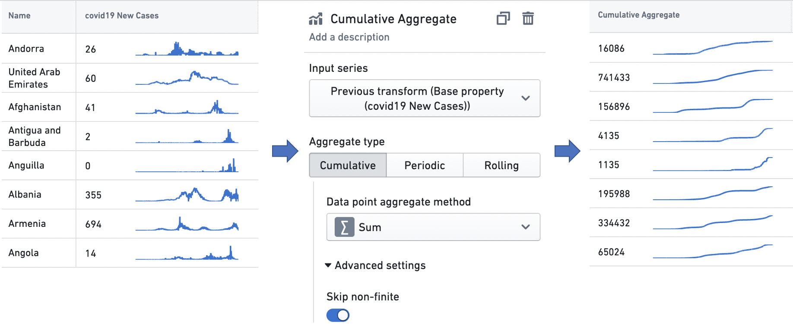

* **Periodic:** Output points are generated at equally spaced, non-overlapping time intervals, and every output point is an aggregation over the input points that fall in its corresponding interval. These intervals are aligned with a user-specified alignment timestamp, and their length is defined by a user-specified window size. For example, the configuration below creates a time series of the average input values in the sequence of two week windows generated such that one of the windows — the alignment window — begins with the alignment timestamp.
  Along with skipping non-finite values in the input series, the advanced settings also allow the user to configure the following options:
  * Window type: `Start` means that each output point represents the beginning of a time interval, and is an aggregate over the input points that follow it, while `End` means that each output point represents the end of a time interval, and is an aggregate over the input points that precede it.
  * Alignment timestamp: Periodic intervals will be generated by starting at this timestamp, and offsetting by multiples of the window size.

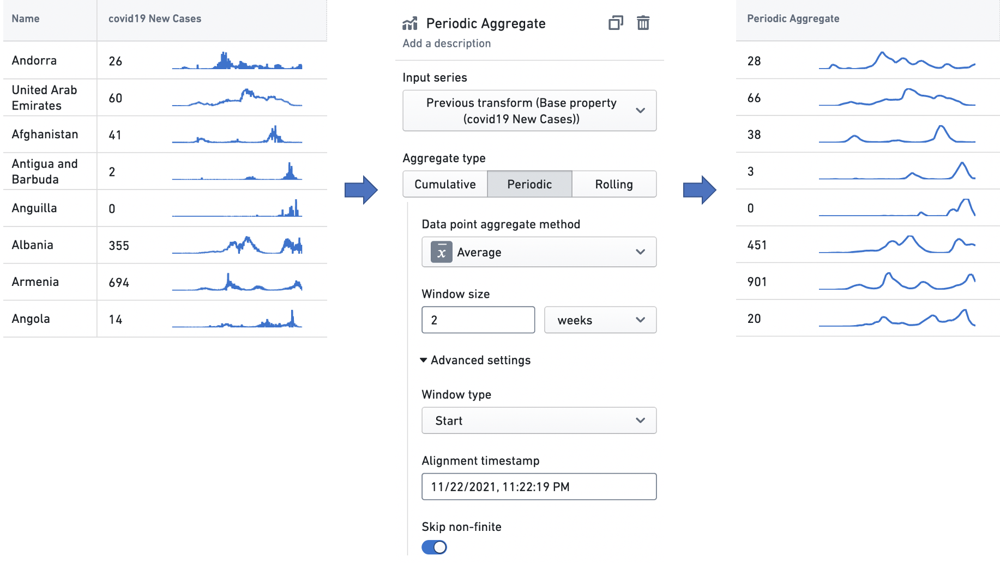

* **Rolling:** Each output point is generated by taking a point on the input time series and aggregating over the points that fall in a fixed-size temporal window preceding it, including the input point itself. For example, the configuration below creates a time series where each point is the standard deviation of the input values observed in the three day window preceding it. The advanced settings allow the user to skip non-finite values in the input series when performing the operation.

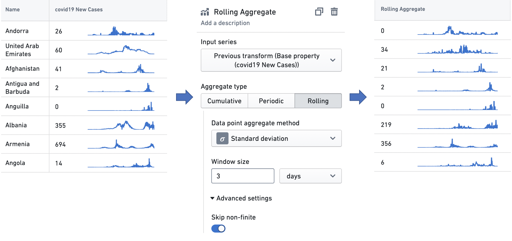

### Derivative

The derivative transform produces a time series representing the rate of change of the input time series. It also can perform a unit conversion on the rate of change, to enable interpretation with a user-specified time unit. For example, given a time series of the cumulative kilometer distance covered by a car over time, the transform can perform the scaling necessary to interpret the rate of change — the speed — at any point in terms of "kilometers/hour" (a common metric for measuring speed), "kilometers/second", or any similar temporal denominator.

In the example below, the derivative transform is configured to produce a weekly rate of change in COVID-19 case counts. These case observations are recorded daily, so there is one data point per day in the input time series, and a rate of change would ordinarily be interpreted as having the unit "cases/day". However, as the time unit for the transform is set to `weeks`, the transform scales the daily rates of change by a factor of seven (as there are seven days in a week), so the user can interpret the time series in the unit "cases/week".

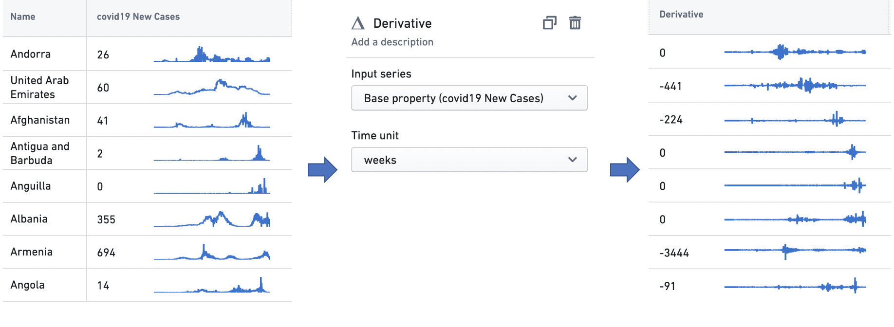

### Formula

The formula transform computes a domain-specific language (DSL) formula on a set of input time series. Using the `Add input` button, users can add new input time series — either time series properties or the outputs from other transforms — to the transform, and then build formulas using variable references to these inputs. The example below scales the input time series by a factor of two, and adds five to the result.

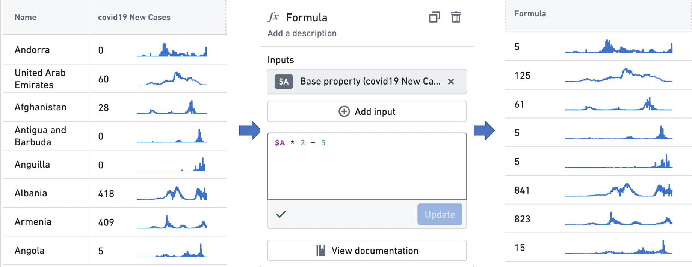

### Integral

The integral transform produces a time series representing the cumulative area under the input time series when it is visualized as a graph. It also can perform a unit conversion on the area, to enable interpretation with a user-specified time unit. For example, given a time series of the kilowatt power consumption of a home, the transform can perform the scaling necessary to interpret the total area — the total energy consumed — at any point in terms of "kilowatt-hours" (the standard metric for measuring electricity consumption), "kilowatt-minutes", or any similar temporal numerator. The user can also specify the integration method, which is the method used to interpolate the value used between time series points. The options here are `linear`, which uses the average value between two time points; `left hand sum`, which uses the value at the earlier time point; and `right hand sum`, which uses the value at the later time point.

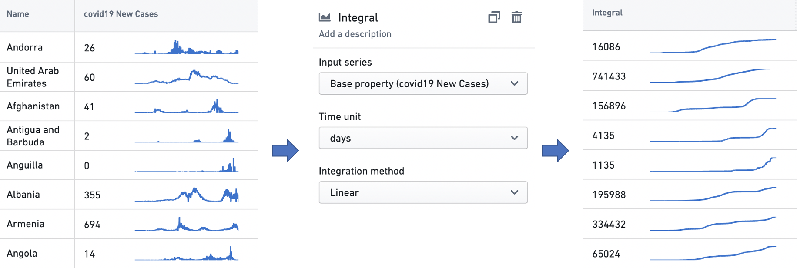

### Time range

The time range transform filters an input time series to a user-specified time range. See the [Time ranges](#time-ranges) section below for more information on specifying time ranges.

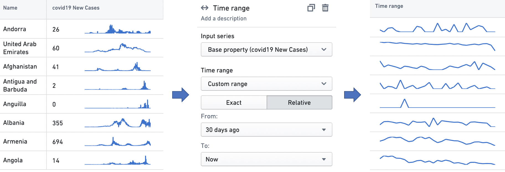

### Time shift

The time shift transform generates an output time series that is identical to the input time series, but temporally shifted by a user-specified duration in a user-specified direction.

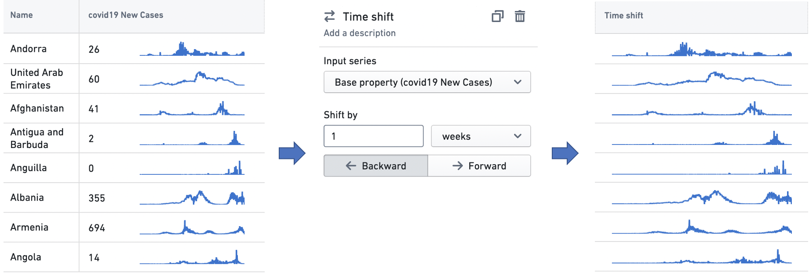

## Time series summarizers

A **time series summarizer** configures a summary statistic for time series data; that is, a value that reflects the state of the time series. Summarizers are used in all Workshop widgets that support time series properties. For instance, the Object table and Metric card widgets use them to configure a single value to be displayed with a time series, as in the examples below. See [Object table](/docs/foundry/workshop/widgets-object-table/) and [Metric card](/docs/foundry/workshop/widgets-metric-card/) for more information on the respective use cases.

There are two types of time series summarizer.

* **Single Value:** The Single Value summarizer computes and displays one aggregation for the time series input. For example, this Single value summarizer is set up to display the average number of COVID-19 cases from last week.

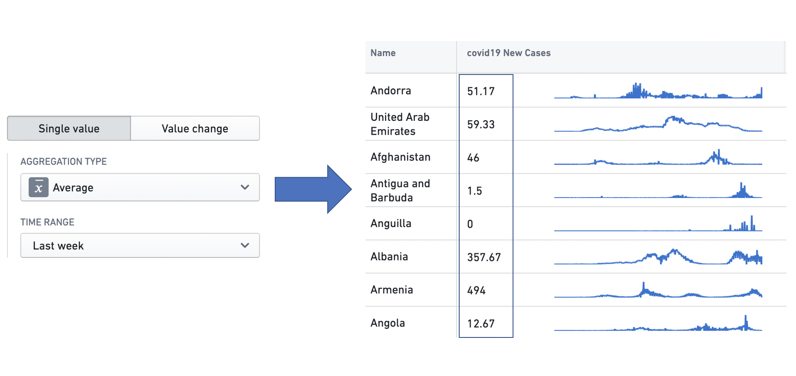

* **Value Change:** The Value Change summarizer computes two summarizers across the input data, and then calculates the difference between the two. This is especially useful in capturing changing trends. For example, this Value change summarizer computes the change in the weekly total number of COVID-19 cases observed between the last two weeks.

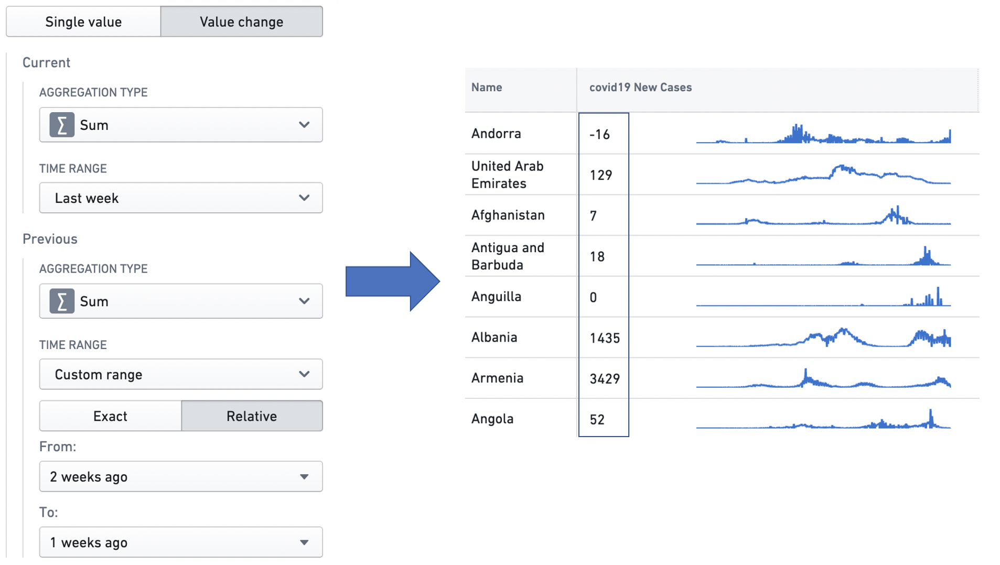

A summarizer is defined by an **aggregation type**, which specifies the calculation to be performed over the input data points, and a **time range**, which specifies the time range over which the aggregation is performed. See the [Time ranges](#time-ranges) section below for more information on specifying time ranges.

The different aggregation types are as follows.

* **Average:** Calculates the mean over the input data points.
* **Count:** Gets the number of input data points in the time range.
* **Difference:** Calculates the difference between the values of the last point and the first point in the time range.
* **First:** Gets the value of the first data point in the time window.
* **Integral:** Calculates the area under the curve over the time range.
* **Last:** Gets the value of the last data point in the time window.
* **Min:** Gets the minimum value among the data points in the time window.
* **Max:** Gets the maximum value among the data points in the time window.
* **Product:** Calculates the product of all the input values in the time range.
* **Relative difference:** Calculates the difference between the values of the last point and the first point in the time range, and divides this difference by the value of the first point. If multiplied by 100 (e.g. using a [Formula transform](#time-series-transforms)), this produces the percentage change in the value of the time series over the time range.
* **Standard deviation:** Calculates the standard deviation of the input values in the time range.
* **Sum:** Calculates the sum over the input data points.
* **Time-weighted average:** Calculates the mean value over the input data points, weighted by the duration each point is in effect. This is appropriate for series sampled at irregular intervals.

## Time ranges

A **time range** specifies a finite interval of time, defined by its start and end times. We also call it a **time window**. Time ranges are used in **time series transforms**, to filter time series data using the time range transform; in **time series summarizers**, to specify the time window over which the aggregation is performed; and in the Object Table and Metric Card widgets, to configure sparklines and baselines. See [Time series transforms](#time-series-transforms), [Time series summarizers](#time-series-summarizers), [Object table](/docs/foundry/workshop/widgets-object-table/) and [Metric card](/docs/foundry/workshop/widgets-metric-card/) for more information on the respective use cases.

The interface to specify a time range is consistent across these applications. Users can select from one of the default options in the dropdown, or choose to specify a custom range.

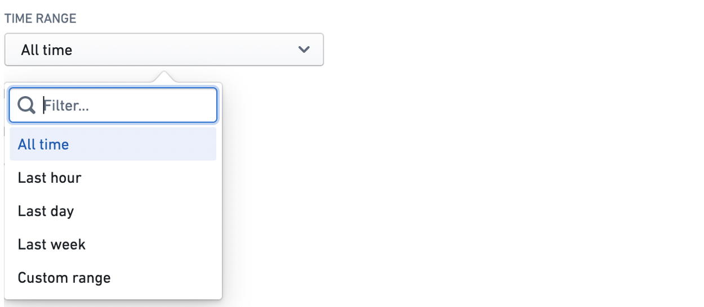

The custom range comes in two varieties: exact and relative.

The exact option uses a date and time picker to allow the user to specify absolute timestamps for the start and end of the range. The window specified here is absolute and hence does not change.

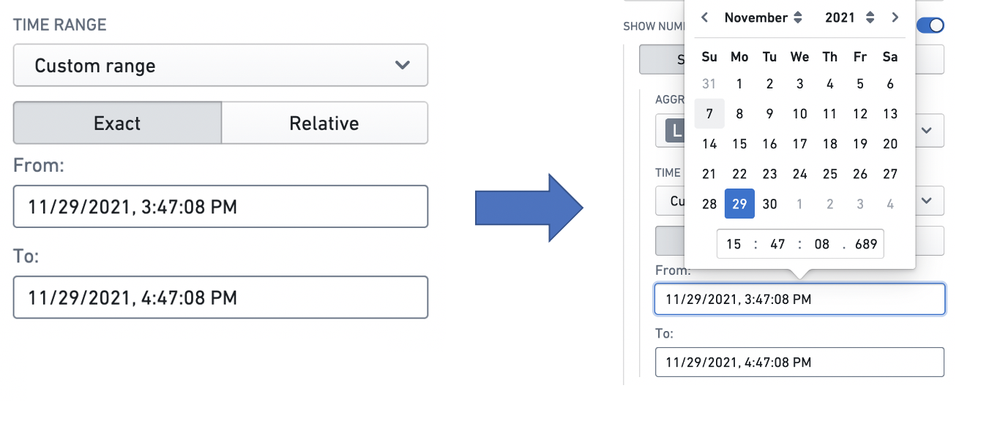

The relative option specifies the start and end of a window relative to the current time. Note that the current time is computed when it is first needed (e.g. when a user displays a widget using a relative time range). It then stays constant unless the web page is reloaded — this is to ensure consistency between widgets. Hence, the time window specified here is not an absolute window — it slides with the passing of time.

For example, a relative start of "2 weeks ago" specifies a window beginning December 1 when the application is opened on December 15, but December 2 when the application is opened on December 16. Similarly, a relative end of "1 week from now" specifies a window ending December 22 when the application is opened on December 15, but December 23 when it is opened on December 16. The window size can be specified in terms of milliseconds, seconds, minutes, hours, days, and weeks.

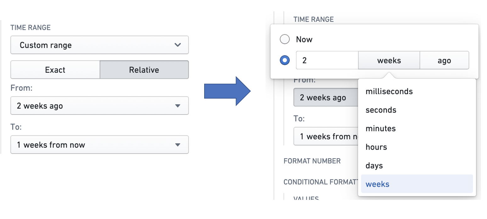

## Baselines

A **baseline** is an additional time series line, rendered in combination with a sparkline in a visually distinguishing way (e.g. as a dotted line). By providing visual grounding and context for a time series, a baseline can help users interpret trends. Baselines can be configured in the Object Table and Metric Card widgets.

There are three types of baseline: `Static`, `Numeric property`, and `Time series property`.

The `Static` type means that the value of the baseline for every time series is a static user-specified value. The user can input this value into a text box. In this example, the `Weekly Cases` column has a baseline with a static value of `1000`.

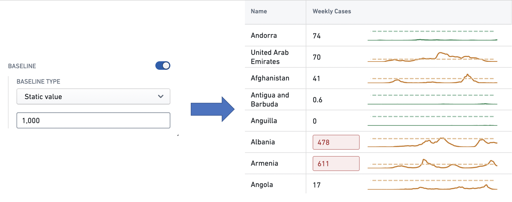

The `Numeric property` type means that the user can specify a numeric property of the object type feeding the widget, whose value for each object is used as the baseline for the corresponding series. See [Property](/docs/foundry/object-link-types/properties-overview/) for more information on object properties. In this example, each row in the `Hospital Admissions` column has a baseline whose value is the value of the `Hospital Capacity` property of the corresponding `Country` object.

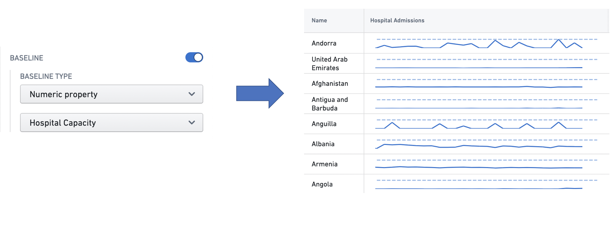

The `Time series` type means that the user can configure a **time series summarizer** to generate a unique baseline value for every series. See [Time series properties in Workshop](#time-series-summarizers) for more information on summarizers. In this example, each time series in the `Weekly Cases` column has a baseline with the value of the most recent observation in the time series.

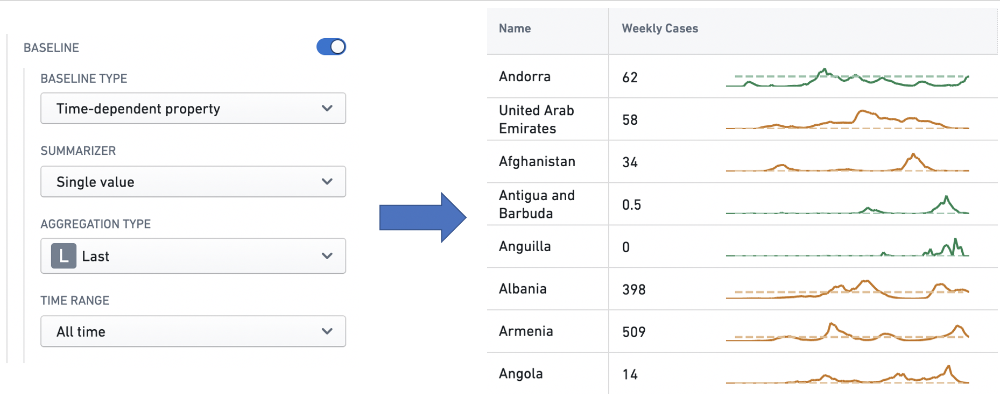
