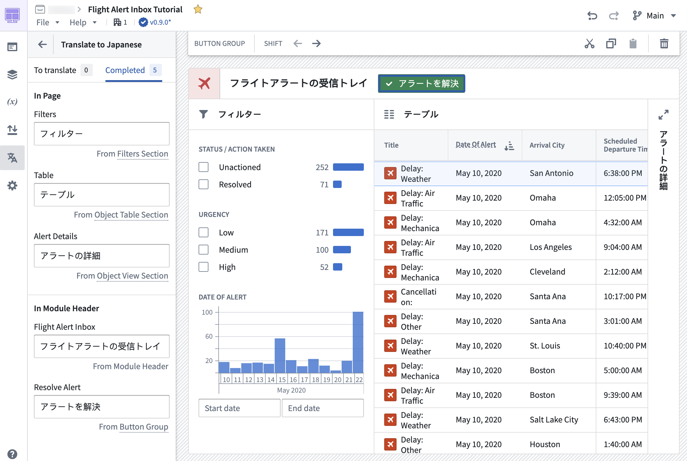
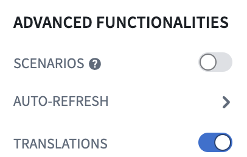
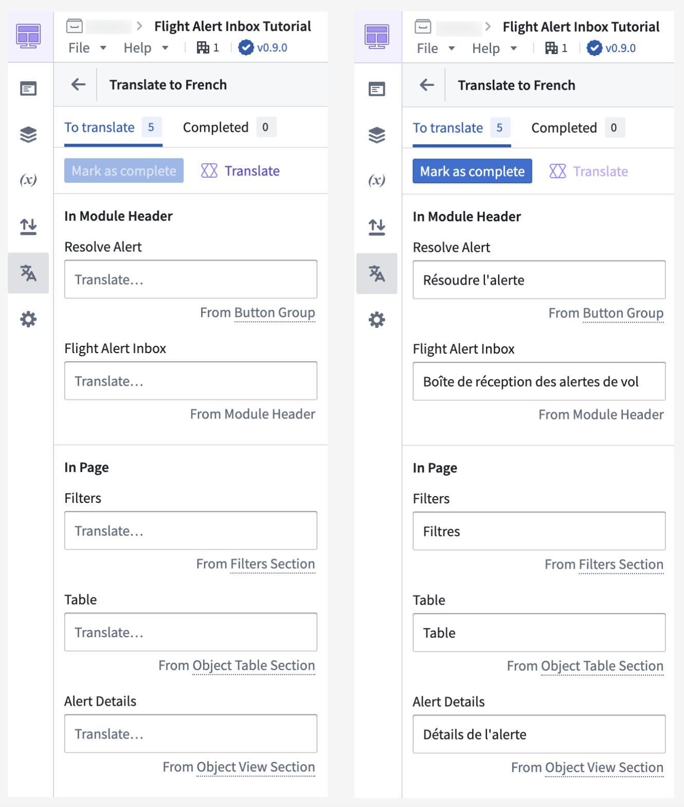
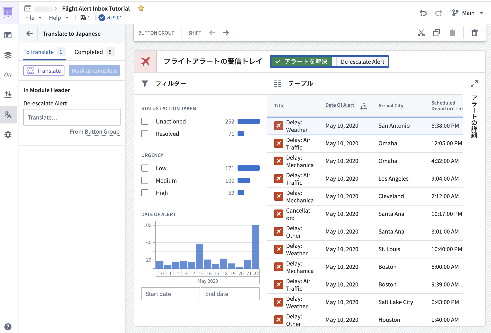
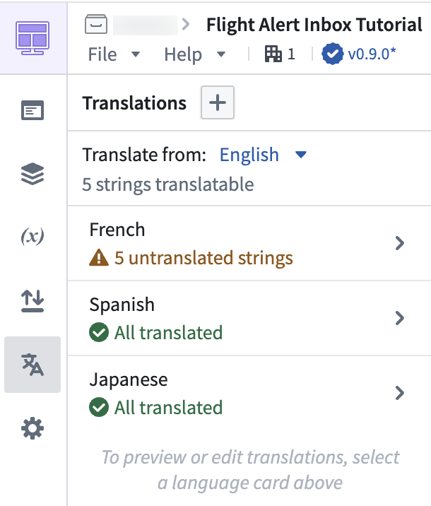

<!-- source: https://palantir.com/docs/foundry/workshop/translations/ · mirrored 2026-08-18 from Palantir Foundry docs -->

# Translation, localization (l10n), and internationalization (i18n)

Application builders can now provide translations for supported string types used within a Workshop application through the Translations feature. This feature allows for the localization (l10n) and internationalization (i18n) of Workshop applications into various languages manually or with the help of AIP for enabled enrollments. Viewers will then be presented with a translated view of the module in their browser's locale if the Workshop application has been translated into that language using this feature.

To turn on the feature, navigate to the **Settings** tab in edit mode and toggle on **Translations** in the **Advanced functionalities** section. Once enabled, a new **Translations** tab will appear where application builders may configure translations for their module.

## Translatable content

The following content in a Workshop application can be translated:

* Module header **Title**
* Section header **Title(s)** and **Tabs**
* Static text from widgets such as:
  * Tabs widget **Label**
  * Button Group widget **Text** and **Description**
  * Metric Card widget **Label** and **Description**
  * Markdown widget **Content**
* Object Table and Object List widget **Column Titles**
* Pivot Table widget **Aggregation Titles**
* Filter List widget **Section Titles**

## Translation methods

Translation of valid strings within a Workshop application may be done either manually by application builders or automatically-generated using AIP for enrollments with custom workflows enabled.

### Manual translation

Strings within the module may be manually translated by application builders. On selection of a target language, each translatable string detected within the module will be displayed with an input field to manually enter translations. Once translations are added, they can be previewed directly within the module for immediate review.

### Automatic translation with AIP

Strings within the module can also be translated with AIP. Use of AIP to translate strings requires configuring [AIP capabilities for custom workflows](/docs/foundry/aip/enable-aip-features/#aip-and-capabilities-for-custom-workflows).

In order to provide AIP with the necessary context to perform string translations, the module's starting language must be defined, and a target language must be set. The **Translate** option marked with the purple AIP icon can then be used to automatically translate all detected strings eligible for translation in the module using AIP. Translations can be immediately previewed in the module for review and manual edits where necessary.

Once satisfied with the translations, the translations may then be **Marked as complete** essentially marking these strings as reviewed to application builders. Any new or modified strings detected in the module, for example, on the addition of a new button or on edit of a section header's title, will appear in the **To translate** section, separating them from the already-translated and reviewed strings.

## Preview translations

Translated text may be previewed directly in the module in edit mode by navigating to the **Translations** tab and selecting the configured language of choice.

