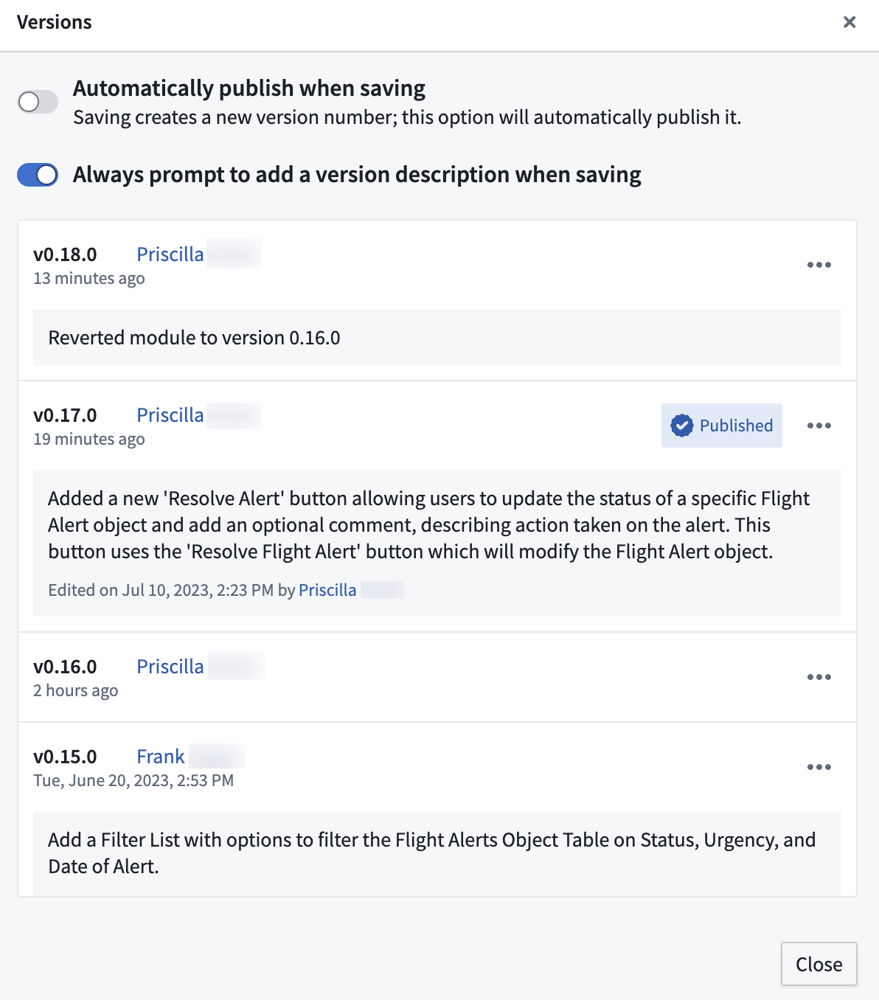
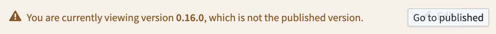
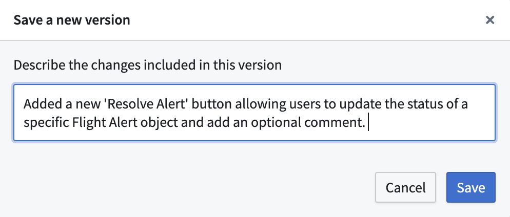

<!-- source: https://palantir.com/docs/foundry/workshop/versions/ · mirrored 2026-08-18 from Palantir Foundry docs -->

# Publishing and versioning

Module **versioning** allows builders to safely and iteratively build Workshop applications; the version accessible to end users can be controlled by **publishing** a stable version of the module. This allows for continuous development on a live Workshop application without necessarily exposing changes to end users when the module is saved.

## Version history and settings

The Versions dialog is where builders can view a history of the saved versions for a module. Each saved version displays a timestamp, editor, and description if available. For each saved version, builders have the option to:

* **Publish this version:** Publish a saved version of a module that will be accessible to viewers.
* **View this version:** View the module at that specific version. When viewing a non-published version, a warning banner will appear at the top of the module.

* **Revert to this version:** Save the historic version as the newest version of the module. A description detailing the revert action will be automatically generated.

:::callout{theme="neutral" title="Edit a previous version of a module"}
To edit a previous version of a module, follow the steps below:
\* Ensure the **Automatically publish when saving** toggle switch is off in the Versions dialog.
\* Revert to the version you would like to edit.
\* Create a duplicate copy of the selected version of the module with **File > Duplicate File**.
\* Revert the original module to the newest version, and make any desired edits to the duplicate copy you created.
:::

The Versions dialog is also where builders can go to edit settings related to saving and versioning actions:

* **Automatically publish when saving:** This toggle controls whether saving will automatically publish a new version.
* **Always prompt to add a version description when saving:** This toggle controls whether the builder is prompted to add an optional description when saving a new version. Descriptions can be added to help document the changes being made to modules and build up a richer record of the module's history. Descriptions can be viewed, added, and edited in the module’s Versions dialog.

## Viewing changes between versions

Use the [Changelog panel](/docs/foundry/workshop/changelog/) to visualize differences between module versions. You can select:

* **Range selection:** Choose a start and end version to see all changes between those versions.
* **Single selection:** Select a single version to compare it to the previous version.

The Changelog panel highlights additions, deletions, changes, moves, and newly unused elements. You can inspect JSON diffs to see the exact modifications and review a visual hierarchy to understand how changes relate to nested components.

## Branching and rebasing

When developing on a branch, you may need to rebase before merging your Workshop changes into `main` if `main` has changed since your last save. Rebasing applies your branch's changes to the latest `main` version of the module and surfaces any merge conflicts that must be resolved.

The rebasing user interface uses the [Changelog panel](/docs/foundry/workshop/changelog/) to visualize changes and highlight conflicts, such as when the same widget was modified on both `main` and your branch. Once conflicts are resolved, save to finish the rebase, and then proceed to merge your branch into `main`.

For a complete walkthrough, see [Rebasing and conflict resolution](/docs/foundry/workshop/branching-integration/#rebasing-and-conflict-resolution).
