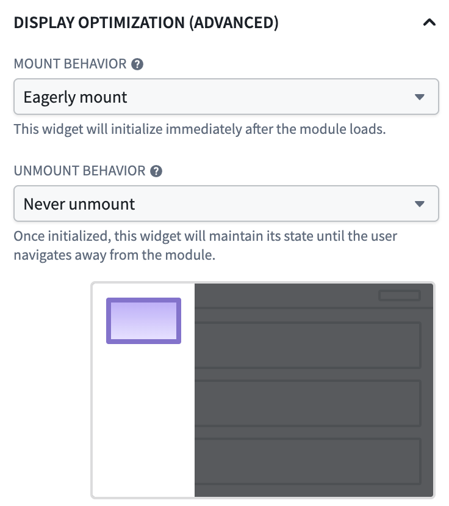

<!-- source: https://palantir.com/docs/foundry/workshop/widget-display-optimization/ · mirrored 2026-08-18 from Palantir Foundry docs -->

# Widget display optimization

Widget display optimization is a Workshop setting that controls when individual widgets mount and unmount as users navigate within a module. By default, widgets mount when they become visible and unmount when they leave the screen. This frees up browser resources when widgets are not in view but means that widgets must reload their data and rebuild their state every time a user navigates back to them.

:::callout{theme="warning"}
Display optimization is an advanced feature. Eagerly mounting widgets or keeping them mounted when not currently in view consumes browser memory and can degrade module performance if applied broadly. Configure non-default display behavior only on the specific widgets where it is needed.
:::

## When to adjust display behavior

Adjusting widget display behavior is most useful for:

* **Custom widgets that hold local state:** Custom widgets unmount by default when scrolled off-screen, which discards any state held inside the widget's iframe. Setting these widgets to remain mounted preserves that state across navigation.
* **Widgets with expensive initial loads:** If a widget runs a computationally expensive function, queries a large amount of data, or initializes a complex visualization, keeping it mounted avoids the user waiting for that work to repeat each time they revisit the view.
* **Widgets that users return to frequently:** Scroll position and loaded data are preserved across module navigation in most cases (but not all) when a widget is configured to remain mounted.
* **Widgets that should be ready before the user navigates to them:** Eagerly mounting a widget mounts it on initial module load so the widget is fully loaded the first time a user navigates to its layout. This is useful for widgets on a destination page that users almost always reach, where the wait on first navigation would otherwise be disruptive. The tradeoff is a longer initial module load time.
* **Widgets that are heavy when off-screen:** Configuring a widget to unmount when scrolled off-screen, in addition to the default unmount when its layout is no longer rendered, can reduce memory and rendering pressure for modules with large or expensive widgets in long scrollable layouts.

It is not recommended to change display behavior on widgets that are rarely revisited or hold no meaningful state. Note that display optimization settings are not supported in **loop layouts**.

## Configuration options

Display optimization is controlled by two independent settings: a widget's **mount behavior** and its **unmount behavior**. The default values for each setting are tuned for most use cases, and the recommended approach is to leave them in place unless one of the scenarios above applies.

### Mount behavior

* **Default:** The widget mounts when its containing layout (the page, section, or tab that holds it) first renders.
* **Delay until on-screen:** The widget delays mounting until it is scrolled into view. This is the historical behavior for some widget types and is useful when a layout contains many widgets that the user may never reach.
* **Eagerly mount:** The widget mounts as soon as the module loads, even if it is not yet visible. The widget remains mounted for the rest of the session.

### Unmount behavior

* **Default:** The widget unmounts when its containing layout is no longer rendered; for example, when the user switches to another tab or page.
* **Unmount when off-screen:** The widget unmounts whenever it is scrolled out of view, in addition to the default condition. This is the most aggressive unmount setting and is useful for widgets that are expensive to keep in memory.
* **Never unmount:** Once mounted, the widget remains mounted for the rest of the session. Subsequent navigation back to the widget is immediate and any widget state is preserved.

## Configure widget display behavior

To set display behavior for a specific widget:

1. In edit mode, select the widget in the canvas.
2. Open the widget configuration panel's **Display** tab and locate the **Display optimization** options.
3. Choose the desired mount and unmount behavior from the available modes.

The configuration panel contains a short description and animation of each mode and disables options that do not apply to the selected widget or layout type.

## Performance considerations

The default display behavior is tuned for modules with many widgets across many pages or sections, where unmounting off-screen widgets keeps memory usage and rendering work bounded. When you opt a widget into staying mounted:

* The widget's DOM, React state, and any in-memory data remain in the browser for the entire session.
* Widgets configured to **eagerly mount and never unmount** add their initialization work to the module's initial load time, which can noticeably increase for the module if applied broadly.
* Modules that keep large numbers of widgets mounted are more susceptible to slowdowns, memory pressure, and browser tab crashes on lower-spec devices.

Use the [Performance Profiler](/docs/foundry/workshop/performance-profiler/) to measure the impact of widget display optimization changes on your module's load and reload times.
