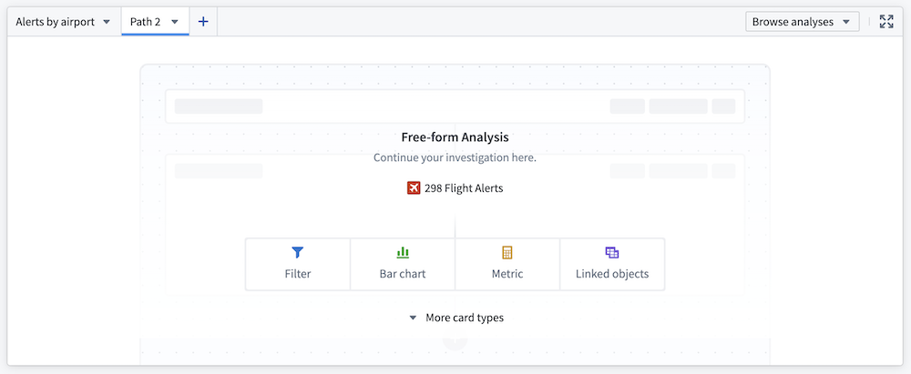

<!-- source: https://palantir.com/docs/foundry/workshop/widget-free-form-analysis/ · mirrored 2026-08-18 from Palantir Foundry docs -->

# Free-form Analysis

The **Free-form Analysis widget** enables users to independently investigate object data with flexibility, within the framework of the Workshop application.

:::callout{theme="neutral"}
For investigating time series data specifically, see the [Time Series Analysis widget](/docs/foundry/workshop/widget-time-series-analysis/), which provides specialized tools for time series visualization, derived plots, and analysis.
:::

## Available cards

### Core display cards

* **Metric card:** Display numeric aggregations of an object set, including average, count, minimum, maximum, sum, and approximate unique count of a selected property.
* **Text card:** Add annotations to your analysis with a rich text editor card.

### Object cards

* **Filter object set:** Take an input object set and return an object set based on logical conditions defined on both object properties and properties of linked objects.
* **Linked objects:** Expose relationships between object types and provide exploration into linked objects.
* **Object selector:** Select and pin a single object (for example, a particular alert within a `Flight Alert` object type).

### Table cards

* **Object table:** Present an object set in a table, with select properties displayed as columns of a table.
* **Pivot table:** Display data aggregations from an object set in a table. Choose object properties to serve as row and column properties; the resulting data is organized into groups based on these object properties and aggregated according to the specified configuration.

### Visualizations

* **Bar chart:** Create a horizontal or vertical bar plot of objects. Categories are defined by object properties, and values can be determined by object count (default) or average, maximum, minimum, or sum of a property value.
* **Heat grid:** Display a three-dimensional chart, illustrating two categorical dimensions and an aggregate dimension (count, average, sum, maximum, or minimum) by color.
* **Line chart:** Define categories based on object properties. Set values to object count (default) or average, maximum, minimum, or sum of a property value.
* **Pie chart:** Define categories based on object properties. Set values to object count (default) or average, maximum, minimum, sum of a property value.
* **Waterfall plot:** Display the running total (average, count, maximum, minimum, sum, or unique count) of one property as values (grouped by a second property) are added or subtracted.

## Connect to other Palantir applications

* **Open in Quiver:** Perform more complex analyses in a Quiver analysis.
  * Note: Selecting **Open in Quiver** creates a duplicate analysis; any changes in the Quiver analysis will not be reflected in the analysis path in the Workshop widget.
* **Copy to Notepad:** Allows users to copy cards to Notepad.
  * Note: This functionality is only available for saved analyses.

## Configuration options

* **Input object set:** The object set that serves as the base input to the analysis.
* **Empty state header and description:** Define how the widget is configured when there are no cards in a path.
* **Enable path saving:** Save and share analyses for future reference. Analyses can be saved as either **Private** or **Public**.
  * **Enable copy for Notepad** (only available for saved analysis paths): Copy individual cards in a path to add to a Notepad. Cards can only be copied for Notepad if they are in a saved analysis path.
* **Output object set:** Save the output object set for reference elsewhere within the Workshop application.
