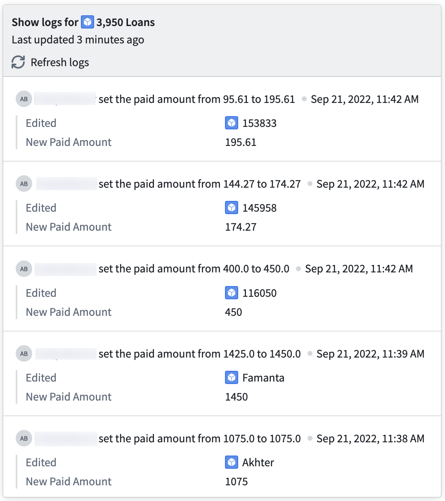

<!-- source: https://palantir.com/docs/foundry/workshop/widgets-action-log-timeline/ · mirrored 2026-08-18 from Palantir Foundry docs -->

# Action Log Timeline

Use the **Action Log Timeline** widget to display [action logs](/docs/foundry/action-types/action-log/) on objects in a temporal view.

## Configuration options

* **Objects to show logs for:** Define an object set containing a single object type to display its action logs.
* **Action logs to display:** Add specific action log object types to be displayed in the timeline view.
  * **Action log:** Select an existing action log object type on the object type of the specified object set.
  * **Properties to display:** Specify properties to display for each action log instance in the timeline view.
