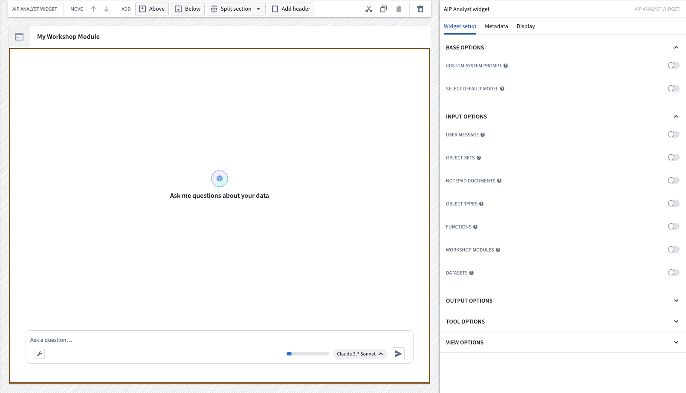

<!-- source: https://palantir.com/docs/foundry/workshop/widgets-aip-analyst/ · mirrored 2026-08-18 from Palantir Foundry docs -->

# AIP Analyst

AIP Analyst can be embedded as a Workshop widget to provide AI-powered analysis capabilities directly in Workshop modules. The widget supports extensive configuration options to control data access, tool availability, and user interface customization.

For a full list of tools that can be enabled or disabled, see [Capabilities](/docs/foundry/aip-analyst/capabilities/).

Platform administrators can also use the [Checkpoints](/docs/foundry/checkpoints/overview/) application to configure a checkpoint for opening AIP Analyst, requiring user interaction before the application is allowed to load.

[Learn more about the AIP Analyst Workshop widget.](/docs/foundry/aip-analyst/workshop-widget/)
