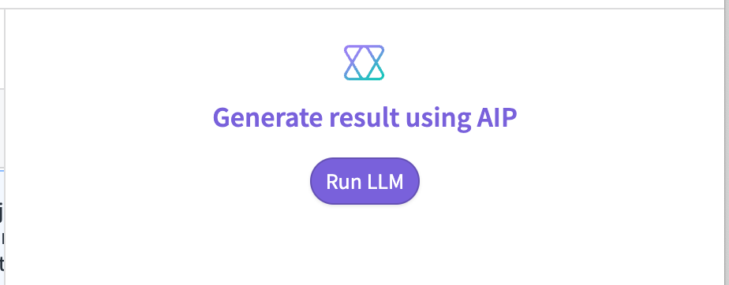
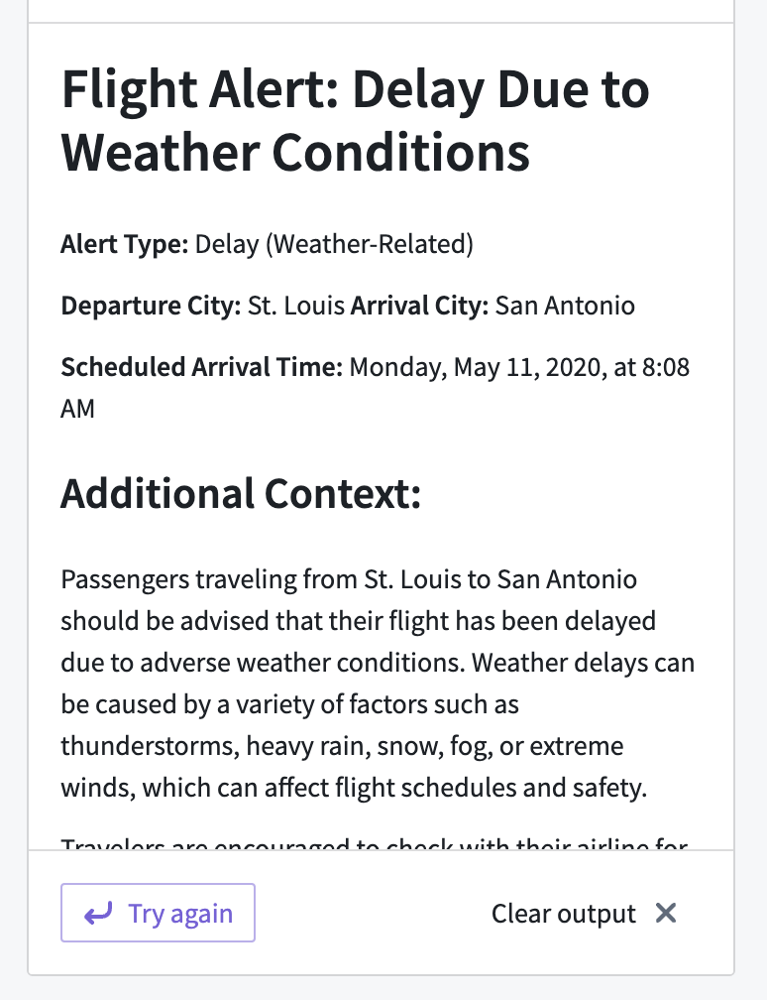

<!-- source: https://palantir.com/docs/foundry/workshop/widgets-aip-generated-content/ · mirrored 2026-08-18 from Palantir Foundry docs -->

# AIP Generated Content

The AIP Generated Content widget can display the response from an [AIP Logic](/docs/foundry/logic/overview/) function or visually stream the response from an LLM (similar to the [Stream LLM response into variable event](/docs/foundry/workshop/concepts-events/#stream-llm-response-into-variable)).

:::callout{theme="warning"}
Users must be able to access AIP Logic to use this widget. Otherwise, they receive the error `Could not find widget with type: oa-aip-generated-content`. Ensure that every user who needs a Workshop module containing this widget can view the AIP Logic application.
:::

## Configuration options

The AIP Generated Content widget has the following three options for generating a response:

1. **Logic:** This option requires selecting an [AIP Logic](/docs/foundry/logic/overview/) function.

2. **Direct to LLM:** This option enables displaying the response of an LLM in real time within the widget. It has the following configuration options:
   * **Prompt:** The string variable of your prompt.
   * **Clear output when prompt changes:** When enabled, this will clear the AIP Generated Content widget output when the prompt variable changes. This is useful when  the user is directly interacting with the prompt.
   * **Temperature:** The temperature to use with the model, a number between `0` and `1`. Higher values, like `0.8`, will make the output more random, while lower values, like `0.2`, will make the output more focused and deterministic.
   * **Model:** The language model to use. Four OpenAI models are supported: GPT-3, GPT-4, GPT-4 32K, and GPT-4-Turbo.

3. **LLM via prompt function:** This option is the same as **Direct to LLM**, but the prompt is a function instead of a string.

#### Other configuration options

* **Output variable:** The string or object set variable that stores the response.
* **Icon:** The icon to display at the top of the widget; defaults to Palantir's AIP icon.
* **Button label:** The label to use within the button; defaults to "Generate result using AIP".
* **Title:** The title to display in the center of the widget.
* **Loading state message:** The message to display as the response is loading.
* **Show loading spinner:** When enabled, it shows a spinner when loading instead of the loading state message.

The following example shows what the AIP Generated Content widget looks like when displaying a string response:

