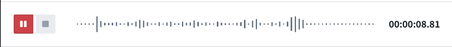
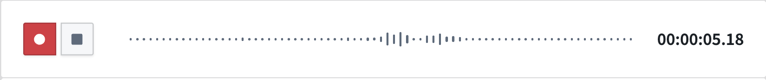
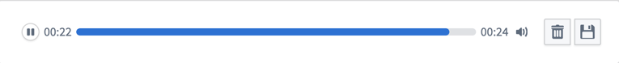
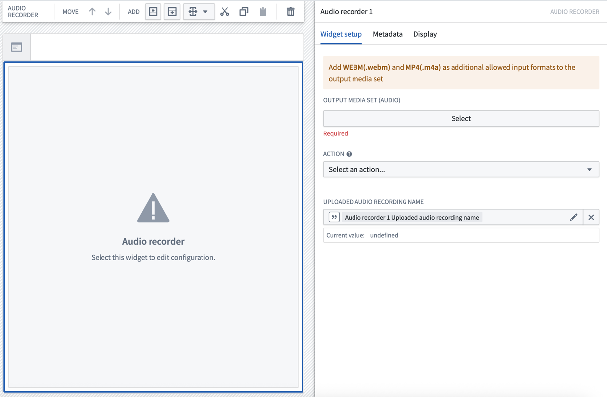
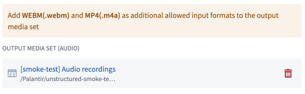
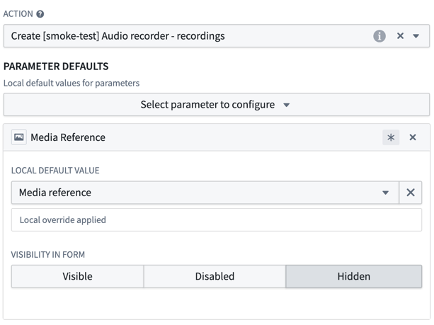

<!-- source: https://palantir.com/docs/foundry/workshop/widgets-audio-recorder/ · mirrored 2026-08-18 from Palantir Foundry docs -->

# Audio Recorder

The **Audio Recorder** widget allows you to record audio directly within Workshop applications. You can upload recordings to a media reference property or a specified media set.

For playback and transcription display of audio saved to a media reference or media set, see the [Audio and Transcription Display widget](/docs/foundry/workshop/widgets-audio-preview/).

The Audio recorder has several lifecycle states:

* No recording: Select the record button to start a new recording.   
     

* Recording in progress: Pause your recording by selecting the pause button.   
     

* Recording paused: Resume your recording by selecting the record button. To end the current recording session, select the stop button.   
     

* Recording completed: Play back, save, or discard your recording.   
     

## Configuration options

You are required a select a media set to save the audio recordings to. Optionally, you can configure an action to be triggered upon completion of the recording session.

Here is a screenshot of the initial state of a newly-added Audio recorder widget alongside its initial configuration panel:

### General setup

To set up the Audio Recorder widget, select the media set where recorded audio files will be uploaded. The widget will save recordings directly to this destination.

:::callout{theme="warning" title="Supported audio formats"}
To ensure compatibility with desktop and mobile devices:

* **For web applications:** Add WEBM (.webm) as an additional allowed input format to your output media set.
* **For mobile applications:** Add MP4 (.m4a) as an additional allowed input format to your output media set.
:::

### Action configuration

To use the recorded audio in your ontology, you can configure an action to run automatically when an audio recording is uploaded. The audio recorder widget automatically stores the media reference and recording name locally as values that can be passed to your action.

* **Action configuration**
  * **Action:** Choose the action to trigger upon upload from the action dropdown. The selected action must include a media reference parameter and be associated with an object type backed by the same media set as your output media set.
  * **Parameter defaults:** Configure how widget values are passed to your action:
    * **Media reference parameter:** Set the local default value to **Media reference** to automatically pass the uploaded recording's media reference to your action. It is recommended to set the visibility of the media reference parameter to **Hidden** since the value is automatically populated by the widget.
    * **Audio recording name parameter:** Optionally use **Audio recording name** as a local default value for string parameters to pass the recording's file name.   
         

### Output variables

* **Uploaded audio recording name**
  * Save the uploaded filename to a string Workshop variable for use elsewhere in your application. This allows you to reference the specific recording that was just uploaded, enabling workflows like displaying the recording in an object table or triggering additional processing.
