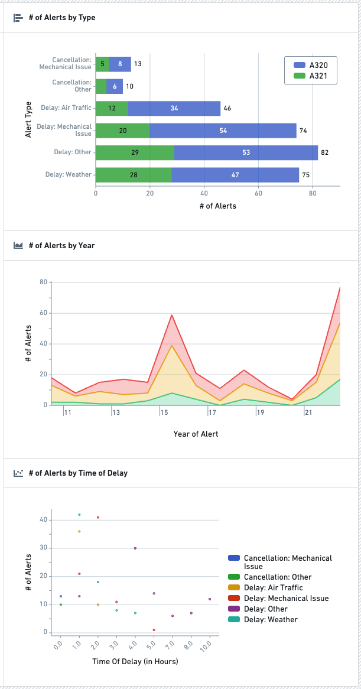
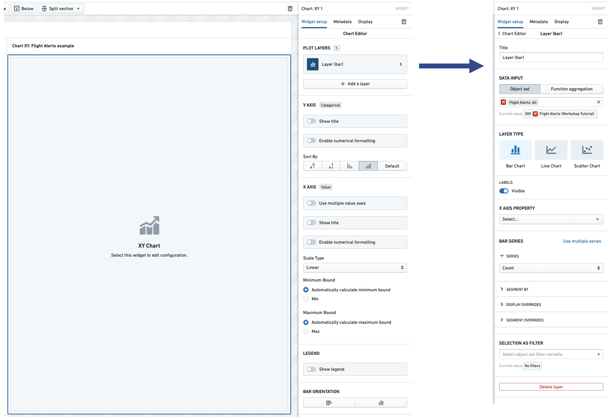

<!-- source: https://palantir.com/docs/foundry/workshop/widgets-chart/ · mirrored 2026-08-18 from Palantir Foundry docs -->

# Chart XY

:::callout{theme="neutral"}
Consider using the [Vega Chart](/docs/foundry/workshop/widgets-vega-chart/) widget if the Chart XY widget does not enable desired functionality or formatting.
:::

The **Chart XY** widget is used to visualize Objects as interactive charts. Module builders configuring a Chart XY widget can:

* Display data as bar, line, and scatter charts.
* Choose which properties are visualized, how these properties are aggregated (e.g. count, sum, average), and whether/how the properties are segmented.
* Use Function-backed layers to display more advanced aggregation types and charts.
* Set display options for chart titles, axes, legends, and numerical formatting.
* Enable selection and downstream filtering on a chart.

The below screenshot shows an example of three configured Chart XY widgets displaying `Flight Alerts` data:



## Configuration options

In the image below, to the left of the blue arrow you can see a newly added (but not yet configured) Chart XY widget, alongside its initial configuration panel. To the right of the blue arrow in the image below, you can see an individual **Layer** configuration panel with the backing object set of `Flight Alerts` already populated:



### Layer configuration options

Configuring a Layer is required to add data to the Chart XY widget. The following configuration options are available for a Layer:

* **Title**
  * Sets a title for the current Layer within your configuration panel.
  * Note: This title is not visible to module users, but is intended to help builders organize and manage complex **Chart XY** configurations that use multiple Layers.
* **Data input**
  * Controls the input data for this Layer.
  * The **Object set** option allows a Workshop object set variable to be used as input.
  * The **Function aggregation** option allows a function that returns a 2D Aggregation or 3D Aggregation to be used as input.
    * Note: Function aggregation layers will only have a subset of the below Layer configuration options available.
  * The **Time series set** option allows a Workshop time series set variable to be used as input. See [Variables](/docs/foundry/workshop/concepts-variables/) for more information on time series set variables. This configures a time series chart, with the time range on the X axis, and the time series values of the variable on the Y axis.
* **Layer type**
  * Selects the type of chart displayed. Current options include **Bar Chart**, **Line Chart**, and **Scatter Chart**. If the data input is a time series set, only the Line Chart option is supported. See [Variables](/docs/foundry/workshop/concepts-variables/) for more information on time series set variables.
* **Area options**
  * Provides three visualization options for line charts:
    * "Line" (which display a simple line chart),
    * "Area" (which plots a line chart and shades the area beneath each line), and
    * "Stacked" (which is similar to the "Area" option but stacks segmented chart values on top of each other).
  * Area options are only available for line charts.
* **Labels**
  * Toggles the display of value labels on the chart.
  * This option is currently available for Bar Charts and Line Charts.
* **X axis property**
  * Determines the property type plotted on the chart.
* **Bar / line / chart series**
  * **Use single / multiple series**
    * Allows either one or more chart series to be plotted for the selected **X axis property**.
    * For instance, if "Alert Type" was selected as the **X axis property**, multiple series would allow the plotting of both the count of each "Alert Type" and also the sum of the "# of Hours Delayed" for each "Alert Type".
  * **Series aggregation**
    * Determines the aggregation method used to produce each value plotted on the chart.
    * By default, this is set to "Count."
    * Other options include: "Average," "Min," "Max," "Sum," and "Approximate Unique Count."
  * **Segment by**
    * Optional.
    * Enables each plotted value to be segmented by a secondary property type.
    * As an example, if "Alert Type" was selected as the **X axis property** and then "Aircraft Type" was selected as the **Segment by** option on a bar chart, each bar would show the count of objects of each "Alert Type" segmented by each "Aircraft Type".
  * **Display of null/missing values**
    * Only available for **Line chart**.
    * Controls how null or missing values are displayed on a Line chart.
    * Options are "Gap" (where a missing value is displayed as an empty gap in a plotted line), "Ignored" (where a missing value is ignored and a plotted line instead connects the previous and next available values), or "Zeroes" (where a missing value is treated as equivalent to value of "0).
  * **Display override**
    * Optional.
    * Overrides the legend display name of the current series.
    * For segmented charts, overrides the legend display name of a single segment.
  * **Segment overrides**
    * Only available for **Bar chart**.
    * Modifies how each bar chart value is displayed.
    * Options include: "Stacked," "Percentage," and "Grouped."
* **Selection as filter**
  * Optional and only available for **Object set**-backed charts.
  * When set, allows for selection and downstream widget filtering for this chart layer via the output **Object set filter** variable.
* **Delete layer**
  * Allows the current chart layer to be deleted.
* **Scenarios**
  * **Compare against Scenarios**
    * Enable this toggle to select the Scenario array variable to compare data from. This will compare the data in the table to values from the Scenarios in the array using the "segment by" axis of the chart.
    * If this option is enabled, you cannot segment by other properties.
  * See the [Scenarios documentation](/docs/foundry/workshop/scenarios-overview/) for more information on Scenarios.

### Runtime configuration options

Some Chart XY configuration options are available at runtime through the chart toolbar, rather than in the widget configuration panel.

#### Timestamp bucket size

When a chart layer uses a date or timestamp property as the X axis property with basic aggregation, a cog (settings) button appears in the chart toolbar at runtime. Selecting this icon opens a bucket size selector that allows you to configure how timestamp values are grouped—for example, by day, week, or month.

:::callout{theme="neutral"}
The bucket size configuration button only appears when the layer's X axis property is a date or timestamp type and the layer uses basic aggregation rather than function-backed aggregation.
:::

### Chart-wide configuration options

In addition to the configuration options for a layer described above, the main Chart XY configuration panel contains a number of chart-wide configuration options:

* **Categorical axis**
  * **Show title**
    * If enabled, displays the title of the categorical axis and also allows this title to be override.
    * By default, this title will display the property type(s) plotted within the chart's series.

  * **Enable numerical formatting**
    * If enabled, provides configuration options for numerical values displayed in the categorical axis keys.
    * Configuration options include numerical grouping, min / max decimals shown, scientific notation, and others.

  * **Sort by**
    * Controls sorting logic for how each charted value is displayed.
    * By default, sorts categorical keys alphabetically from A to Z.
    * Other options include sorting by value (ascending or descending) and **Custom** sorting.
    * To define a custom category order, assign numeric sort values to a property and select that property as the sort metric.
* **Value axis**
  * **Use multiple value axes**
    * Only available if multiple chart series have been configured and allows value axes to be configured on a per series basis. This can be helpful when different series on a chart have substantially different value scales.
  * **Show title**
    * If enabled, displays the title of the value axis and also allows this title to be override.
    * By default, this title will display the aggregation type(s) used within the chart's series.
  * **Enable numerical formatting**
    * If enabled, provides configuration options for numerical values displayed in the values axis.
    * Configuration options include numerical grouping, min / max decimals shown, scientific notation, and others.
  * **Scale type**
    * Allows the value axis scale to be set to either "Linear" (the default) or "Logarithmic."
  * **Minimum bound**
    * By default, set to "Automatically calculate minimum bound" based on the displayed chart values.
    * If switched to "Min," the module builder can control the minimum value display on the value axis.
  * **Maximum bound**
    * By default, set to "Automatically calculate maximum bound" based on the displayed chart values.
    * If switched to "Max," the module builder can control the maximum value display on the value axis.
* **Legend**
  * **Show legend**
    * Toggles display of a legend of chart series' titles and series' colors.
  * **Positioning options**
    * When "Show legend" is enabled, controls the positioning of the legend within the chart.
* **Bar orientation**
  * **Horizontal / vertical toggle**
    * Controls the orientation of the chart.
    * For a **Bar chart**, "Horizontal" is the default.
    * For a **Line chart** or **Scatter chart**, only "Vertical" is allowed.

## Function aggregations (Function-backed layers)

Configuring a function-backed layer requires writing a function that returns either a `TwoDimensionalAggregation` or `ThreeDimensionalAggregation`.

Below is a full example that returns a `TwoDimensionalAggregation` in order to chart one time series divided by another time series:

```typescript
import { Function, TwoDimensionalAggregation, ThreeDimensionalAggregation,
         IRange, Timestamp } from "@foundry/functions-api";
import { ObjectSet, MyObjectType } from "@foundry/ontology-api"

export class TimeseriesAggregations {

    @Function()
    public async percentOfTotal(objects:ObjectSet<MyObjectType>):
                                Promise<TwoDimensionalAggregation<IRange<Timestamp>>> {
        const numerators = await objects.groupBy(e => e.date.byDays())
                                        .sum(e => e.value);
        const denominators = await objects.groupBy(e => e.date.byDays())
                                          .sum(e => e.total);

        return this.divide(numerators, denominators);
    }

    private divide(numerators:TwoDimensionalAggregation<IRange<Timestamp>>,
                              denominators: TwoDimensionalAggregation<IRange<Timestamp>>):
                              TwoDimensionalAggregation<IRange<Timestamp>> {

        const percentage = numerators.buckets.map((bucket, i) => {
           const numerator = bucket.value;
           const denominator = denominators.buckets[i].value;
            if (denominator == 0) {
                return { key: bucket.key, value: 0 };
            }
            return { key: bucket.key, value: numerator / denominator }
        });

        return { buckets: percentage };
    }
}
```

Below is a full example that returns a `ThreeDimensionalAggregation` which will chart a separate series for each value returned by `segmentBy()`:

```typescript
import { Function, TwoDimensionalAggregation, ThreeDimensionalAggregation,
         IRange, Timestamp } from "@foundry/functions-api";
import { ObjectSet, MyObjectType } from "@foundry/ontology-api"

export class TimeseriesAggregations {

    @Function()
    public async percentOfTotalSegmented(objects:ObjectSet<MyObjectType>):
                                         Promise<ThreeDimensionalAggregation<IRange<Timestamp>, string>> {
        const numerators = await objects.groupBy(e => e.date.byDays())
                                        .segmentBy(e => e.groupId.topValues())
                                        .sum(e => e.value);
        const denominators = await objects.groupBy(e => e.date.byDays())
                                          .segmentBy(e => e.groupId.topValues())
                                          .sum(e => e.total);

        return this.divideThreeDimensional(numerators, denominators);
    }

    private divideThreeDimensional(numerators:ThreeDimensionalAggregation<IRange<Timestamp>, string>,
                             denominators: ThreeDimensionalAggregation<IRange<Timestamp>, string>):
                             ThreeDimensionalAggregation<IRange<Timestamp>, string> {

        var percentage = numerators.buckets; //copy
        for (let i = 0; i < numerators.buckets.length; i++) {
            for (let j = 0; j < numerators.buckets[i].value.length; j++) {
                percentage[i].value[j].value = numerators.buckets[i].value[j].value /
                                               denominators.buckets[i].value[j].value;
            }
        }

        return { buckets: percentage };
    }
}
```

For more examples, see the Functions documentation on [object set aggregations](/docs/foundry/functions/api-object-sets/) and [creating custom aggregations](/docs/foundry/functions/create-custom-aggregation/).
