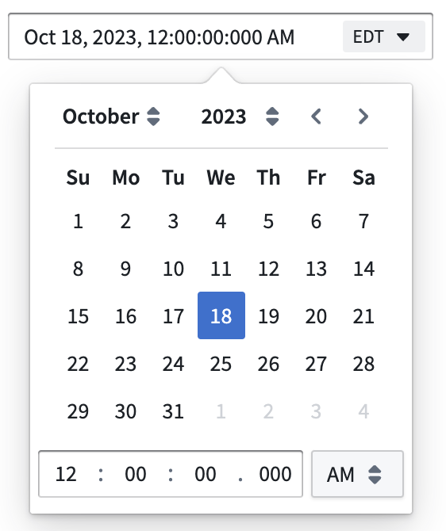

<!-- source: https://palantir.com/docs/foundry/workshop/widgets-date-time-picker/ · mirrored 2026-08-18 from Palantir Foundry docs -->

# Date and Time Picker

The Date and Time Picker widget can be used to allow a user to enter a single date and time value.

## Configuration Options

* **Label**
  * Sets an optional label for the widget. This text is displayed across the top of the widget.
* **Selected timestamp**
  * Output variable of the widget, storing the user’s selected date and time value.
* **Date format**
  * Sets the date format displayed by the widget.
* **Time format**
  * Sets the time format displayed by the widget, either using a 12-hour clock or a 24-hour clock.
* **Time precision**
  * Sets the time precision used by the widget, down to the millisecond, second, or minute.
* **Timezone user editable**
  * Toggle controlling whether or not the timezone of the widget is adjustable in view mode by the user.
* **Default timezone**

  * Sets the default timezone used by the widget. This can be set statically by manually selecting the timezone, dynamically using a variable, or set to local which uses the viewer's local timezone. When using a variable to set the timezone dynamically, the value must be an IANA timezone identifier (for example, `Asia/Dubai` or `America/New_York`) rather than a GMT offset code.
