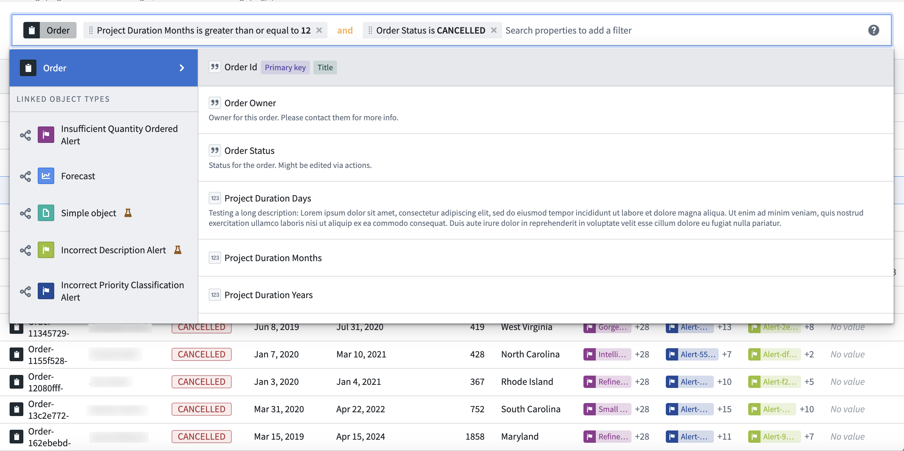

<!-- source: https://palantir.com/docs/foundry/workshop/widgets-exploration-search-bar/ · mirrored 2026-08-18 from Palantir Foundry docs -->

# Exploration Search Bar

Use the **Exploration Search Bar** widget to visualize and apply filters to an object set. The widget supports both filtering on properties on the object type and filtering with linked object types and their properties. For more information on how to use the extensive filtering capabilities of the search bar, review the [filter results documentation](/docs/foundry/object-explorer/filter-results/).

## Configuration options

* **Mode**
  * **Read only:** Display a non-editable view of any filters applied to a specified object set containing a single object type.
  * **Remove only:** Display an editable view of any filters applied to a specified object set containing a single object type, allowing users to remove any applied filters. An object set filter variable containing the applied filters may optionally be specified as output.
  * **Update existing filters only:** Display an editable view of any filters applied to a specified object set containing a single object type, allowing users to remove or edit any applied filters. An object set filter variable containing the applied filters may optionally be specified as output.
  * **Add, update, remove:** Display an editable view of any filters applied to a specified object set containing a single object type, allowing users to remove or edit any applied filters and add new property filters to apply on the object set. An object set filter variable containing the applied filters may optionally be specified as output.
    * **Menu configuration**
      * **Property types available:** Define which property types to display in the dropdown menu. Options include **All (Including hidden)**, **Prominent**, **Visible**, or **Custom**.
      * **Link types available:** Define which link types to display in the dropdown menu. Options include **All (Including hidden)**, **Prominent**, **Visible**, **Custom list**, or **None**.
      * **Disable property value autocomplete:** Toggle to display/hide suggested filters.
      * **Disable keyword filtering:** Toggle to enable/disable keyword filtering for string properties.
* **Show clear button:** Toggle to display/hide a button to clear all filters from the search field.
* **Prevent users from changing operators (or, and):** Toggle to enable/disable users from changing operator values used between applied filters.
* **Icon:** Add an icon to display to the left of the tab label.
* **Fill entire container width:** Toggle to enable/disable the search bar spanning the width of its container.
* **Display object type pill:** Toggle to enable/disable a pill describing the object type of the current object set.
* **Show search help icon:** Toggle to display/hide the help icon linking to the [filter results documentation page](/docs/foundry/object-explorer/filter-results/).
* **Placeholder:** Define placeholder text to display in the search field.
