<!-- source: https://palantir.com/docs/foundry/workshop/widgets-iframe/ · mirrored 2026-08-18 from Palantir Foundry docs -->

# Iframe

:::callout{theme="neutral"}
When trying to develop a custom widget, we recommend using a [Custom widget](/docs/foundry/custom-widgets/overview/) instead of an **Iframe** widget's bidirectional option.
:::

The **Iframe** widget enables embedding of external, full-page applications within Workshop, providing builders with a way to add custom views to their modules.

An embedded application can also bidirectionally communicate using Workshop variables and events, enabling the embedded app to act similar to a custom widget. See the [bidirectional](#bidirectional) configuration options for more details on how to iframe an application that is able to read from and write to Workshop.

Note that since iframes require additional memory and processing resources, the stability and performance of your Workshop module may be impacted. We do not recommend embedding more than one iframe widget on-screen.

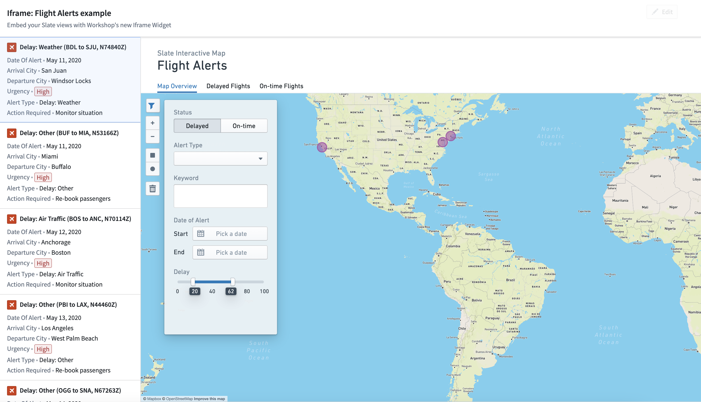

:::callout{theme="neutral"}
You will need to configure the [content security policy (CSP)](/docs/foundry/administration/embed-foundry-externally/#embed-external-resources-in-foundry) in order to iframe external resources in your Foundry environment. The external resource itself must also set a [frame-ancestors directive for the Content-Security-Policy header ↗](https://developer.mozilla.org/en-US/docs/Web/HTTP/Reference/Headers/Content-Security-Policy/frame-ancestors) that allows your Foundry URL to embed the resource. If you are using a URL external to your Foundry environment that makes requests to Foundry APIs, you must additionally configure [cross-origin resource sharing (CORS)](/docs/foundry/administration/configure-cors/).
:::

## URL

Input the URL for an application as a static string or a string variable.

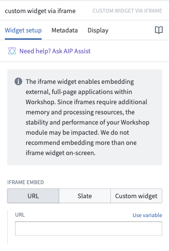

:::callout{theme="neutral"}
When embedding another Foundry application, you can hide the Foundry sidebar by adding the `embedded=true` URL query parameter.
:::

:::callout{theme="neutral"}
When pasting a standard YouTube URL (for example, `https://www.youtube.com/watch?v=VIDEO_ID`), Workshop will detect the URL format and offer a one-click option to convert it to the proper embedded format (`https://www.youtube.com/embed/VIDEO_ID`) required for display in an iframe.
:::

## Slate

The Slate configuration option allows you to embed a Slate application into your Workshop module. Parameters can be used to allow your embedded Slate application and the Workshop module to interact with each other.

The sections below provide details on how to embed a Slate application with the iframe widget.

### Slate source

The Slate source defines the method of referencing the Slate embedded within your module. You can choose to use a **Compass reference** or **Permalink** as your Slate source.

* **Compass reference:** Allows you to use a Foundry resource selector to choose a Slate application to embed.
* **Permalink:** Allows you to enter the permalink or RID of a Slate application to choose it to embed. You can find your Slate RID within your URL: `/workspace/slate/documents/<slate-permalink>/latest`.

### URL parameters

URL parameters append to your Slate URL and are used to set variables in Slate. Changing a URL parameter will cause the whole page to reload, so we recommend only using URL parameters for variables that rarely need to be modified. To reference a URL parameter in Slate, set up a variable with the same name as the URL parameter and reference it using handlebars: `{{username}}`. Note that static string URL parameters should be URI encoded as they are passed directly as URL parameters.

**Example:** Change the appearance of the embedded Slate application based on the user name and ID on load.

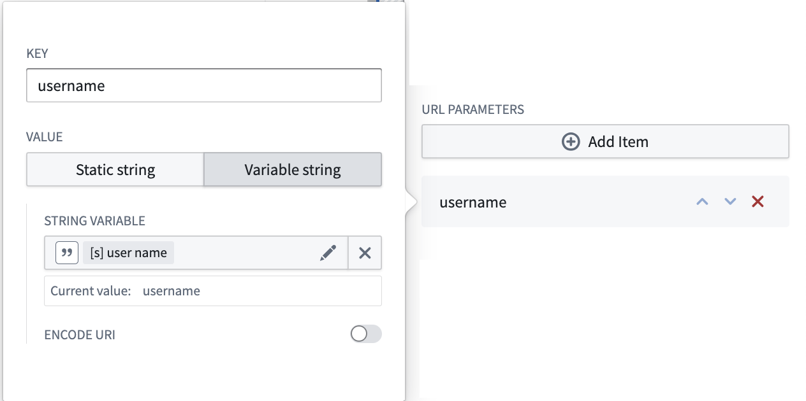


### Input parameters

Input parameters are passed into the embedded Slate application from the Workshop module. An input parameter is defined by its key and its value type. Static strings, string variables, numbers, and object sets can be passed to the embedded Slate application.

Within your Slate application, you can retrieve information from your Workshop module by using the `Slate.getMessage` event in the [Events panel](/docs/foundry/slate/concepts-events/) and the code example below as a reference. The `parameter_key` must match the key you defined in your iframe widget in Workshop.

```typescript
const payload = {{slEventValue}}
return payload["<parameter_key>"]
```

**Example:** Set a Workshop filter to adjust the view in your embedded Slate application.

```typescript
const payload = {{slEventValue}}
return payload["flight-alerts"]
```

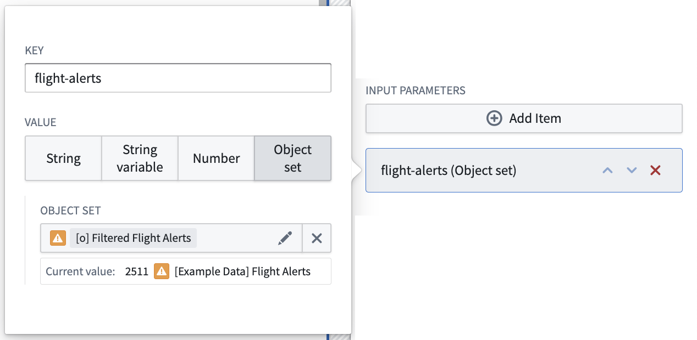

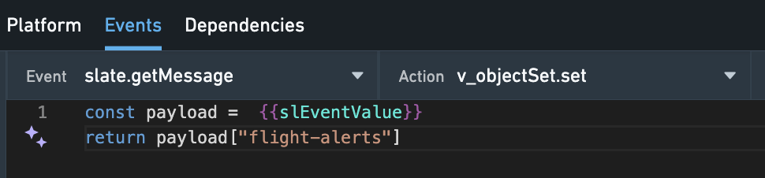

### Output parameters

Output parameters are passed into the Workshop module from the Slate embed. An output parameter is defined by its key and its value type. Object sets, object set filters, and string variables can be passed to the Workshop module. Within your Workshop module, you can retrieve information from your Slate application by assigning a Workshop variable to the parameter. Within your Slate application, you need to initiate the information transfer using the Slate.sendMessage event and the code snippet below. The parameter key in the code must match the key you defined in your Workshop widget.

```
return {
    type: "WORKSHOP//SET_OUTPUT_VALUE",
    outputParameterKey: "<parameter_key>",
    value: 
}
```

:::callout{theme="neutral"}
Certain JavaScript primitives will be mapped to the appropriate Workshop types when storing the value in a string variable. `undefined` will be mapped to `undefined` (effectively setting the variable back to its default value), and `null` will clear the string variable value.
:::

**Example:** Use the selection state from the embedded Slate application to change the filter set state in Workshop.

```
return {
    type: "WORKSHOP//SET_OUTPUT_VALUE",
    outputParameterKey: "selected-objects",
    value: {{f_selection}}
}
```

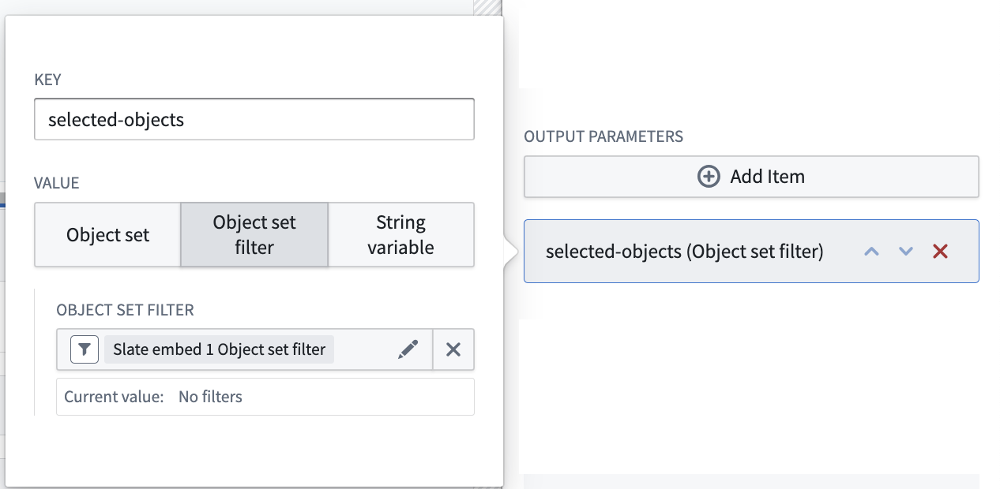

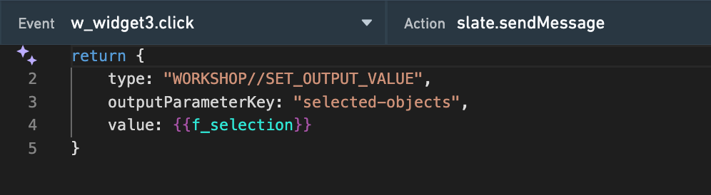

### Triggerable events

You can trigger any [Workshop event](/docs/foundry/workshop/concepts-events/) from Slate. A triggerable event is defined by its key and its event type. You can trigger events that open overlays, reset variables, and more.

Within your Workshop module, define the `event_key` and the event you want to trigger. Within your Slate application, use the `Slate.sendMessage` event in the Events panel and the code snippet below as a reference. The `event_key` must match the key defined in the iframe widget.

```
return {
    type: "WORKSHOP//TRIGGER_WORKSHOP_EVENT",
    eventKey: "<event_key>",
}
```

**Example:** Toggle a collapsible section in Workshop with a button click from Slate.

```
return {
    type: "WORKSHOP//TRIGGER_WORKSHOP_EVENT",
    eventKey: "<event_key>",
}
```

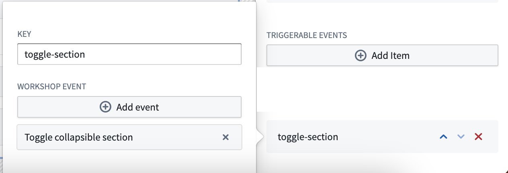

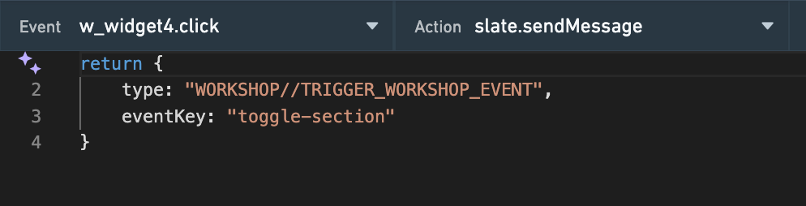

## Bidirectional

The bidirectional configuration option allows you to embed a custom-built application and enable bidirectional communication with Workshop using defined configuration fields. This enables the embedded application to act as if it were any other Workshop widget, with the ability to read from and write to Workshop variables, as well as execute Workshop events. In order to access the ontology in your application, use the [Ontology SDK](/docs/foundry/ontology-sdk/overview/).

### When to use

While Workshop has a [variety of available widgets](/docs/foundry/workshop/concepts-widgets/#types-of-widgets), some circumstances may require specific functionality beyond what is provided by Workshop's built-in widgets. This bidirectional widget option allows you to create your own applications, define configuration fields, and embed them in Workshop like any other widget.

### Configure bidirectional widgets

To enable bidirectional communication, you must configure the custom application's source code before iframing it as a bidirectional widget.

#### Step 1: Modify your custom application to communicate with Workshop

The communication between your custom application and Workshop is done using the npm package [@osdk/workshop-iframe-custom-widget ↗](https://www.npmjs.com/package/@osdk/workshop-iframe-custom-widget). Install the package to your custom application by using the following command:

```bash
npm i @osdk/workshop-iframe-custom-widget
```

This package provides the means to bidirectionally communicate with Workshop through the function `useWorkshopContext` which takes in the definition of the variables and events that your application wants to receive from Workshop, and returns a context object that has an interface to read from Workshop variable values, write to Workshop variable values, and execute Workshop events. Review the npm package page for [@osdk/workshop-iframe-custom-widget ↗](https://www.npmjs.com/package/@osdk/workshop-iframe-custom-widget) for details and further instructions.

#### Step 2: Configure the bidirectional widget

Once your application has been deployed with the changes to bidirectionally communicate with Workshop, add an **Iframe** widget to your Workshop module and select the **Bidirectional** option.

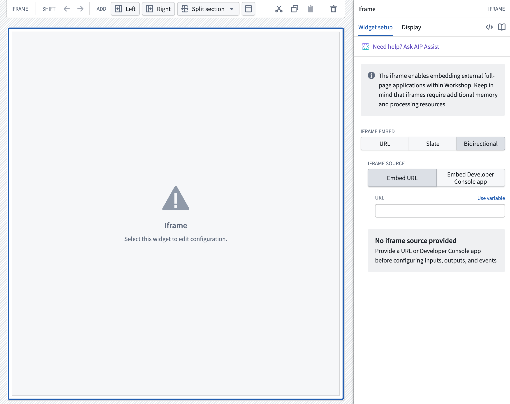

Input the URL of your application either as a static string or with a string variable. The widget's configuration panel will display a loading state while waiting to receive the definition of variables and events required by the embedded application.

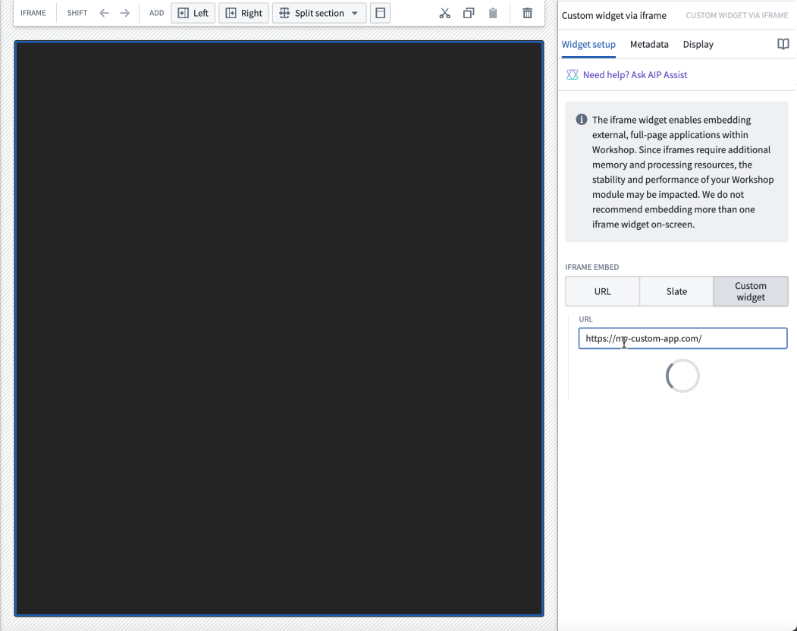

After receiving the definition of required variables and events, the widget's configuration panel will display variable pickers and event selectors for each variable and event requested, allowing each to be set.

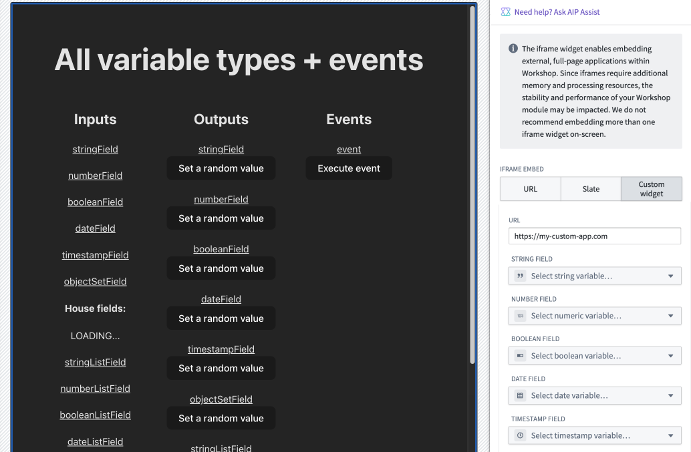

The value of the set Workshop variable will be sent to the custom application each time the value or loading state of the variable changes. The set events will determine what events can be executed from within the custom application.

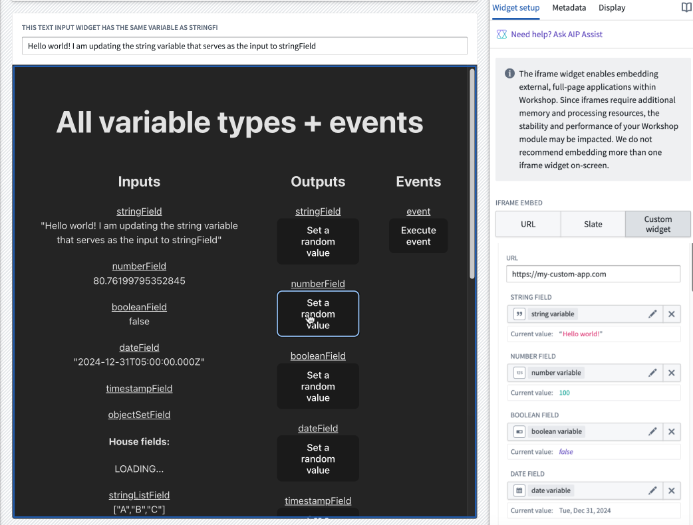

#### Example of a bidirectional widget

The screenshot below shows an example where a change to a variable's value in Workshop is immediately sent to and reflected within a custom application. The Workshop string variable is configured both as one of the variables within the custom application's definition and as the output of the [Text Input widget](/docs/foundry/workshop/widgets-text-input/). When a user enters text into the widget's input field (thus changing the string variable's value), the value is immediately passed to and reflected within the iframed application.

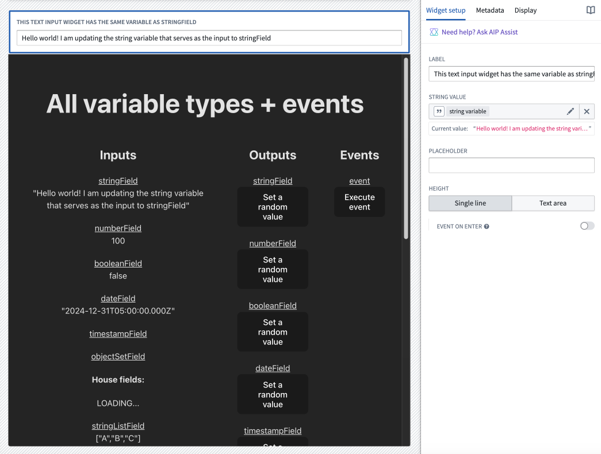

The screenshot below shows an example where a Workshop variable's value can be set by the iframed application. Selecting the **Set a random value** button for the `numberField` within the custom application will generate a numeric value and pass it to the number variable set within the iframe widget's configuration.


The screenshot below shows an example of a Workshop event being executed from within the iframed application. A **Toggle between light and dark mode** event has been set for the iframed application configuration. Selecting the **Execute event** button in the application will switch the module to light mode.

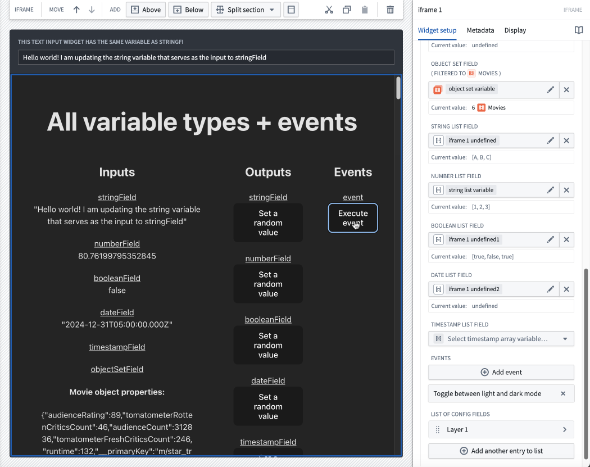

### Limitations

* Object set field definitions sent by the iframed application are specified with a single preset object type. When configuring the variable in Workshop, the object type that the variable is constrained to will be shown in the config panel for object set variables. If the Workshop object set variable contains objects that are not of the preset object type, the objects will be filtered out before being sent to the iframed application.

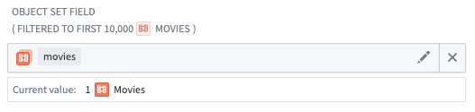

* Object Set variables are limited to 10,000 objects when sent to the iframed application. If you try to pass an Object Set variable from Workshop to the iframed app with more than 10,000 objects or attempt to set a Workshop variable with more than 10,000 objects from inside the iframed application, objects following the 10,000th object will be cut off, and not sent to the recipient.

* There is currently no support for struct variables.

* Iframes reload every time they are removed from the page and later displayed again, which discards any state held inside the iframe. To prevent the widget from resetting in this case, you can configure the widget's [display optimization](/docs/foundry/workshop/widget-display-optimization/) settings to keep it mounted, or store bidirectional widget data in Workshop variables that are passed to the widget.

## Local network access

By default, browser security policies restrict embedded applications from requesting `localhost` or other local network addresses. If your embedded application must communicate with local services, enable local network access.

To allow local network access, enable the **Allow local network access** option in the iframe widget configuration. When enabled, the iframe will include the `local-network` permission in its `allow` attribute, permitting the embedded application to make requests to localhost addresses.

:::callout{theme="warning"}
Enabling local network access allows the embedded application to communicate with services on the user's local machine. Enable this option only when necessary and when you trust the embedded application.
:::
