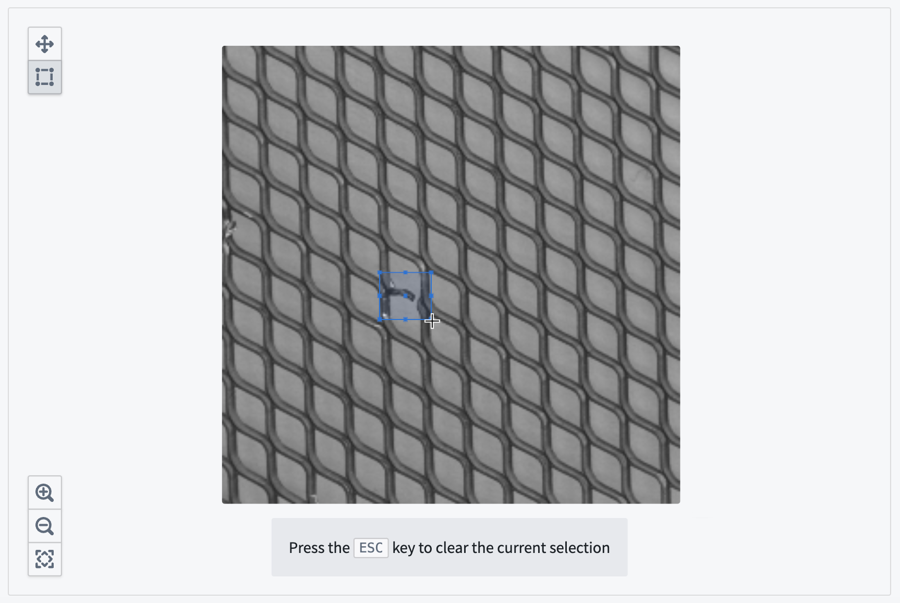
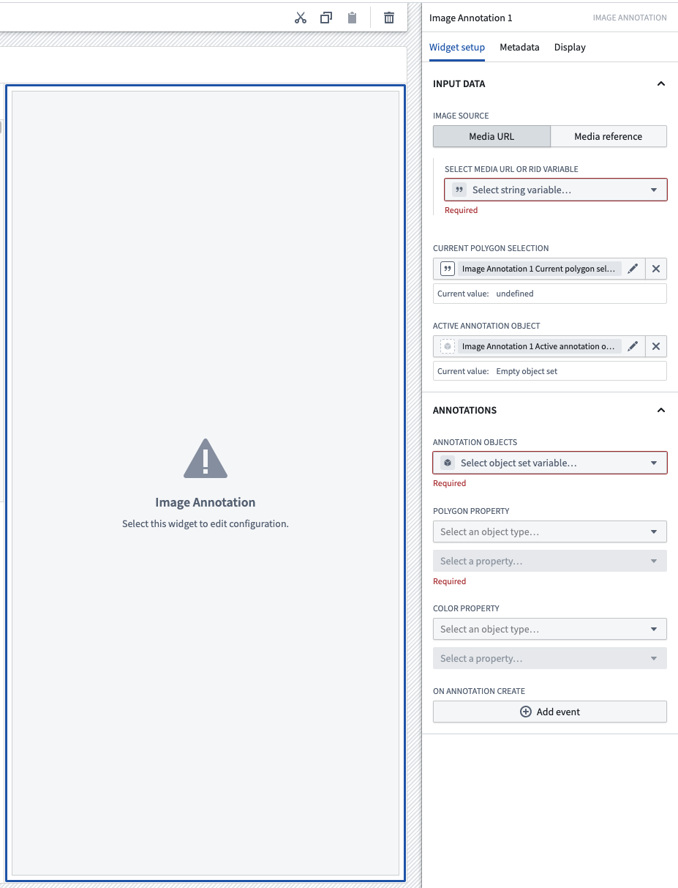

<!-- source: https://palantir.com/docs/foundry/workshop/widgets-image-annotation/ · mirrored 2026-08-18 from Palantir Foundry docs -->

# Image Annotation

The **Image Annotation** widget is used to annotate images by drawing rectangles around areas of interest.

The screenshot below shows an example of a configured **Image annotation** widget in the process of creating an annotation:

## Configuration options

Here is a screenshot of the initial state of a newly-added Image Annotation widget alongside its initial configuration panel:

* **Input data**
  * **Image source:** The image can be displayed from either a media URL or media reference. Currently this widget accepts the following image file types:
    * **Media URL:** Select a string variable with a valid media URL to render a preview of the media. If referencing a media URL from a dataset, the URL should be in either of the following format: `.png`, `.jpg`, `.jpeg`, `.bmp`, or `.webp`,
      * `https://{my-foundry-url}/foundry-data-proxy/api/web/dataproxy/datasets/{dataset rid}/transactions/{transaction rid}/{filename}`
      * `https://{my-foundry-url}/foundry-data-proxy/api/web/dataproxy/datasets/{dataset rid}/views/{branch name}/{filename}`.
      * Otherwise, if referencing an external media URL, configure access in your enrollment's [Content Security Policy](/docs/foundry/administration/embed-foundry-externally/) settings.
    * **Media reference:** Define an object set with a single object and select the [media reference](/docs/foundry/media-sets-advanced-formats/media-overview/#media-references) typed property to render a preview of the media for that object.
  * **Current bounding box selection:** A string variable that tracks the active bounding box selection coordinate stored as "x1, y1, x2, y2", where (x1, y1) are the pixel coordinates for the upper-left corner of the box, and (x2, y2) are the pixel coordinates for the lower-right corner of the box.
  * **Active annotation object:** The object representing the currently selected annotation.
* **Annotations**
  * **Annotation objects:** The object set representing the annotations to be superimposed on the image. Currently, up to 1000 annotations per image is supported.
  * **Bounding box property:** The annotation object set's string property that represents the point vector.
  * **Color property:** The annotation object set's string property that represents the color to be drawn as a hex code. This field is optional.
  * **On annotation create:** Enable module builders to configure Workshop events to trigger when an annotation is created by a user.
