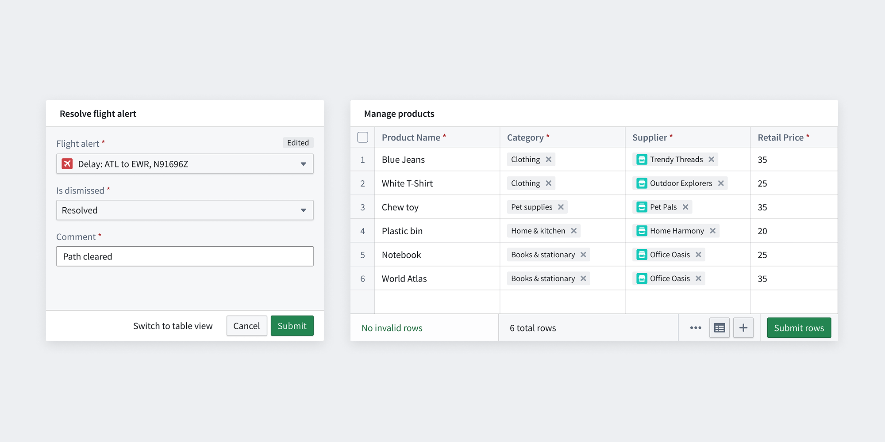
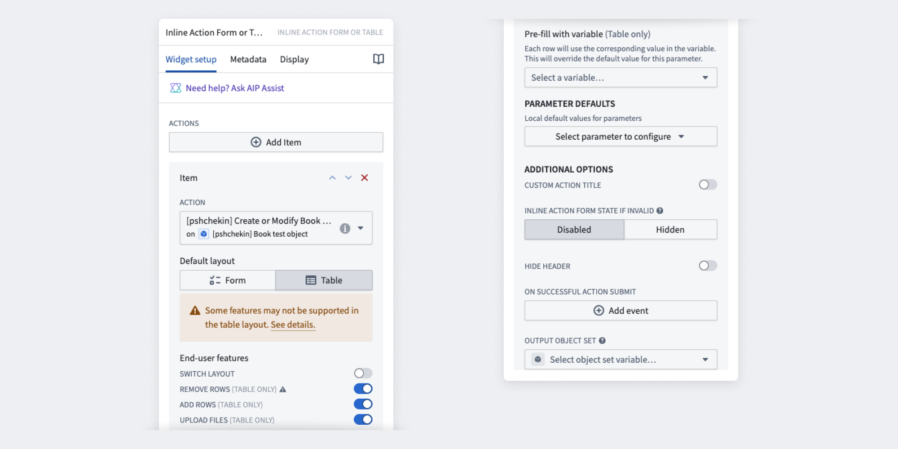

<!-- source: https://palantir.com/docs/foundry/workshop/widgets-inline-action-form/ · mirrored 2026-08-18 from Palantir Foundry docs -->

# Inline Action

The **Inline Action** widget enables users to interact with the Ontology to create, modify, or delete one or multiple objects or links. The widget supports both form and table interfaces, which can be configured in either Workshop or the Ontology Manager application. Both interfaces support extensive configuration options, including default values, constraints, and live validation with custom error messages to simplify troubleshooting. To configure the widget, users must have an existing action type in the Ontology with defined parameters, logic, and security. A single Inline Action widget can display multiple Actions simultaneously. Here are the key scenarios where you should use Inline Actions:

* To enable users to perform business operations or workflows directly from your app.
* To collect structured information from users.
* To standardize and control how actions are performed on objects, ensuring data integrity and auditability.

## Action form

Action forms trigger one Action at a time and are recommended for small-scale datasets where guided form interaction is desired. It is commonly used for performing an Action on a small number of objects, or running a Function that can compute a more complex set of edits from a small number of parameters. Common examples include inputting personal information, marking several tasks as completed, or running an LLM to extract information from uploaded media and save the results to the ontology.

## Action table (Action grid)

Action tables (previously known as Action grids) are recommended for large-scale datasets or when data is sourced from CSV files. They support live editing within your Workshop application. Common examples include managing warehouse inventory and performing bulk updates. The table layout offers several benefits, including keyboard navigation and CSV file upload capabilities.

:::callout
There may be some Actions that are not yet usable in the Table because some feature of the Action is only supported in the Form layout. Over time, these feature gaps will be removed.
:::

## Configuration

### Primary features

* **Select an Action:** Select **Add item** to include multiple actions, each requiring individual configuration. When multiple actions are implemented in the same widget frame, users will see a selection menu upfront.
* **Select default layout:** Choose between Action Table and Action Form based on your use case.
* **End-user features:** Configure additional user interactions, including layout switching, row management, and file uploads. Note that table layout may have limited configuration options; see the action type configuration page for details. Also note that batch call limits apply to the table layout, as well as the requirement that edits do not conflict.
* **Pre-fill with variable (table only):** Pre-populate table rows by mapping an object set variable to an object reference action parameter. The variable's object type must match the action parameter's defined object type.
* **Define parameter defaults (table and form):** Set local default values for parameters in the Inline Action view. If unspecified, the action type parameter configurations from the Ontology will apply.

### Additional features

* **Set custom Action title:** Customize the widget header by replacing the default title with your own text.
* **Inline Action form state if invalid:** Configure how the Action form appears when submission criteria are not met. Choose between `disabled` or `hidden` to either disable or hide invalid Actions.
* **Hide header:** Control the visibility of the Action header.
* **Apply to Scenario:** Applies the Action to a selected Scenario.
* **On successful action submit:** Configure a Workshop event to trigger after an Action is successfully submitted.
* **Output object set:** Specify the object set that will be created or modified when the Action is submitted.
