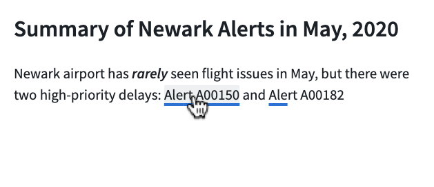
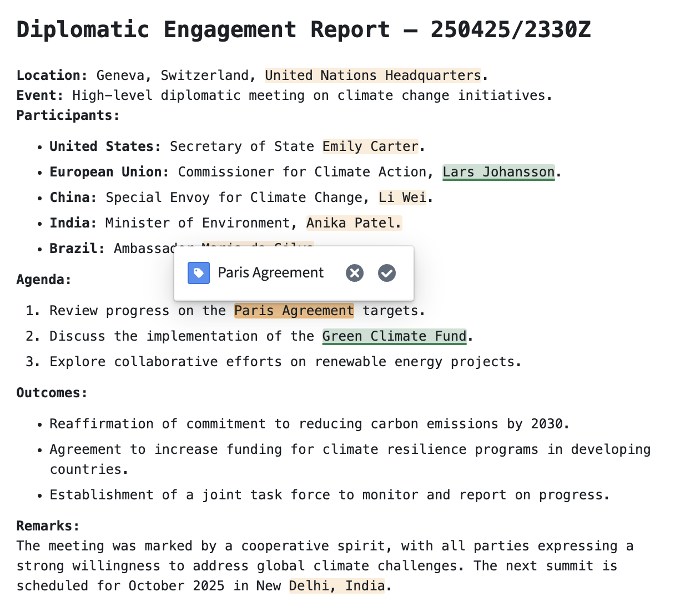
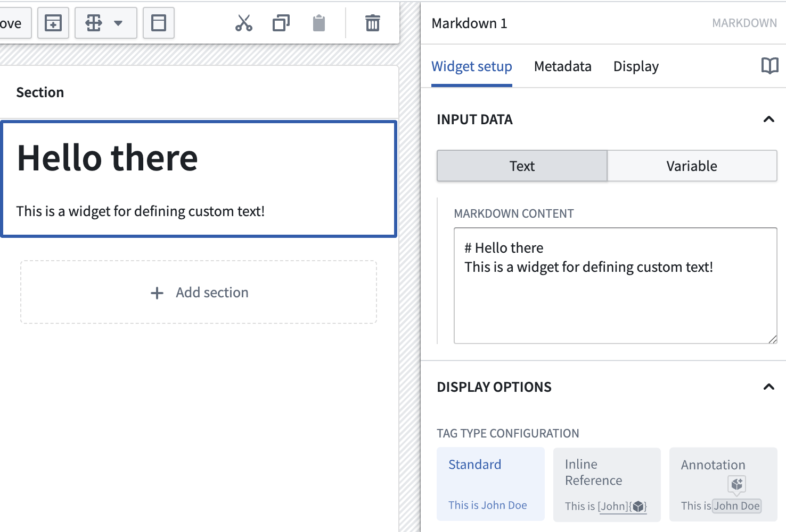
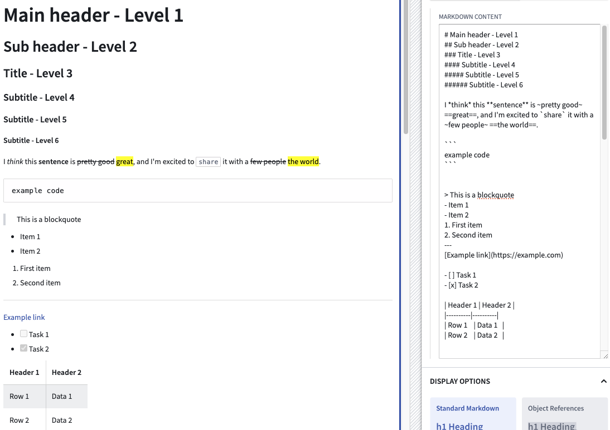
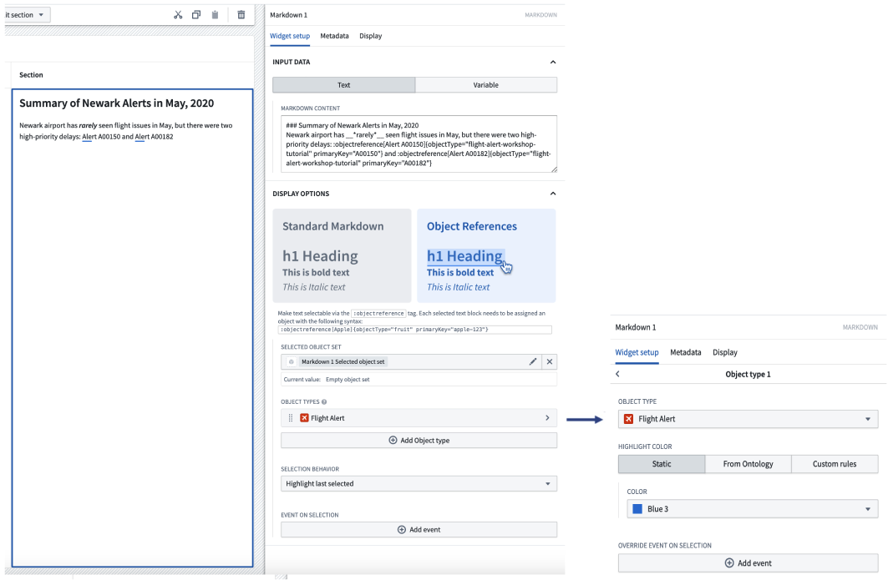
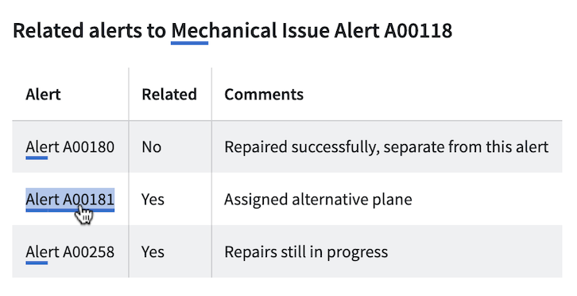
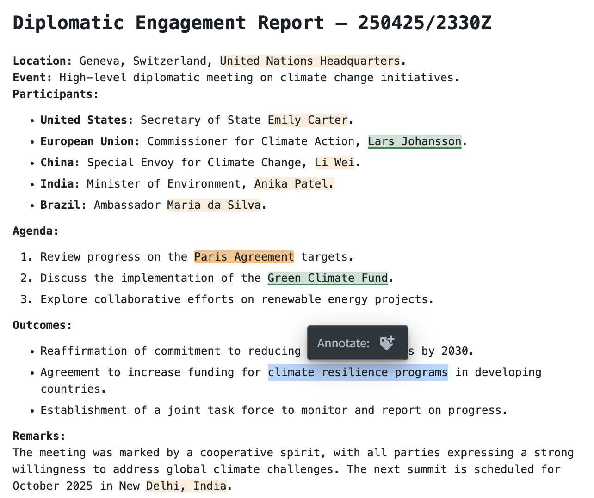

<!-- source: https://palantir.com/docs/foundry/workshop/widgets-markdown/ · mirrored 2026-08-18 from Palantir Foundry docs -->

# Markdown

The **Markdown** widget supports rendering text with Markdown formatting. Advanced functionality within the widget can be used to enable additional workflows such as attribution, citation, and user tagging on text.

Module builders configuring a Markdown widget can use the following features:

* Basic Markdown text formatting such as bold, italic, strikethrough, and highlighting
* More advanced Markdown formatting such as headers, tables, block styling, code styling, and URLs

The below screenshot shows an example of a configured Markdown widget including object references, where text anchors that have attached Ontology object references are shown underlined and are selectable:

* Embedded references from specific highlighted anchor text to Ontology objects
* Triggering on-click Workshop events from specific highlighted anchor text



The example below shows a configured Markdown widget displaying annotation objects with the following user interactions configured on the embedded objects:

* Display annotation objects on specific portions of text
* Trigger on-click Workshop actions and events from displayed annotation objects
* Create new annotation objects on specific portions of text



## Configuration options

The screenshot below shows the initial state of an unconfigured Markdown widget alongside its initial configuration panel.



For the Markdown widget, the core configuration options are the following:

* **Input data: Text/Variable**
  * **Text:** If the text option is chosen, a builder can directly enter the input Markdown text they'd like to display into the configuration panel.
  * **Variable:** If the variable option is chosen, a string variable can be chosen as the input Markdown text to be displayed.

* **Display options:**
  * **Tag type configuration**
    * **Standard:** By default this option is enabled and displays the input with standard Markdown formatting.
    * **Inline reference:** If enabled, allows references to Ontology objects and on-click Workshop events to be embedded in the text. This is a custom extension of the Markdown syntax; see the [inline references](#inline-references) section below for more information.
    * **Annotation:** If enabled, allows display of annotation objects embedded in the text, user interactions on existing annotation objects, and creation of new annotation objects using the widget. See the [annotations](#annotations) section below for more information.
  * **Enable monospace font:** Toggle to enable/disable displaying text in the widget in monospace font.
  * **Enable scrolling:** Toggle to enable/disable scrolling for the widget.
  * **Allow long word wrap:** Toggle to enable/disable wrapping of long, unbroken strings (such as long URLs) that exceed the width of the widget. When enabled, which is the default for new widgets, such strings break onto the next line instead of overflowing the widget.
  * **Break on newlines:** Toggle to control how single line breaks in the Markdown source are rendered. When enabled, which is the default for new widgets, a single newline in the source begins a new line in the rendered output. When disabled, single newlines are collapsed into spaces, following standard Markdown rendering.
  * **Text alignment:** Sets the alignment of the rendered Markdown content within the widget. Choose **Left** (the default), **Center**, or **Right**.

    :::callout{theme="neutral"}
    Explicit per-column alignment defined in Markdown table syntax (for example, `| :---: |`) takes precedence over the widget-level text alignment setting. Code blocks remain left-aligned and full-width regardless of the selected alignment.
    :::

* **User text selection:**
  * **Output user selected raw text:** Outputs the user selected text as a raw Markdown string.
    * **Selected text:** Outputted string variable containing user selected text as raw Markdown.
  * **Output user selected indices:** Outputs the starting and ending indices of the user selected text as numeric variables.
    * **Selection start index:** Numeric output variable containing the starting index of the user selected text.
    * **Selection end index:** Numeric output variable containing the ending index of the user selected text.

## Syntax examples

The following are some examples of supported Markdown syntax. Note that the highlight syntax `==text==` and tasklist are supported despite not being standard in typical Markdown implementations. A table showing supported Markdown syntaxes and their corresponding examples follows below.
Markdown supports subheaders ranging from level 1 to level 6.

| Syntax type         | Markdown syntax                                       |
|---------------------|-------------------------------------------------------|
| Main Header         | `# Main header`                                       |
| Subheader           | `### sub header`                                      |
| Italics             | `I *think* this`                                      |
| Bold                | `**sentence** is`                                     |
| Strikethrough       | `~pretty good~`                                       |
| Highlight           | `==great==`                                           |
| Inline Code         | `` `share` ``                                         |
| Code Block          | \`\`\` \n example code \n \`\`\`                      |
| Blockquote          | `> This is a blockquote`                              |
| Unordered List      | `- Item 1`<br>`- Item 2`                              |
| Ordered List        | `1. First item`<br>`2. Second item`                   |
| Horizontal Rule     | `---` or `***`                                        |
| Link                | `[title](https://palantir.com)`                        |
| Image               | ``|
| Task List           | `- [ ] Task 1`<br>`- [x] Task 2`                      |
| Table               | See below for syntax                                  |

Table Syntax Example

```markdown
| Header 1 | Header 2 |
|----------|----------|
| Row 1    | Data 1   |
| Row 2    | Data 2   |
```



## Object references in the Markdown widget

### Inline references

As an advanced feature, the Markdown widget allows builders to tag subsets of Markdown text ("anchors") and then use these anchors to link to specific Ontology objects and trigger Workshop on-click events.

The format for creating one of these anchors is as follows:

```
:objectreference[$text_to_display]{objectType="$object_type_id" primaryKey="$object_primary_key"}
```

Let's walk through an example where we're attempting to reference two Flight Alerts objects within a sentence. First, let's look at the desired end-state we'd like to appear on-screen for users. Note: each of the Flight Alert objects reference below is individually selectable by a user and will then become the output selected object set of the Markdown widget.



To achieve the above, the backing Markdown input is the following:

`Newark airport has __*rarely*__ seen flight issues in May, but there were two high-priority delays: :objectreference[Alert A00150]{objectType="flight-alert" primaryKey="A00150"} and :objectreference[Alert A00182]{objectType="flight-alert" primaryKey="A00182"}`

Beyond the syntax describe above for the Markdown input, builders can also configure the following options for object references:

* **Selected object set:** Required for using object references. This is the output object set of the Markdown widget. When a user selects an object reference within the Markdown widget, that object will be output into this object set variable.
* **Object types:** Required for using object references. Builder should select all object types which will be referenced within the Markdown widget. Once an object type is added, builders can additional configured conditional formatting rules within the inner configuration panel. If an object type is referenced in the Markdown widget but not configured in this list, the object reference will not appear in the Markdown widget.
  * **Object type:** Specify the object type to configure further color and event options.
  * **Highlight color:** Select a static color, inherit colors from a property with Ontology formatting, or define custom rules to determine color.
  * **Override event on selection:** Configure Workshop events to trigger for the specified object type. These will override any other event on selection.
* **Selection behavior:** Controls the selection behavior within the Markdown widget.
  * If **No highlight** is chosen, selecting an object reference within the Markdown widget will not result in a selection state.
  * If **Highlight last selected** is chosen, selecting an object reference within the Markdown widget will result in the most recently selected anchor text being highlighted.
  * If **Highlight selected reference** is chosen, highlighting within the Markdown widget is based on the contents of the selected object set. This option works best when object references in the Markdown are 1:1 with the objects from another widget, and the selected object set of both widgets are the same.
* **Event on selection:** This option enables module builders to configure Workshop events to trigger when an object reference is selected in the Markdown widget (for example, causing a drawer with a more detailed object view to appear).

Object references in Markdown can also have standard Markdown formatting applied. The screenshot below contains a variety of examples of Markdown formatting, such as headings and tables embedded with objects.



### Annotations

The **Annotation** option can be used to display annotation objects on text using the Markdown widget. This option also allows users to interact with text within the widget by creating new annotation objects on selected portions of text, or running actions and events on the displayed annotation objects.



Annotation objects capture selected text using zero-indexed numeric indices, with an inclusive start index and an exclusive end index, to represent the text selection's start and end positions. Markdown widget annotations currently do not support negative indices.

Upon selection of the **Annotation** option, the following configuration will be available:

* **Display existing annotations**
  Configure separate annotation object layers to display various annotations within the widget.
  * **Annotation inputs**
    * **Name:** Set the name for the annotation layer in the widget configuration.
    * **Annotation object set:** Specify the object set containing annotation object types to be displayed.
    * **Start index:** Set the numeric object property representing the inclusive starting index for an annotation.
    * **End index:** Set the numeric object property representing the exclusive ending index for an annotation.
  * **Existing annotation interaction**
    * **Selected annotation:** Object set containing the currently selected annotation object.
    * **On select event:** Set event(s) to be triggered on selection of an annotation object.
    * **Properties to display in tooltip:** Specify object properties to be displayed in the on-hover tooltip of an annotation object.
    * **On hover interactions:** Configure on-hover interactions such as actions and events, which will be displayed in the on-hover tooltip of an annotation object.
      * **Icon:** Set the icon displayed for an on-hover interaction.
      * **Title:** Set the title displayed for an on-hover interaction. The title appears when hovering over the interaction icon.
      * **Interaction:** Configure an action or event that can be triggered on the annotation object.
        * **Hovered object:** A special action parameter value that can be used to reference the hovered annotation object.
  * **Annotation display options**
    * **Highlight color:** Set the color used to display the annotation. A custom color may be statically defined or conditional formatting rules may be set.
    * **Annotation formatting:** Set how annotations are displayed. Options include colored highlighting, underlining using a solid or dashed line, or both highlighting and underlining for an annotation.
* **Create annotations via actions or events:**
  Configure actions or events to create new annotation objects when text is highlighted within the widget.
  * **Icon:** Set the icon displayed on text highlighting.
  * **Title:** Set the title displayed on text highlighting. The title appears on hover over the icon.
  * **Interaction:** Configure an action or event which can be triggered on the highlighted text.
    * **Highlighted text:** A special action parameter value that can be used to reference text highlighted within the widget.

## Limitations

The Markdown widget does not support rendering HTML. HTML provided to the Markdown widget will be rendered as text.
