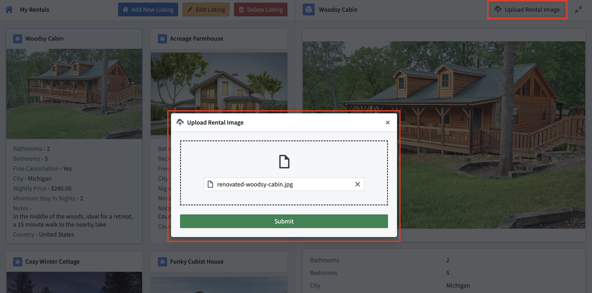

<!-- source: https://palantir.com/docs/foundry/workshop/widgets-media-uploader/ · mirrored 2026-08-18 from Palantir Foundry docs -->

# Media Uploader widget

The Media Uploader widget is used to add a special type of button that allows users to upload media files to Foundry and trigger [actions](/docs/foundry/ontology/overview/) using the uploaded files as inputs. On desktop, you can select files from your computer. On mobile devices, you can also choose images from your device's gallery or capture photos directly using the device's camera.

## Configuration options

* **Button configuration**
  * **Text:** Sets the display text for the button.
  * **Intent:** Sets the button's intent coloring. Options include none, primary (blue), success (green), warning (amber), or danger (red).
  * **Left icon:** This parameter controls the icon to the left of a widget's display text. Set to Blank to not show an icon.
  * **Right icon:** This parameter controls the icon to the right of the widget's display text. Set to Blank to not show an icon.

* **Upload**
  * **Destination:** Sets the upload destination for media files uploaded using this widget. The upload destination can be set to a [dataset](/docs/foundry/data-integration/datasets/), a Compass folder, or a [media set](/docs/foundry/data-integration/media-sets/).
    * **Static:** Statically set the file upload destination by selecting a destination folder using the Compass resource selector.
    * **Dynamic:** Dynamically set the file upload destination’s resource identifier (RID) using a Workshop string variable.
    * **Override branch:** Toggle to enable/disable the ability to upload media files to a specified [branch](/docs/foundry/data-integration/branching/) using a Workshop string variable.
  * **Allowed file extensions:** Set the allowed file extensions that may be uploaded.

:::callout{theme="neutral"}
The Media Uploader widget automatically generates filenames for uploaded files. Custom filenames are not supported.
:::

* **Output**
  * **Legacy**
    * **Upload media RID:** A string variable that outputs the RID for uploaded media.
    * **Uploaded filename:** A string variable that outputs the filename for uploaded media.
    * **On upload:** An action can be triggered on upload by selecting the `Action` option. When the `Action` option is selected, you must select the relevant action type and configure parameters for the corresponding action form. `No Action` is set on upload by default.
  * **Objects**
    * **Enable multi-file upload:** Toggle to enable/disable the ability to upload multiple files in a single upload. When enabled, you can set a maximum number of files allowed for each upload session.
    * **Action:** Set an action to trigger on media upload. If multi-file uploads are enabled, the action will be triggered on each uploaded file. The uploaded file may be referenced when configuring action parameters by selecting the special 'File identifier' value.
      * For uploads to datasets, the ‘File identifier’ value will be the uploaded filename. For uploads to Compass folders, the ‘File identifier’ value will be the uploaded file’s RID. For uploads to media sets, the ‘File identifier’ value will be the uploaded file’s media reference.
