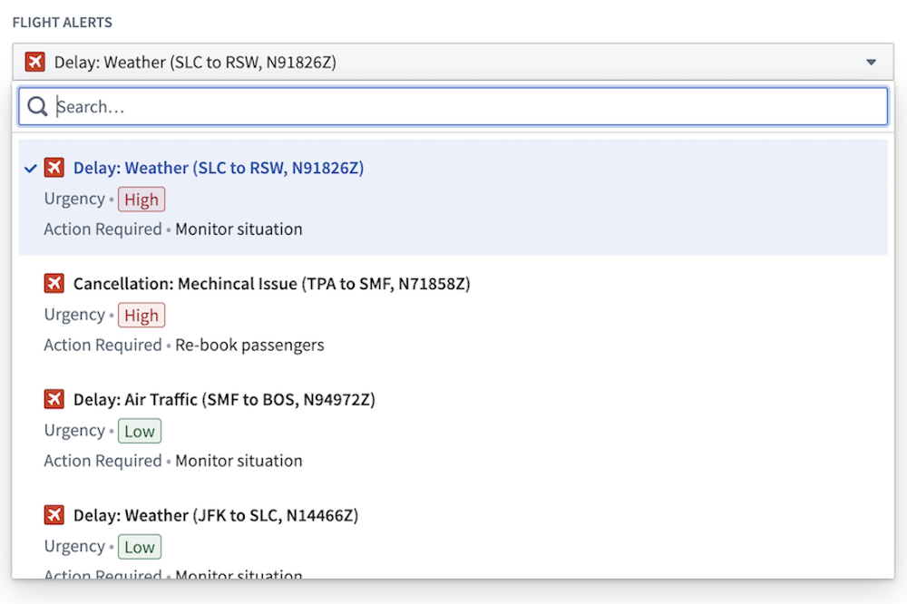
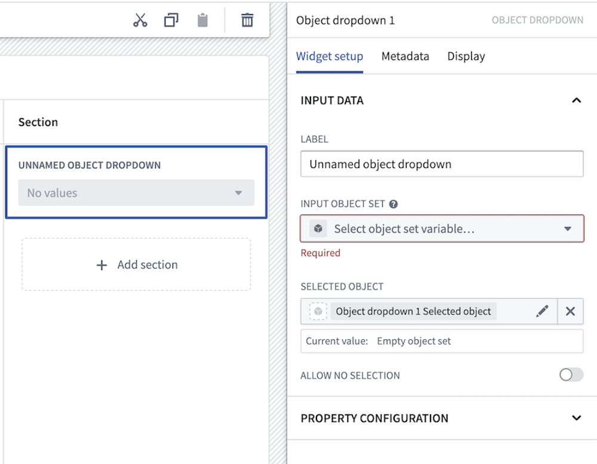

<!-- source: https://palantir.com/docs/foundry/workshop/widgets-object-dropdown/ · mirrored 2026-08-18 from Palantir Foundry docs -->

# Object Dropdown

The **Object Dropdown** widget is used to select a single object from a list of objects. Module builders can use the Object Dropdown widget to do the following:

* Display data on one or multiple object types.
* Choose which property types are displayed.
* Set the sorting criteria.
* Display conditional formatting and numerical formatting options configured in Ontology Manager.
* Hide null properties on a per object basis to produce a more compact display.
* Set which properties can be searched on.
* Allow no selection from the list.

The screenshot below shows an example of a configured Object Dropdown widget displaying `Flight Alert` objects:

## Configuration options

The example below shows the initial state of a newly added Object Dropdown widget next to the configuration panel:

The following core configuration options are available for the Object Dropdown widget:

* **Input data**
  * **Label:** Set an optional label for the Object Dropdown widget. This text is displayed across the top of the widget.
  * **Input object set:** This input variable determines the data that will be displayed in the widget. A module builder can either reuse an existing object set variable created elsewhere in the module or define a new object set variable inline. Many of the other configuration options shown below will only be configurable once this object set parameter has been populated.
  * **Selected object:** This is an output variable for the widget that outputs a single object set of the currently selected object. This object set can be used in downstream widgets within the current module.
  * **Allow no selection:** If enabled, the widget will be allowed to have no object selected.
* **Property configuration**
  * **Add property:** Select a property to display beneath the object title.
  * **Hide null properties:** If enabled, null properties will be hidden on a per object basis within the list.
  * **Sort items by:** Specify the order in which objects are sorted in the dropdown widget. If multiple object types exist in the object set, only shared properties can be sorted on.
  * **Search items by:** Specify which object properties search is performed on.
    * **On-screen properties:** If enabled, search will be performed on all string properties that are displayed in the dropdown widget.
    * **Specific properties:** If enabled, search will be performed on the specified string properties.
    * **All searchable properties:** If enabled, search will be performed on all searchable properties in the object set.
