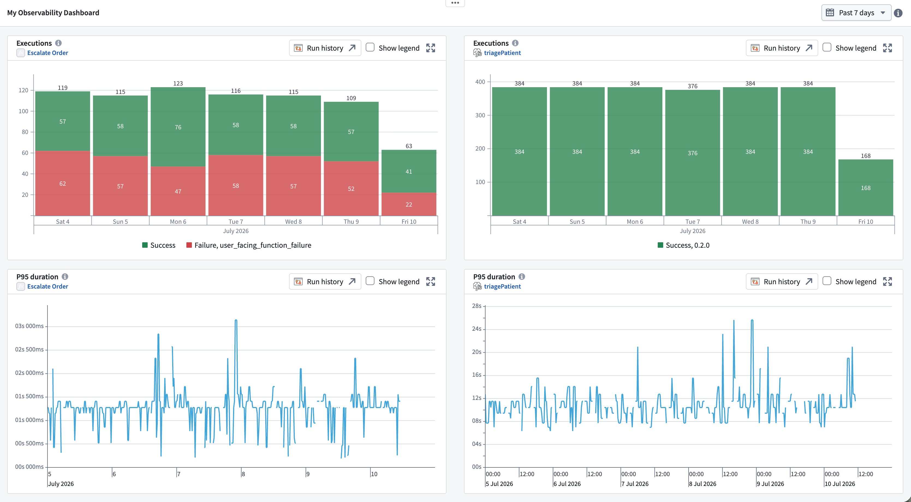
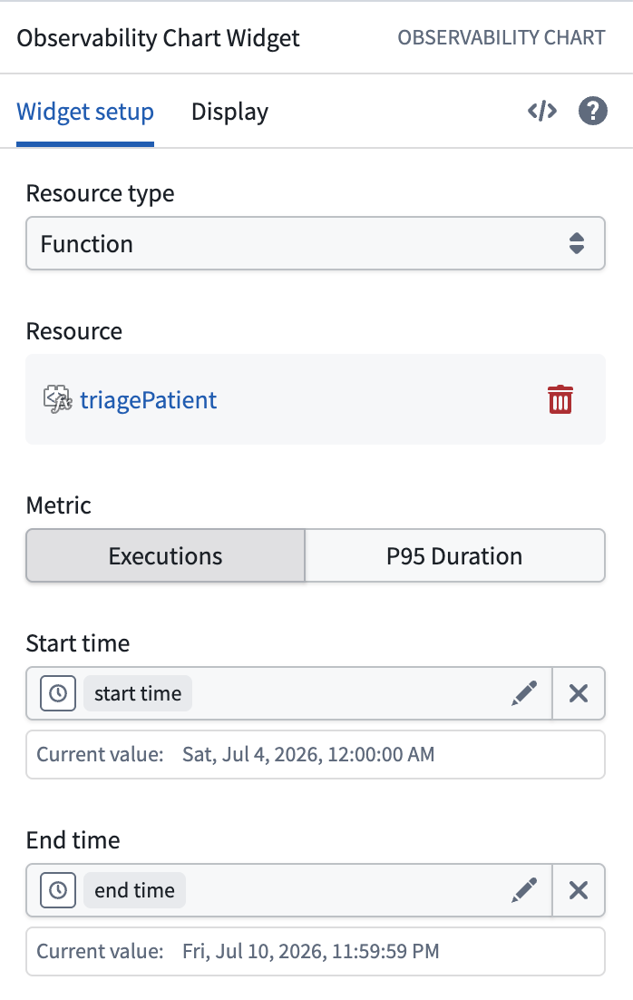

<!-- source: https://palantir.com/docs/foundry/workshop/widgets-observability-chart/ · mirrored 2026-08-18 from Palantir Foundry docs -->

# Observability Chart

The **Observability Chart** widget plots platform telemetry for a single resource over time, directly inside a Workshop application. You can use this widget to embed live operational metrics—such as execution counts, latency, and compute utilization—alongside the rest of your workflow, so that operators can spot trends, anomalies, and performance shifts for the entire workflow at a glance.

Module builders configuring an Observability Chart widget can:

* Chart metrics for a **function**, **action**, or **compute module**.
* Choose which metric to plot for the selected resource (for example, executions or P95 duration for a function).
* Derive the visible time range from Workshop variables, and let users brush a range directly on the chart to update those variables.
* Expand a chart for a closer look, or view it in [Workflow Lineage](/docs/foundry/workflow-lineage/overview/) to debug the underlying executions.

The screenshot below shows an [observability dashboard](/docs/foundry/observability/dashboards/) built from several Observability Chart widgets: the execution counts and P95 duration for an **Escalate Order** action, alongside the same metrics for a `triagePatient` function. A single time range control at the top of the module drives all four charts.

The metrics shown here are the same near real-time metrics surfaced elsewhere in the platform—see [AIP observability metrics](/docs/foundry/aip-observability/metrics/) for more details. The Observability Chart widget lets you embed those metrics in a purpose-built Workshop application.

## Configuration options

The widget setup panel is shown below, configured to plot executions for a `triagePatient` function over a variable-backed time range.

### Resource type

Select the type of resource whose metrics you want to plot. The remaining configuration options depend on this selection. Supported resource types are:

* **Function**
* **Action**
* **Compute module**

### Resource

Choose the specific resource—the function, action type, or compute module—to chart. Only one resource can be plotted per widget; add multiple Observability Chart widgets to compare several resources side by side.

### Metric

Select which metric to plot for the chosen resource. The available metrics depend on the resource type:

* **Functions** and **actions:**
  * **Executions:** Success and failure counts over time.
  * **P95 Duration:** The 95th-percentile execution duration over time.
* **Compute modules:**
  * **CPU:** CPU utilization over time.
  * **Memory:** Memory usage over time.

### Time range

The visible time window is controlled by two timestamp variables:

* **Start time**
* **End time**

Back these options with Workshop [variables](/docs/foundry/workshop/concepts-variables/) to control the range shown, for example, from a [Date/Time Picker](/docs/foundry/workshop/widgets-date-time-picker/) elsewhere in the module. These variables are also widget outputs. When a user selects a range directly on the chart, the widget writes the new bounds back to the **Start time** and **End time** variables. This lets you zoom the chart interactively and drive other widgets from the selected range.

## Interactivity

* **Range selection:** Dragging to select a range on the chart updates the **Start time** and **End time** variables, which zooms the chart and can filter or update any other widgets bound to those variables.
* **Show legend:** Toggle a legend that labels each series in the chart.
* **Expand:** Expand a chart into a larger dialog for closer inspection.
* **Run history:** Select **Run history** to open the resource's [run history](/docs/foundry/aip-observability/run-history/) in Workflow Lineage and investigate the individual executions, logs, and traces behind the metric.

## Availability

Telemetry is only available while the underlying resource is reporting metrics. If the resource cannot be found, or a compute module is not currently running or has no active session, the widget displays a message in place of the chart rather than an empty plot.

## Related documentation

* [Observability overview](/docs/foundry/observability/overview/)
* [Data Health](/docs/foundry/observability/data-health/)
* [AIP observability metrics](/docs/foundry/aip-observability/metrics/)
* [Metric Card widget](/docs/foundry/workshop/widgets-metric-card/)
