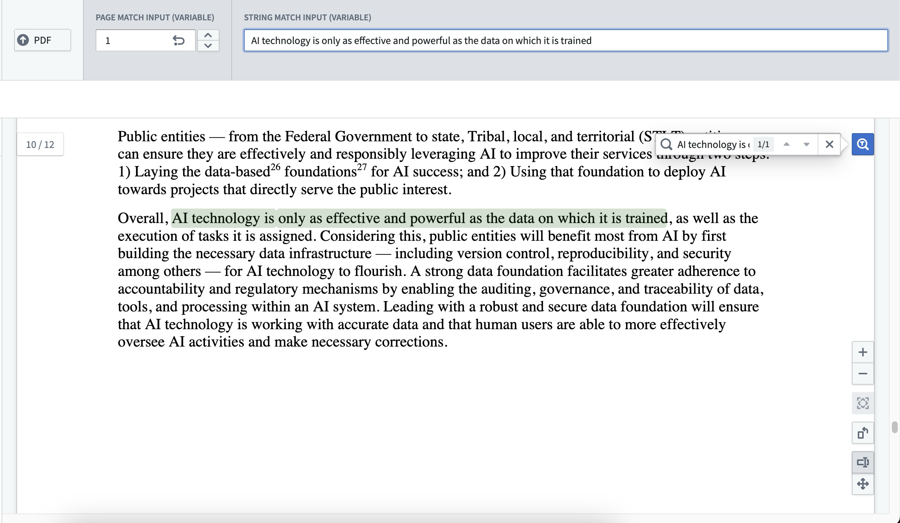
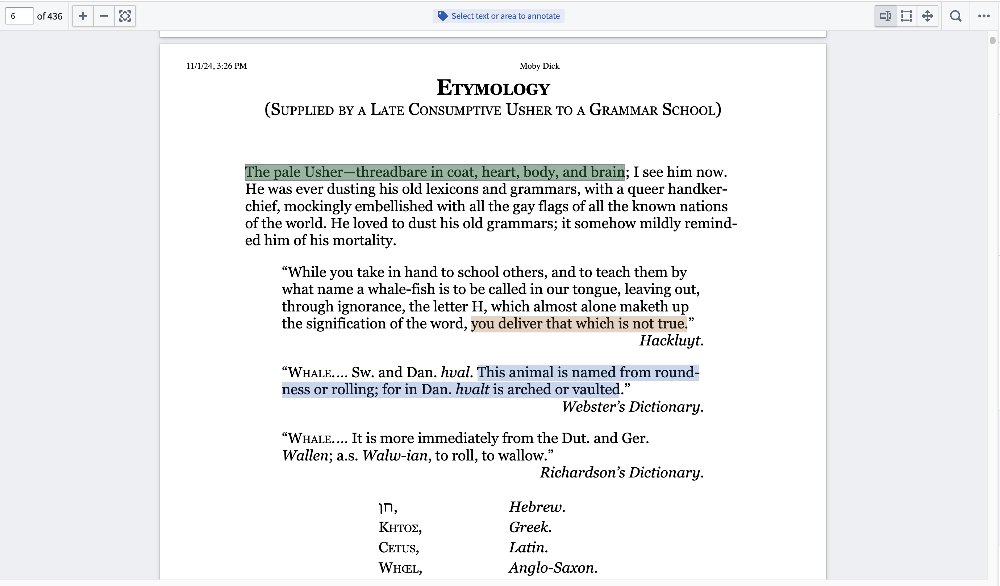
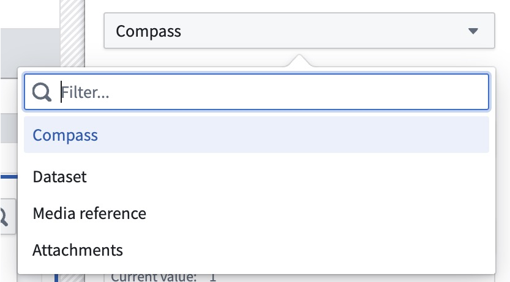
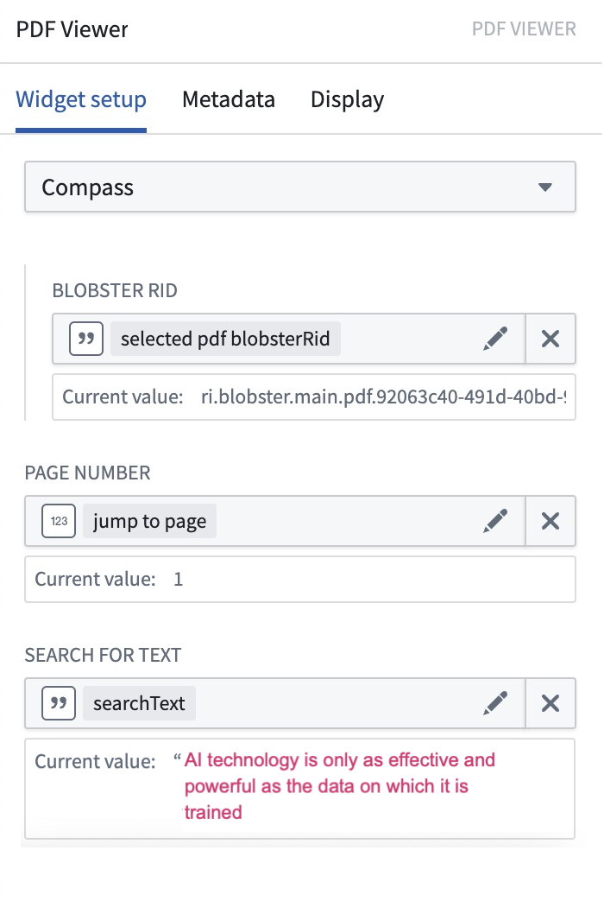

<!-- source: https://palantir.com/docs/foundry/workshop/widgets-pdf-viewer/ · mirrored 2026-08-18 from Palantir Foundry docs -->

# PDF Viewer

The PDF Viewer widget supports basic capabilities such as keyword search with text highlighting and auto-scroll on match, as well as more complex capabilities such as the ability to display, create, and interact with text and area annotations, enabling user tagging workflows.

The capability provides many enhanced functionalities including, but not limited to, the following:

* Accepting string variables for keyword matches throughout the document.
* Built-in search functionality for keyword matches provided by user.
* Match highlighting (green for current match; purple for others) and hit count display.
* Snaps to first result and between other hits.
* Supports [MediaReferences (media sets)](/docs/foundry/media-sets-advanced-formats/media-overview/#media-references).
* Displaying existing annotation objects.
* Creating annotations through configured actions.
* Customizable annotation interactions including events on selection, property display tooltips, and custom color highlighting.

## Configuration options

The widget configuration supports several media input sources along with variable inputs for page numbers and text. The variable page number input will navigate users to the specified page within the PDF. The configured text input will be populated into the search bar, and a keyword search will be executed against that term. Even without configuring the widget, you can still manually enter any search term in the PDF view. To begin configuring annotations on the PDF document, select the **Enable annotation** option and refer to the **Configure annotations** section.

* **Configure PDF sourcing options:**
  * Select the desired media source to populate the widget with a PDF. The dropdown will provide a list of supported media sources available to you. Currently supported media sources are Compass, datasets, media references, and attachments. Once the media source is selected, configuration for that media source will be available. Example media sources may include:
    * **Compass:** Uses the Palantir file system as a media source for PDFs. When selecting this option, provide the following:
      * **Blobster RID:** A string variable to specify the Blobster RID for the desired PDF.
    * **Dataset:** Uses a dataset as a media source for PDFs. When selecting this option, provide the following:
      * **Dataset RID:** A string variable to specify the RID of the dataset that contains the desired PDF.
      * **File Path:** A string variable to specify the file path within the dataset of the desired PDF.
      * **Branch:** A string variable to specify the branchID for the dataset. If no branch is specified, this will default to the `master` branch.
    * **Media reference:** Define an object set with a single object and select the [media reference](/docs/foundry/media-sets-advanced-formats/media-overview/#media-references) typed property for the PDF.
      * **Object set with a single object:** An object set variable for the desired PDF. The object set selected must contain a single object.
      * **Property:** The desired media reference typed property from the selected object set for the desired PDF.
    * **Attachments:** Define an object set with a single object and select the attachment property as a media source for PDFs. When selecting this option, provide the following:
      * **Object set with a single object:** An object set variable for the desired PDF. The object set selected must contain a single object.
      * **Property:** The desired attachment property from the selected object set for the desired PDF.

* **Configure input variables:**
  * **Customize page number:** Toggle to enable/disable using a numeric variable to capture the page number a user is currently on and/or change the current page being displayed by the widget.
  * **Customize initial search:** Toggle to enable/disable using a string variable to prepopulate the keyword used to search within the widget.

* **Configure annotations:**
  * **Display existing annotations:** A single annotation object set may be configured per layer. To enable annotations, at least one layer must be added and configured. Each layer has the following configurable fields:
    * **Annotation layer name:** Sets the name for the annotation layer. Note that this name field is only displayed within the widget's configuration panel.

    * **Object set:** Input the annotation object set to be displayed within the layer.

    * **Page property:** Select the integer object property specifying which page of the PDF the annotation object is on.

    * **Bounding box(es) property:** Select the string array object property specifying the coordinates of the bounding box(es) of the annotation object. Each string element in the array should be a stringified JSON object representing the top left (x1, y1) and bottom right (x2, y2) corners of the bounding box.
      * An array is required because annotations can have multiple bounding boxes. For example, three lines of text would require three bounding boxes, one for each line. A valid bounding box property may look like \[ "{"x1":0.0, "y1":2.5, "x2":50.0, "y2":10.1}", "{"x1":2.0, "y1":12, "x2":35.0, "y2":14.2}" ].

    * **Selected annotations:** Select an object set to use both as the input for what annotation objects should be initially selected and as the output containing the currently selected annotation(s) on the document.

    * **On select event:** Configure Workshop events to trigger on selection of an annotation.

    * **Properties to display in tooltip:** Add properties to be displayed in the tooltip popover when an annotation in this layer is selected.

    * **Edit or delete existing annotations (via Actions):** Configure annotation layer Actions that appear in the tooltip popover of annotation objects.
      * **Action icon:** Choose an icon to represent this action in the popover. If no icon is set, a pencil icon will be used by default.
      * **Action label:** Set the display name for the action that will display on hover for action icons in the popover and the action form header.
      * **Action on annotation:** Set an action that can be triggered from the popover. The hovered object may be referenced using the `Hovered object` variable. For more information on actions, review our [action type documentation](/docs/foundry/action-types/overview/).

    * **Highlight color:**
      * **Static:** Set a static color to be used for the display of all annotations within the layer.
      * **Color property:** Set a string object property specifying the highlight coloring for annotations within the layer. The string property must be formatted as a color hex code (for example, "#FBD065"). If the string property does not contain a valid hex code, then the highlight coloring will default to GOLD5 (#FBD065).
      * **Custom rules:** Specify conditional formatting rules to dictate the highlight coloring for annotations within the layer. If no configured conditional formatting rules are met, the color highlighting for an annotation will default to GOLD5 (#FBD065).

    * **Display text in highlight:** Select a property from the annotation object to display its value as text directly within the highlighted region on the document. When configured, annotations show the property value inside the highlighted area rather than displaying only a colored rectangle.
  * **Create annotations (via Actions or events):** Configure Actions or events to run on new text and/or area selections.
    * **Action or event icon:** Choose an icon that will represent this action in the action popover when a new selection is made.
    * **Action or event label:** This label will show as a tooltip when hovering over an action in the action popover. If no icon is set for this action, this label will be displayed in the action popover.
    * **Use for selection type:** Specify whether this action should show up in the action popover for text selections, area selections, or both.
    * **Action or event:** Set an action or event that can be triggered from the action popover.
      * When configuring action parameters, data from the current text or area selection may be referenced using special parameter values:
        * **Page number:** The page number of the document of the current text or area selection. This option may be selected for integer parameters.
        * **Selection coordinates:** The array of strings representing the bounding box(es) of the current text or area selection. This option may be selected for string array parameters.
        * **Highlighted text:** The string content of the selection for text selections. Note that for area selections, the value will be an empty string. This option may be selected for string parameters.
  * **Scroll to an annotation:** Toggle to enable/disable automatically scrolling to an object in the annotation object set. This enables automatic scrolling to the annotations of your choice.

* **Configure more options:**
  * **Output user selected text:** Toggle to enable/disable capturing a user’s text selections in a string variable as output from the widget.
  * **Output user selected coordinates:** Toggle to enable/disable capturing a user's selection coordinates in a string array variable as output from the widget.
  * **Output user selected page number:** Toggle to enable/disable capturing the page number that a user has made a selection on in a numeric variable as output from the widget.
  * **Enable PDF downloads:** Toggle to enable/disable a user's ability to download the PDF displayed in the widget.

:::callout{theme="neutral"}
When annotation layers are configured, exporting a PDF with annotations can only be done via the built-in download functionality in the PDF Viewer widget. Triggering an annotation-inclusive PDF export from a separate custom button outside of the widget is not supported.
:::
