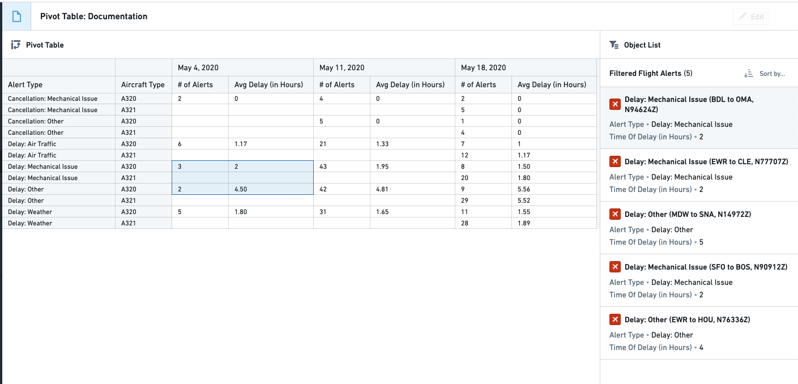
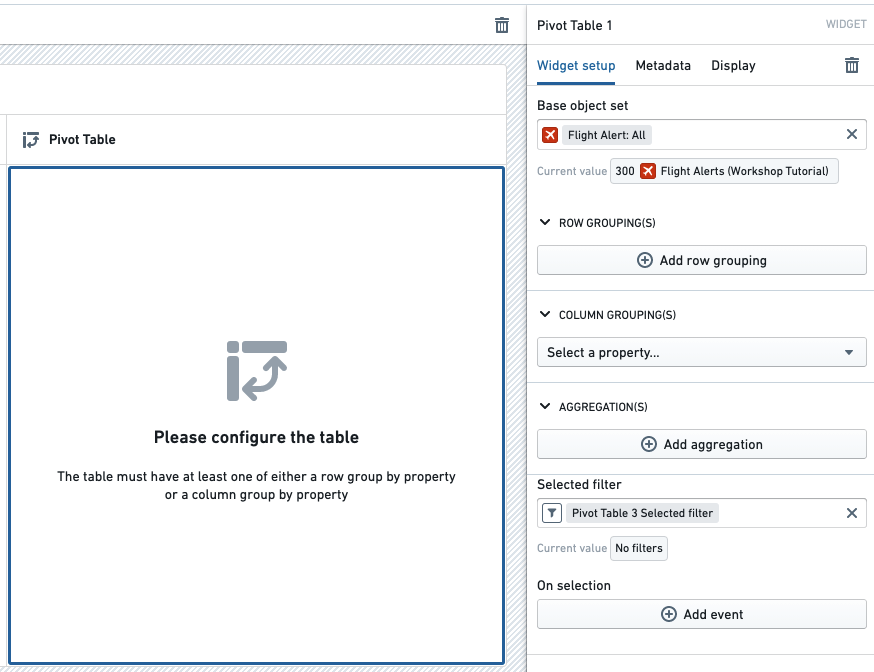
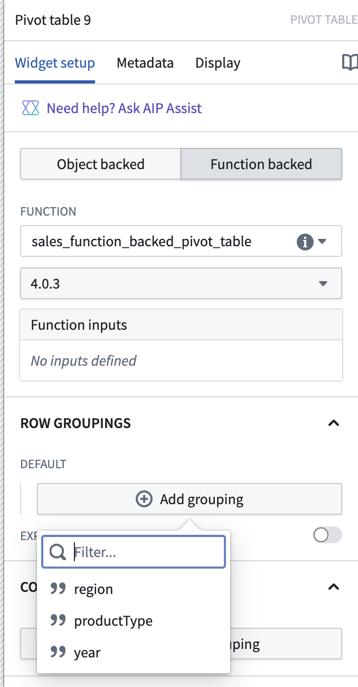
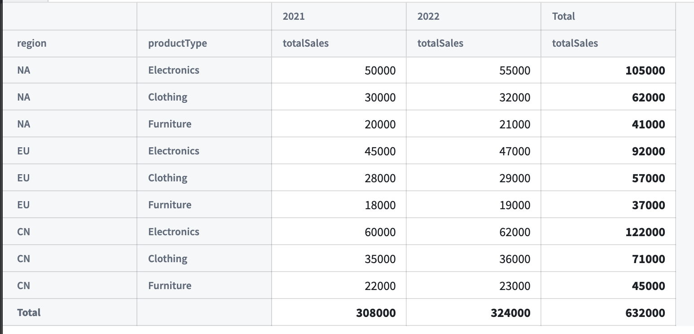
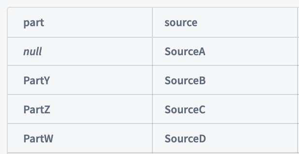
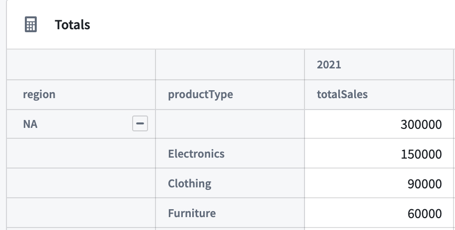
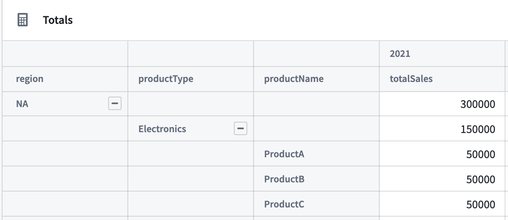
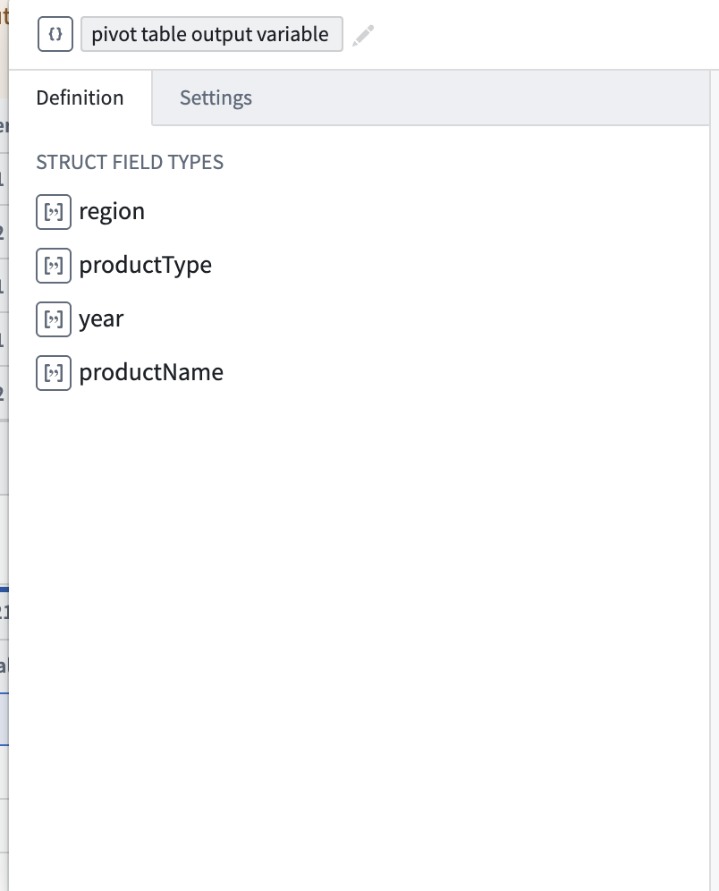
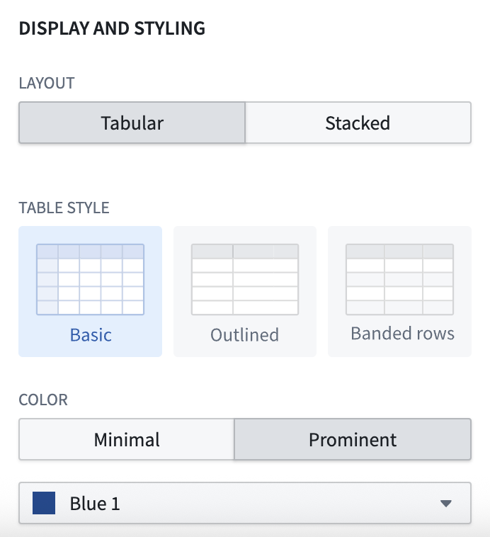

<!-- source: https://palantir.com/docs/foundry/workshop/widgets-pivot-table/ · mirrored 2026-08-18 from Palantir Foundry docs -->

# Pivot Table

The **Pivot Table** widget enables the dynamic grouping and aggregation of object data and then displays this aggregated data in tabular form. Module builders configuring a Pivot Table widget can use features including:

* Row-level grouping of data by one or more property types.
* Column-level grouping of data by up to one property type.
* Dynamic grouping of date and timestamp property types by date, week, month, and year.
* Sorting by both row-level and column-level groupings.
* Aggregations by count, cardinality, average, max, min, and sum.
* Cell, row, and column-level selection to enable downstream filtering on selected group-by buckets.

The example below shows a configured Pivot Table widget displaying `Flight Alerts` data and filtering a downstream **Object list** widget:



## Configuration options

When configuring a pivot table, builders can either derive data from objects or function output.

### Object-backed pivot tables

The example below shows the initial state of an object-backed pivot table before configuration. The widget's configuration panel shows the initial input **Base object set** set to `Flight Alert: All`.



The Pivot Table widget has the following core configuration options:

* **Base object set:** This parameter determines the Objects data passed into the Pivot Table and accepts an object set variable as input. Note that the Pivot Table only supports object set variables of a single object type.
* **Row grouping(s):** The following options allow one or more row-level groupings to be added.
  * **Add row grouping:** Adds a row grouping by the selected property type.
  * **Column width:** Within each row grouping, adjusts the default column width for the grouping property type. Dashboard viewers can also resize row grouping columns at runtime by dragging the column borders.
  * **Time interval:** Within each row grouping for a date or timestamp property type, configures the bucketing time interval (such as exact date/time, week, month).
  * **Show totals:** Adds a **Total** row grouping to the bottom of the table. When multiple aggregations are used to calculate the column value, the **Total** value is the result of applying the same aggregations on the sum of original values of the property.
    * **Disclaimer:** The value that will appear in the `Total` row will be the result of performing the multi-step aggregation on all the raw values of the objects *before* each aggregation.
  * **Sort rows:** Enables sorting on one or more of the configured row grouping properties.

:::callout{theme="neutral"}
The Pivot Table widget supports a maximum of seven row groupings. If you need to work with more groupings, consider adding hidden groupings to your table configuration. This approach allows users to swap between hidden groupings in the UI, effectively managing more groupings than the limit while maintaining performance.
:::

* **Column grouping:** The following options allow up to one column-level grouping to be added.
  * **Select a property:** Adds a column grouping by the selected property type.
  * **Time interval:** Within each column grouping for a date or timestamp property type, configures the bucketing time interval (such as exact date/time, week, month).
  * **Show totals?:** Adds a **Total** column grouping to the right side of the table.
  * **Sort values:** Toggles sorting of column grouping values by ascending or descending order.
* **Aggregations:** The following options control the aggregations displayed with the cells of the table.
  * **Add aggregation:** Allows a new aggregation on a property type or overall object count to be added.
  * **Aggregation placement:** Toggles whether aggregations are placed on columns or rows. The default behavior places aggregations on columns.
  * **Aggregation title:** Clicking into an aggregation's title allows that title to be edited. The title chosen for each metric will appear on the table as a column header.
  * **Aggregation metric:** Controls how a given aggregation is calculated. Options include average, max, min, sum, count, or cardinality.
  * **Column width:** Adjusts the column width for a given aggregation.
* **Selected filter:** This output object set filter variable captures the grouping criteria of user-selected cells and can be used to filter downstream widgets and object set variables. Users can select individual cells, groups of cells, or entire rows or columns.
* **On selection:** Allows **Workshop events** (e.g. opening a drawer within the current module) to be triggered when a user selects something within the table. For more details, see the [Workshop events documentation](/docs/foundry/workshop/concepts-events/).

### Keyboard shortcuts

The Pivot Table widget supports the following keyboard shortcuts for working with selected cells:

* **Copy to clipboard:** Use `Cmd+C` (macOS) or `Ctrl+C` (Windows) to copy the selected cells as tab-separated values. The output includes row groupings, aggregation values, or both, depending on the selection.
* **Refine selection:** Use `Shift+Left` and `Shift+Right` to refine your selection between full rows, row groupings only, and aggregation values only.

### Function-backed pivot tables

A function-backed pivot table derives its data from the output of a [function](/docs/foundry/workshop/functions-overview/).

This approach is useful for the following use cases:

* Transforming or apply custom aggregations to your data before displaying it.
* Combining data from multiple sources.
* Applying complex business logic to your data.

#### Prerequisites

* Your function must output an array of [structs](/docs/foundry/workshop/struct-variables/).
* Each struct must include a field named `values`, which holds the pivot table values.

#### Basic structure

:::callout{theme="neutral"}
TypeScript V1 and TypeScript V2 use the same implementation for function-backed pivot tables. The following patterns and examples apply to both versions.
:::

Below is an example of a TypeScript interface that can be used for a function-backed pivot table.

In this interface:

* `region`, `productType`, `productName`, and `year` are fields used for grouping.
* `totalSales` and `estimatedSales` are the values displayed in the pivot table cells.

```typescript
interface SalesData {
    region?: string;
    year?: string;
    productType?: string;
    productName?: string;

    // Values object containing the metrics
    values: {
        totalSales: Integer;
        estimatedSales: Integer;
    }
};

@Function()
public sales_function_backed_pivot_table(): SalesData[] {
    // Your implementation here
    ...
};
```

#### Configuration

After selecting a function in the dropdown, builders can choose:

1. **Group-by fields:** These determine how the data is organized in rows and columns.
2. **Value fields:** These determine what metrics are displayed in the cells.
3. **Expandable rows:** Fields that can be expanded to show more detailed data.



Once configured, the pivot table will render with the data returned from your function:



#### Totals

Function-backed pivot tables support displaying totals. To render a total, return a struct in your list that follows the guidelines below. For the examples below, assume that `region` and `productType` are the row grouping fields and `year` is the column grouping field.

**Row totals:** To represent a sum of all rows (row total), omit the row grouping fields in the data point.

**Example:** A data point representing the total for 2021:

```js
{
    year: "2021";
    values: {
        totalSales: 622000;
        estimatedSales: 57000;
    }
};
```

**Column totals:** To represent a sum of all columns (column total), omit the column grouping fields in the data point.

**Example:** A data point representing the total for `EU` and `Clothing`:

```js
{
    region: "EU";
    productType: "Clothing";
    values: {
        totalSales: 57000;
        estimatedSales: 57000;
    }
}
```

**Grand totals:** To represent a grand total, omit all grouping fields.

```js
{
    values: {
        totalSales: 3147000;
        estimatedSales: 3160000;
    }
}
```

#### Null buckets

Null buckets are useful for representing missing or undefined data.

To create a null bucket:

1. Return `undefined` for the bucket's value.
2. Ensure that your interface supports undefined fields.

:::callout{theme="warning"}
Avoid using empty strings (`''`) for null or missing values in grouping fields. Workshop interprets empty strings as if the field is omitted, causing records with empty strings to roll up into subtotal rows rather than appear as individual grouping rows. Always use `undefined` for true null buckets.
:::

Below is an example:

```typescript
interface SiteData {
    site?: string;
    part?: string | undefined;  // Note the explicit undefined type
    values: {
        quantity: Double;
    }
}
```

```js
{
    "part": undefined,
    "source": "SourceA",
    "values": {
        "quantity": 100
    }
}
```



:::callout{theme="neutral"}
Omitting a field is different from passing `undefined`. Omitting a field creates a total, while `undefined` creates a null bucket.
:::

#### Expandable rows

Expandable rows allow users to drill down into more detailed data.

To implement expandable rows:

1. Add row fields to the **Expandable rows** section in the configuration options.
2. Structure your data to support different levels of expansion.

Considering the following interface, we would select `productName` and `productType` as our expandable rows in the configuration options:

```typescript
interface SalesData {
    region: string;
    year: string;
    productType?: string;
    productName?: string;
    values: {
        totalSales: Integer;
        estimatedSales: Integer;
    }
};
```

Below are examples of three levels of expansion:

1. **No expansion:** `region` level only.

```json
[
    {
        "region": "NA",
        "year": "2021",
        "values": {
            "totalSales": 30000
        }
    }
]
```

2. **First-level expansion:** `region` and `productType`.

```json
[
    {
        "region": "NA",
        "year": "2021",
        "productType": "Clothing",
        "values": {
            "totalSales": 90000
        }
    },
    {
        "region": "NA",
        "year": "2021",
        "productType": "Electronics",
        "values": {
            "totalSales": 150000
        }
    },
    {
        "region": "NA",
        "year": "2021",
        "productType": "Furniture",
        "values": {
            "totalSales": 60000
        }
    }
]
```



3. **Second-level expansion:** `region`, `productType`, and `productName`.

```json
[
    {
        "region": "NA",
        "year": "2021",
        "productType": "Electronics",
        "productName": "ProductA",
        "values": {
            "totalSales": 5000
        }
    },
    {
        "region": "NA",
        "year": "2021",
        "productType": "Electronics",
        "productName": "ProductB",
        "values": {
            "totalSales": 5000
        }
    },
    {
        "region": "NA",
        "year": "2021",
        "productType": "Electronics",
        "productName": "ProductC",
        "values": {
            "totalSales": 5000
        }
    }
]
```



#### Selection

The output selection of a function-backed pivot table can be written to a [struct variable](/docs/foundry/workshop/struct-variables/). The struct fields are derived from the function's output.



### Display and styling



The Pivot Table widget has the following display and styling options:

* **Layout:** Configures the pivot table's view based on a user's preference.
  * **Tabular:** Default pivot table view.
  * **Stacked:** Provides a more compact view by merging all row groupings into a single column.
    * **Customize stacked groupby label:** Enable to rename the groupby column.
* **Fill Width:** When enabled, the pivot table expands to fill the available space within its parent container, automatically adjusting when container dimensions change.
* **Table style:** Provides three options for pivot table cell and border styles.
  * **Basic:** Default pivot table styling.
  * **Outlined:** Adds a darker outline above and below each top-level row grouping.
  * **Banded rows:** Adds a darker outline above and below each top-level row grouping and additionally adds a light grey background to each alternating row in the table.
* **Color:** Customizes the color of the pivot table header. If the **Basic** table style is selected, a lighter shade of the selected color will be applied to the background of the row grouping column.
  * **Minimal:** Displays a lighter shade of selected color in the pivot table header.
  * **Prominent:** Displays the selected color as is in the pivot table header.
