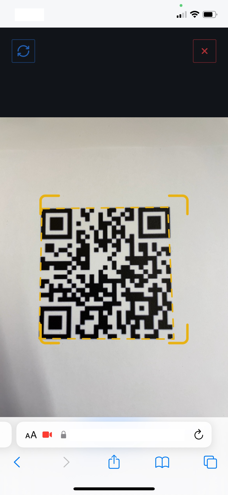

<!-- source: https://palantir.com/docs/foundry/workshop/widgets-qr-reader/ · mirrored 2026-08-18 from Palantir Foundry docs -->

# Widget: QR Code Reader

The **QR Code Reader** widget provides a configurable button for scanning QR codes or barcodes with a system camera:

When users select the button, the system prompts them to grant camera access. They can then scan one or more codes in a full-screen camera view:

The widget stores scanned data in a Workshop [variable](/docs/foundry/workshop/concepts-variables/). You can display the data in a Markdown widget, use it to look up objects through an Object Set variable, or use it to populate an Action form input.

## Configuration options

Below are the core configuration options for the QR Code Reader:

* **Code Scanner Type:** Configures whether the widget scans QR codes or barcodes.
  * **QR Code Scanner:** Scans standard QR codes.
  * **Barcode Scanner:** Scans barcodes. When this option is selected, you can configure which barcode formats to support using the **Barcode Formats** dropdown menu. Available formats include PDF417 and other common barcode types.
* **Single or multiple code:** Configures whether the widget scans the first code it sees, or allows users to scan multiple codes in a row. If multiple code mode is selected, then the scanned data will be output as a string array variable. If single code is selected, then the scanned data is a string variable.
* **Should prompt user before scanning:** When enabled, the user will be prompted to select a **Scan code** button to confirm that a code should be scanned. When disabled, any detected code will be scanned immediately.
* **Button configuration:** Configuration options for the button used to open the full-screen code reader. This is identical to the configuration for an individual button in the [Button Group Widget](/docs/foundry/workshop/widgets-button-group/).
