<!-- source: https://palantir.com/docs/foundry/workshop/widgets-resource-list/ · mirrored 2026-08-18 from Palantir Foundry docs -->

# Resource List

The **Resource List** widget is used to display various types of Foundry resources:

## Files and Projects resources

This type of list is used to display collections of Files and Projects resources, either fixed statically or generated dynamically for every user viewing the widget, in accordance with existing Files and Projects hierarchy and permissions.

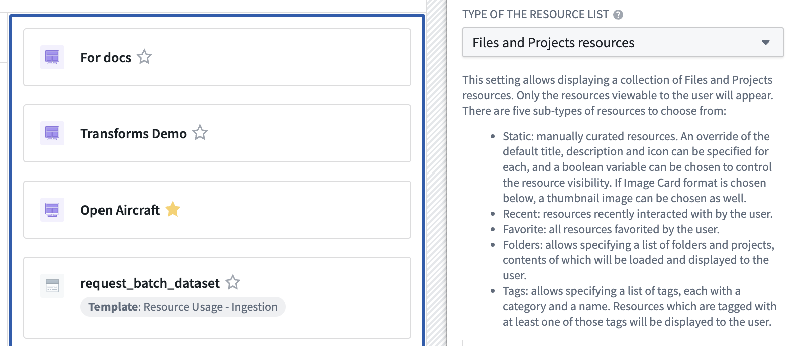

When the **Files and Projects resources** option is chosen from the **Type of the Resource list** dropdown menu in the widget's configuration, you can also select a subtype of resources using the **Content of the Resource list** menu:

* Static: users can manually define a list of resources to display in the list.
* Dynamic:
  * Recent: resources that have been recently interacted with by the user.
  * Favorite: resources that have been favorited by the user.
  * Folders: resources located in a list of projects and/or folders specified by the user.
  * Tags: users can specify a list of tags so that resources that have one of these tags will be displayed.

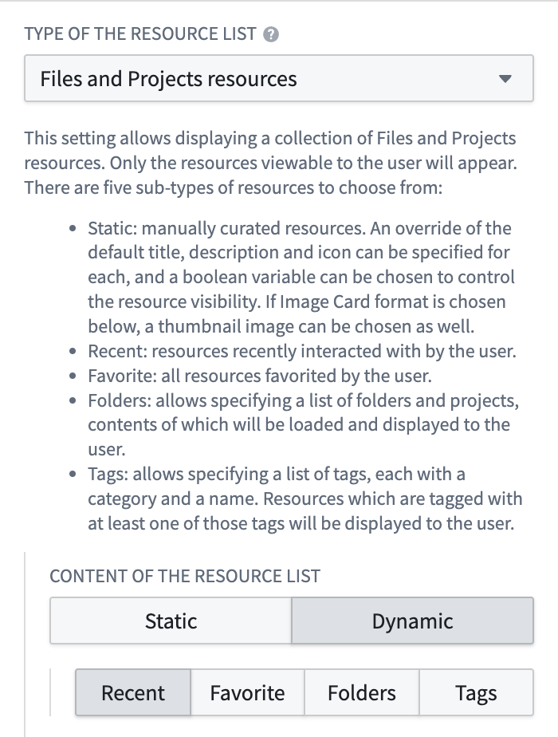

## Object types

This type of list is used to display collections of object types, either fixed statically or generated dynamically for every user viewing the widget, in accordance with existing Ontology permissions and settings.

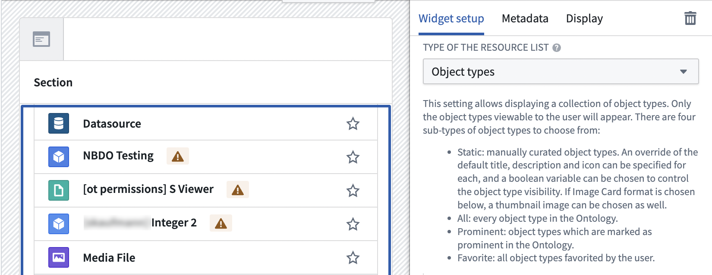

When the **Object types** option is chosen, you can choose one the following subtypes from the **Content of the Object type list** menu:

* Static: users can manually define a list of object type resources to be displayed.
* Dynamic:
  * All: every object type visible to the user in the Ontology.
  * Prominent: object types that are visible to the user that have been marked as prominent.
  * Favorite: object types that have been favorited by the user.

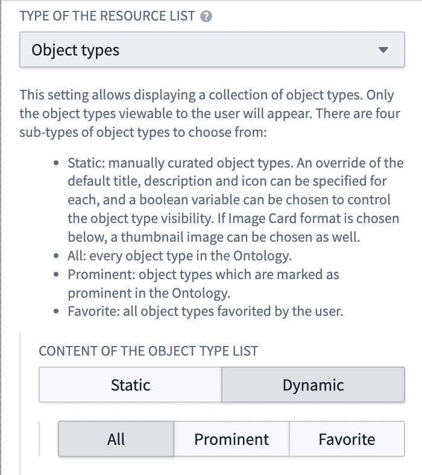

## Object sets

This type of list is used to display a statically fixed collection of object sets, where each item is backed by a [Workshop object set variable](/docs/foundry/workshop/concepts-variables/). To create an Object set list, choose the **Object sets** option from the top-level dropdown in the widget's configuration.

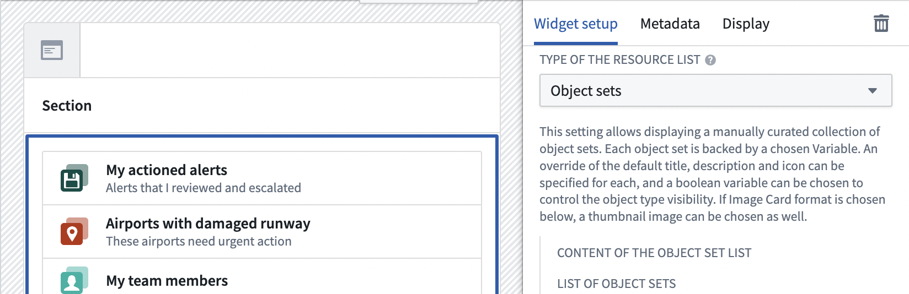

Below is an example of a module that contains multiple Resource lists. Files and Projects resources are located on the top of the module displayed horizontally. Below them, the section titled **Your favorite object types** contains object types, and the column next to the object types contains object sets.

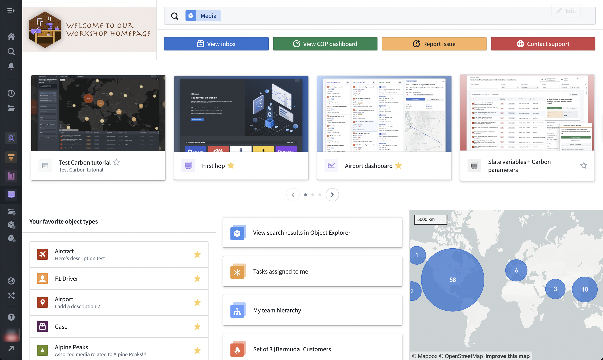

The Resource list widget also supports a number of interactions and display options, including:

* Two item formats:
  * List
  * Image cards
* Three display styles:
  * Minimal
  * Prominent
  * Classic

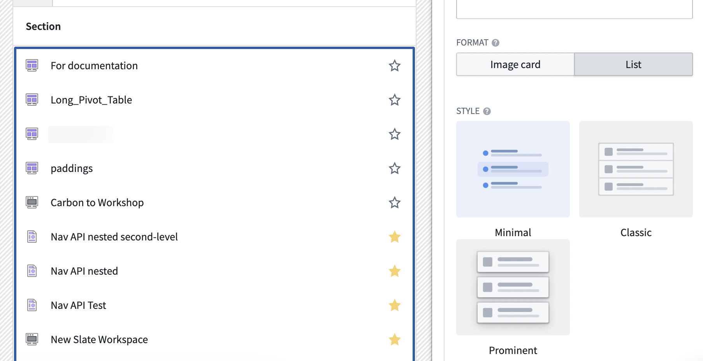
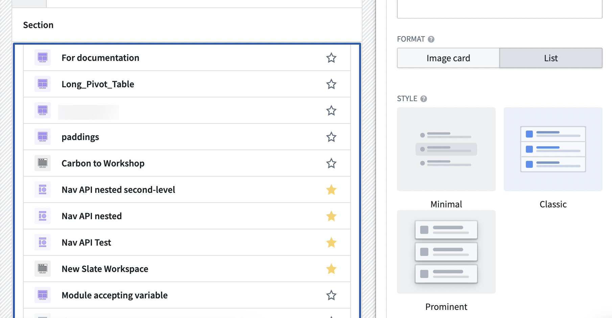
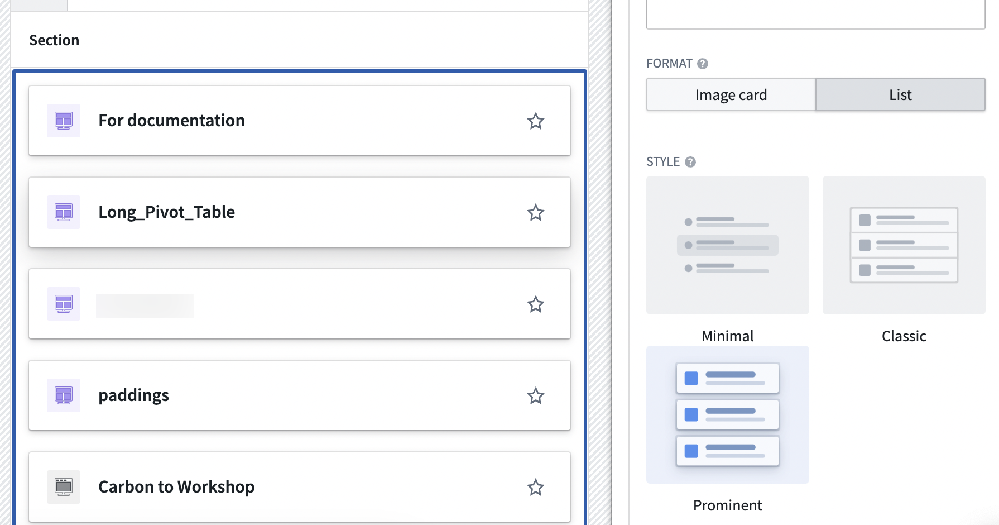

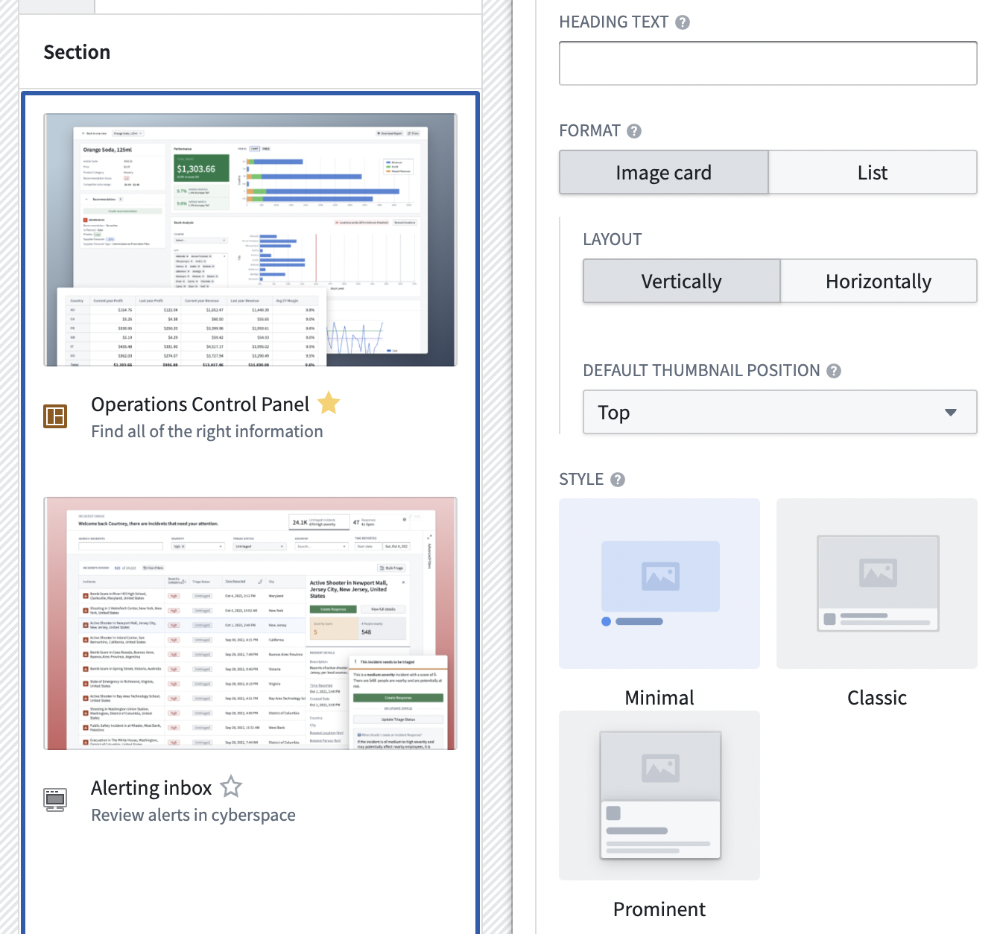
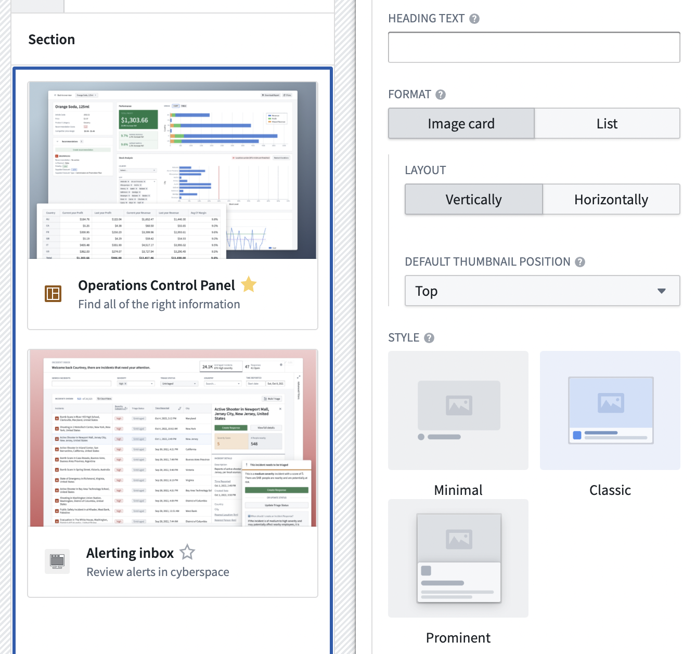
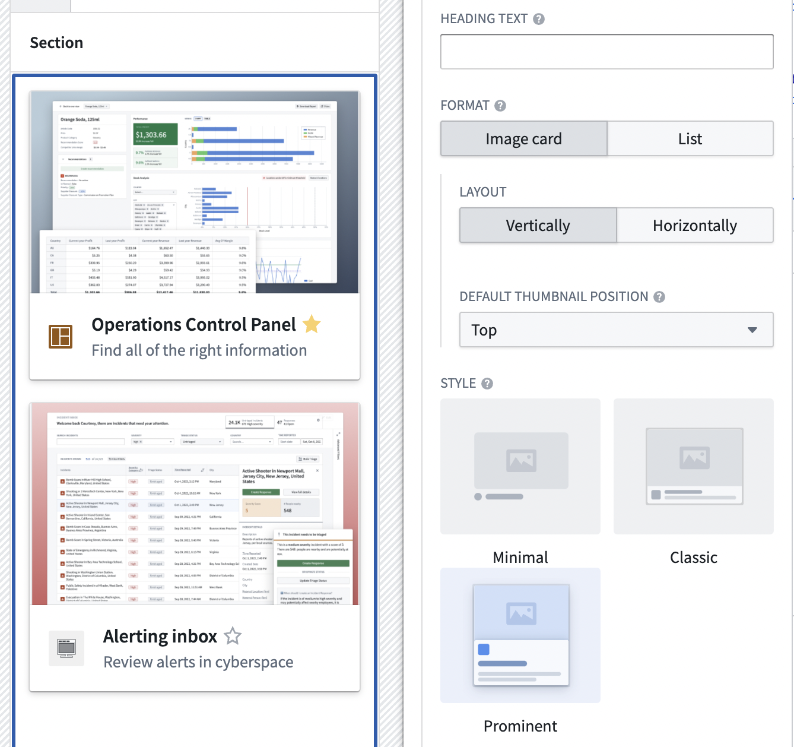

## Display overrides

For each of the list types, if the list is statically fixed then each item can have its display customized. By default, the widget will show the item's display metadata identical to the ones a resource has in Files and Projects or in the Ontology. For example, a Slate dashboard will display a Slate icon the title that appears in the Slate app. Similarly, an object type will show its Ontology icon and title. In some cases it might be desirable to provide different values for these display metadata, or, in case of image card list format, to provide a specific image called a thumbnail for each item.

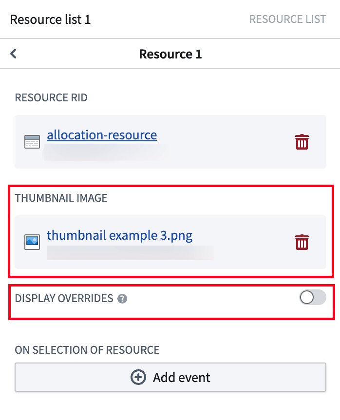

To customize an item's display, select that item in the widget's configuration editor and toggle on the Display Overrides section. The following metadata can be specified or overridden:

* Title: Can be overridden with a static string or a string variable.
* Description: Can be overridden with a static string or a string variable.
* Style: Can be overridden with a choice of minimal, classic, or prominent.
* Icon: Can be overridden with a choice of the name and a predefined or custom color.
* Item visibility: A Boolean variable can be chosen to control the visibility of the item. If the value is *false*, the item will be hidden on the list.
* Thumbnail (only with image card format): An image resource from Files and Projects can be chosen here. The resource has to be uploaded to Foundry first.
* Thumbnail position (only with image card format): Can be overridden with a choice of top, right, bottom, or left.

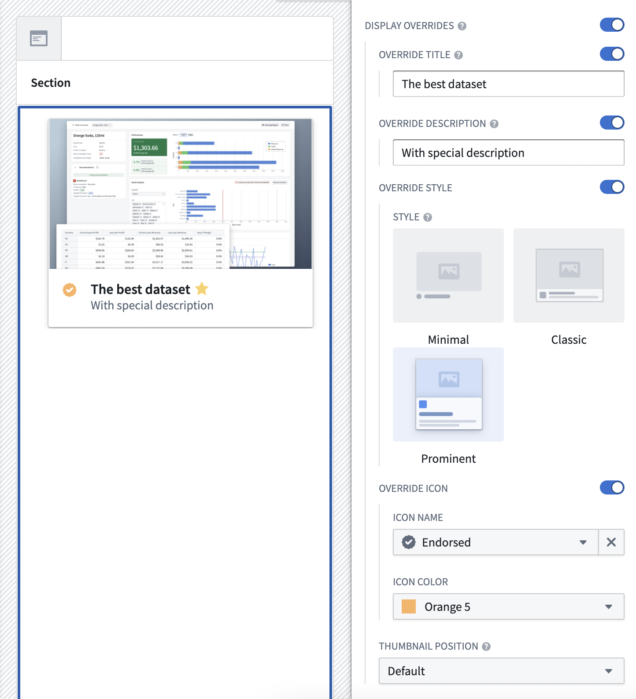

## Integration with Workshop variable and eventing framework

Each item on the Resource list is interactive. The action performed will depend on the type of the list:

* For the Files and Projects Resource list, selecting a resource item will open that resource in the default Foundry application for that resource in a new browser tab. If the user is in a [Carbon](/docs/foundry/carbon/overview/) workspace and the resource can be opened in Carbon, the resource will open in new Carbon tab.
  * An item representing a dataset will be opened in the [Dataset Preview](/docs/foundry/dataset-preview/overview/) application in a new browser tab. Since datasets cannot be opened directly in Carbon, they will always open in Dataset Preview.
  * An item representing a Slate dashboard will be opened in a [Slate application](/docs/foundry/slate/overview/) in a new browser tab, or in a new Carbon tab if user is in Carbon.
* For the object types Resource list, selecting an object type item will open a new exploration [Object Explorer](/docs/foundry/object-explorer/overview/) seeded with all objects of that object type. The new exploration will be opened in a new browser tab, or in a new Carbon tab, if user is in Carbon.
* For the object set Resource list, selecting an object set item will open that object set in [Object Explorer](/object-explorer/overview.md) in a new browser tab, or in a new Carbon tab, if user is in Carbon.

For all types of the Resource list, you can override the default action when the widget displays a static list of items. In widget's configuration editor, select the item and add any number of standard [Workshop Events](/docs/foundry/workshop/concepts-events/). Use the **On selection of resource** for Files and projects resources, **On selection of object type** for object type resources, and **On selection of object set** for object set resources.

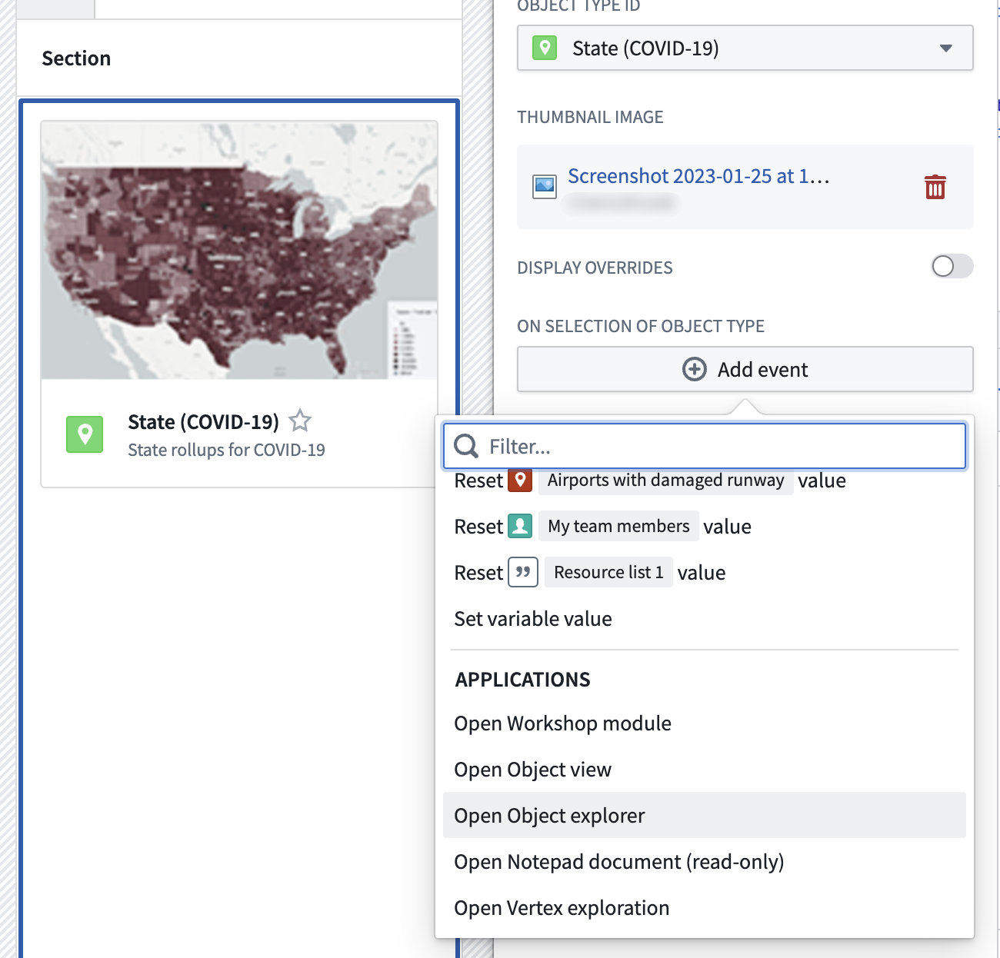

You can reference the selected object type item or object set item itself in the Event configuration if the **Selected object type** or **Selected object set** variable is set in the main widget configuration for the correct type. Refer to [Workshop Events](/docs/foundry/workshop/concepts-events/) for more information on using variables in Events.

In the **Selected object type** or **Selected object set** section of the main widget configuration, you can set the variable that will contain the value of the selected object type or object set.

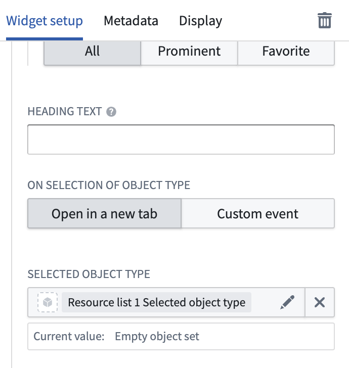

Navigate to the configuration of a specific item by selecting that item in the **Content of the resource list** section. Then use the configured **Selected object type** or **Selected object set** variable in the Event configuration. In the example below, the variable is a parameter for the **Open Object explorer** Event.

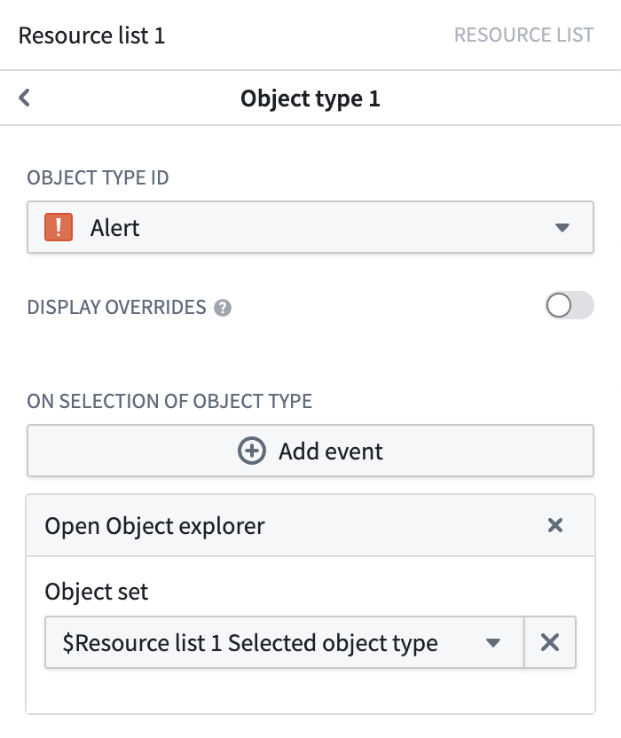
