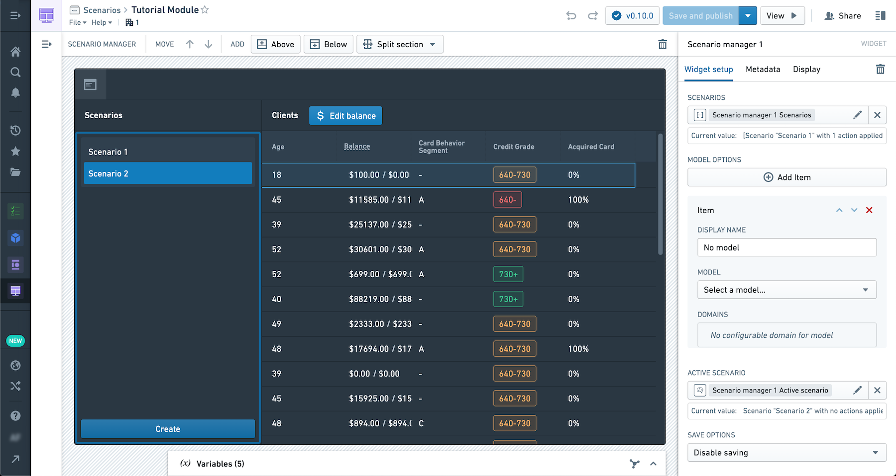
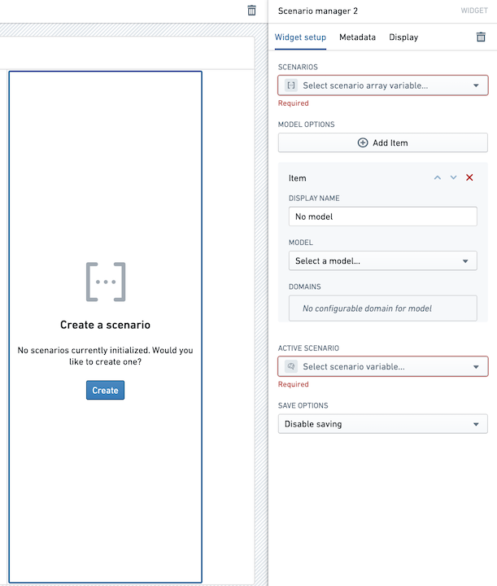
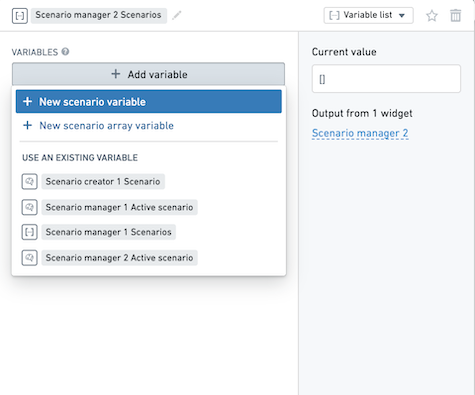

<!-- source: https://palantir.com/docs/foundry/workshop/widgets-scenario-manager/ · mirrored 2026-08-18 from Palantir Foundry docs -->

# Widget: Scenario Manager

The **Scenario Manager** widget allows a user to interactively create and manage Scenarios in a Workshop module. Module builders configuring the Scenario Manager widget can:

* Include the Scenario Manager in a module to enable module users to create, edit, and delete Scenarios.

The screenshot below shows an example of a multiple Scenarios compared side-by-side in the credit “balance” column of an object table. Scenario 1 shows the “balance” modified by an action while Scenario 2 shows the default values in the Ontology. A user can select between the two scenarios in the Scenario Manager.

## Configuration Options

Here is a screenshot of the initial state of a newly added Scenario Manager widget alongside its initial configuration panel:

For the Scenario Manager widget, the core configuration options are the following:

* **Input data**
  * **Static Scenarios:** Scenarios to include in the manager list that cannot be directly appended to or removed by the user. This is particularly useful when including saved Scenarios from an Object set.
  * **Dynamic Scenarios:** The Scenario array variable that will contain Scenarios created by the user when using the module. If a scenario appears in the static and dynamic lists, then it will be removed from the dynamic list.
  * **Active Scenario:** This Scenario variable will hold the currently selected Scenario in the manager. This variable can be used as the input to other widgets to apply actions or show results from the selected Scenario.
* **Model options**
  * **Display name:** Provide a display name for your model.
  * **Model:** Select the relevant model to associate with your Scenario.
  * **Domains:** Provide a domain over which the model / Scenario computations should occur.
