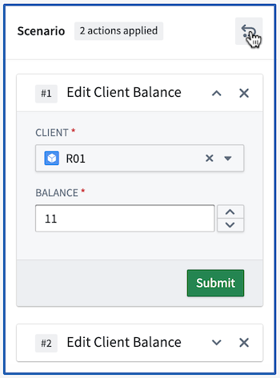
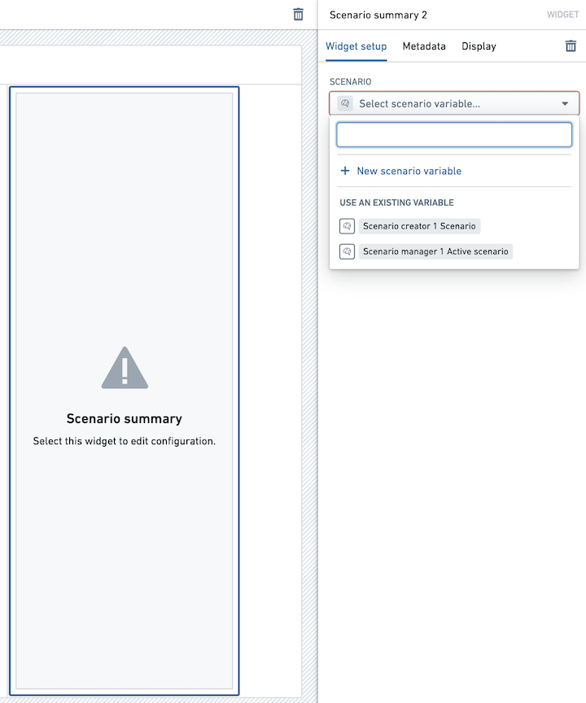

<!-- source: https://palantir.com/docs/foundry/workshop/widgets-scenario-summary/ · mirrored 2026-08-18 from Palantir Foundry docs -->

# Widget: Scenario Summary

The **Scenario Summary** widget in Workshop displays the list of Actions associated with a selected Scenario. Module builders configuring a Scenario Summary widget can configure the Scenario to be summarized.

Users can remove specific actions using the **X** button as well as **undo** the previous changes to your list, including adding back previously removed actions.

## Configuration Options

Here is a screenshot of the initial state of a newly added Scenario Summary widget alongside its initial configuration panel.

For the Scenario Summary widget, the core configuration options are the following:

* **Input data**
  * **Select Scenario variable:** Select the Scenario for which to see the relevant actions.

## Learn more

For a complete walkthrough of building a scenario-powered Workshop application using the Scenario Summary widget, see the [temporary scenarios tutorial](/docs/foundry/ontology/temporary-scenario/).
