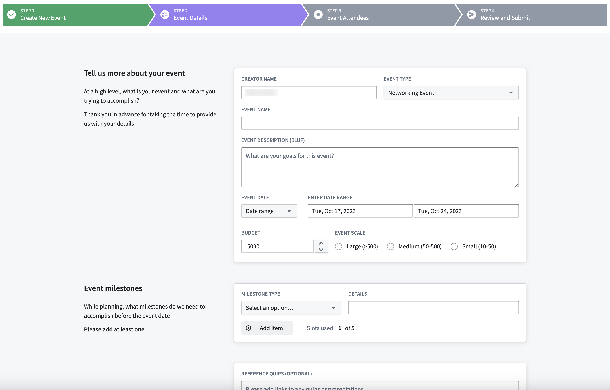

<!-- source: https://palantir.com/docs/foundry/workshop/widgets-stepper/ · mirrored 2026-08-18 from Palantir Foundry docs -->

# Stepper

The **Stepper** widget is used to help navigate the user through a multi-step workflow, displaying and tracking progress as they walk through a sequence of steps.

## Configuration Options

* **Type**
  * **Linear:** Users are required to complete the steps in order.
  * **Non-linear:** Users can freely navigate between steps and complete them in any order.
* **Steps**
  * Create and define the configuration for each step of a workflow.
  * **Label:** Sets the label to be displayed for the step in the widget.
  * **On click:** Set event(s) to be triggered when the step is clicked in the widget.
  * **Is completed:** Set a boolean variable to be used a check to determine when a step has been completed.
  * **Icon:** Set the icon to be displayed for the step.
* **Style**
  * **Template**
    * **Text only:** Displays ordered numbers for each step in the widget.
    * **Use icons:** Displays icons for each step in the widget. Icons can configured on a per-step basis.
  * **Show step number:** Toggle on to also display step numbers on the widget when set to linear stepper type and set to use icons.
  * **Completed color:** Sets the color for a step when it has been completed, triggered by when the boolean variable set for the step is true.
  * **Active color:** Sets the color for the currently active step the user is on.
