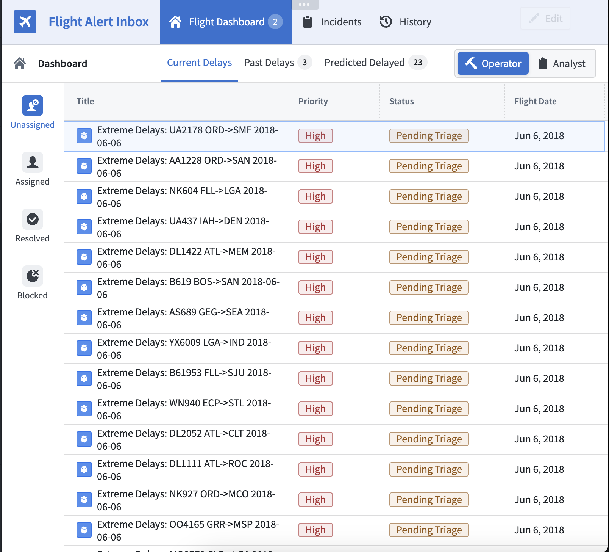
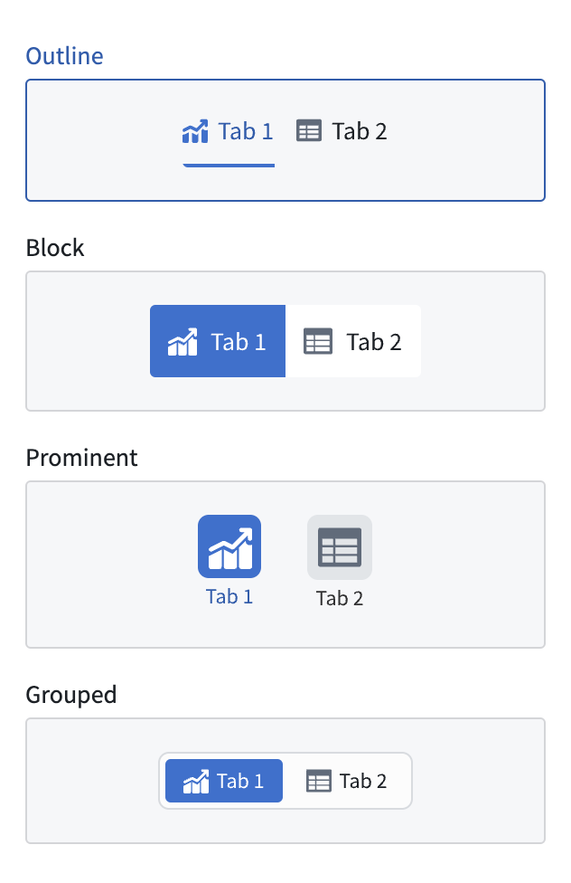

<!-- source: https://palantir.com/docs/foundry/workshop/widgets-tabs/ · mirrored 2026-08-18 from Palantir Foundry docs -->

# Tabs

The **Tabs** widget displays configurable tabs that trigger Workshop events to navigate throughout pages and overlays of a module.

## Configuration options

The following outlines the configuration settings for the Tabs widget:

* **Tabs**
  * **Add item:** Add a new tab. Once created, select the box containing the tab to configure.
    * **Label:** Set the label for the tab.
    * **On click**
      * **Add event:** Add a Workshop Event that is triggered when the tab is selected.
    * **Icon:** Add an icon to be displayed to the left of the tab label.
    * **Badge:** Display a badge to the right of the tab label. By default, no badge will be displayed for a tab. If a builder chooses to display a badge on a tab, they may choose to either display text via a string variable or a numeric value via a number variable.
    * **Conditional visibility:** When toggled on, allows the value of a set boolean variable to control when the tab is either enabled/disabled or visible/hidden.
      * **Boolean variable:** Set a boolean variable to control when the tab is enabled, disabled, or hidden.
      * **Disabled:** If selected, the tab will be enabled when the set boolean variable’s value is true, and will be disabled when the set boolean variable’s value is false.
      * **Hidden:** If selected, the tab will be visible when the set boolean variable’s value is true and hidden when the set boolean variable’s value is false.

* **Display & Formatting**

  * **Design:** Select a styling preset to be applied to all configured tabs in the widget. Choose from **Outline**, **Block**, **Prominent**, or **Grouped**.

  

  * **Outline**
    * **Size:** Set the size for the tabs' display values to either default or large.
  * **Block**
    * **Minimal styling:** Toggle on to enable minimal block styling on tabs; this setting lightens the **Active color** (see below) used for active tabs.
    * **Size:** Set the sizing for the tabs’ display values. Sizing options include **Default** or **Large**.
  * **Prominent**
    * **Width:** Set the width of the widget.
    * **Size:** Set the size for the tabs' display values to either default or large.
  * **Grouped**
    * **Size:** Set the size for the tabs' display values to either small, default, or large.

* **Active color:** \* Set the tab color for the active tab.

* **Tab Height:** Set a predefined section header height for the Tab widget.
  * **Custom:** Set the height of tabs in the widget by entering a custom pixel value.
  * **Auto:** Choose to have the height of the tabs auto-configured to the height of its container.
    * **Fill:** When toggled on, the height of tabs in the widget will be set to the height of the widget.

* **Direction**
  * **Horizontal:** Displays tabs in the widget in a horizontal orientation.
  * **Vertical:** Displays tabs in the widget in a vertical orientation.
    * **Alignment**
      * **Left:** Left-align all tabs in the widget.
      * **Center:** Center-align all tabs in the widget.

## Selection state

The Tabs widget does not hold its own selection state. Instead, selection state is derived from events configured for the widget. **Switch to tab** and **Switch to page** events that lead to [no layout state change](#no-layout-state-change-events) will be used to determine the selected tab. A default selected tab or page may be configured by setting a string variable to the tab or page name in the **Variable-backed tab selection** field of a tabbed section or in the **Variable-backed page selection** field in the settings panel.

Note that adding a Tabs widget to a module will not result in the generation of **Switch to tab** or **Switch to page** events. See [switch to tab](/docs/foundry/workshop/concepts-events/#switch-to-tab-name) and [switch to page](/docs/foundry/workshop/concepts-events/#switch-to-page-name) for more information on how to generate these events for use in a Tabs widget.

### No layout state change events

Events that do not change the layout state - that is, they lead to "no layout state change" - are layout events configured to switch to the selected tab or page that matches the current layout state. For example, a tab with a `Switch to Tab A` event configured will show as selected if the current layout state has `Tab A` selected.

### Limitations

* If multiple *layout* events are configured, the tab with the most ["no layout state change" events](#no-layout-state-change-events) will be the selected tab, preferring the earliest tab in the case of a tie.
* **Set variable value** events are not currently used to check for selected tab state.
  * If using a variable-backed selected tab, you may use **Switch to tab** events, which will update the selected tab variable state in addition to setting the selected tab state.
  * If using a variable-backed selected page, you will need to use a **Set variable value** event in addition to a **Switch to page** event, as page change events do not automatically update the selected page variable value.
