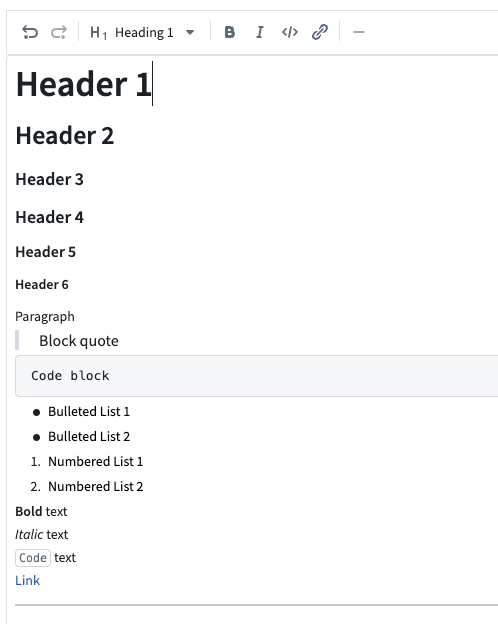

<!-- source: https://palantir.com/docs/foundry/workshop/widgets-text-input/ · mirrored 2026-08-18 from Palantir Foundry docs -->

# Text Input

The **Text Input** widget allows users to enter text values into a form field.

## Configuration Options

* **Label**
  * Sets an optional label for the widget. This text is displayed across the top of the widget.
* **String value**
  * Output variable of the widget, storing the user's entered text.
* **Placeholder**
  * Define placeholder text to be displayed in the input field when no text has been inputted by the user.
* **Format**
  * Set the format of the input field to a single line, a multi-line text area, or a Markdown editor.
  * **Single line**
    * **Event on enter:** set event(s) to be triggered when the enter key is pressed
  * **Text area**
    * **Initial height:** set the initial height of the text input area
  * **Markdown**
    * Enable a rich text editing experience with a formatting toolbar. Users can compose and format text using Markdown syntax or the toolbar controls. The editor supports toggling between a rich text view and a raw Markdown view. See [Markdown mode](#markdown-mode) below for details.

## Markdown mode

When the `format` field is set to **Markdown**, the Text Input widget provides a rich text editing experience powered by the same editor used in [Notepad](/docs/foundry/notepad/overview/). This mode is suited for fields where users need to enter formatted text, such as descriptions, notes, or comments.

### Features

* **Formatting toolbar:** Apply bold, italic, code, and other formatting using toolbar controls without needing to know Markdown syntax.
* **Rich text and raw Markdown views:** Toggle between a rich text view (formatted preview with inline editing) and a raw Markdown view (plain text with Markdown syntax).
* **Placeholder text:** Configure placeholder text that appears when the editor is empty.
* **Auto-sizing:** Enable the editor to expand automatically based on content length.
* **Variable binding:** The output string variable stores the content as a Markdown string, which can be consumed by other widgets such as the [Markdown](/docs/foundry/workshop/widgets-markdown/) widget for display.

### Considerations

* Markdown mode does not support event-on-enter triggers (available only in single line mode).

* Content is stored as a Markdown-formatted string in the bound string variable. Other widgets consuming this value should be able to interpret Markdown formatting.

* **Image syntax limitation:** Markdown content containing image syntax (for example, ``) may cause a "Failed to display rich text contents" error when the widget loads. When this occurs, users must select **View source text** to edit the content. If your content includes images and you do not require the rich text formatting toolbar, consider using the **Text area** format instead.
