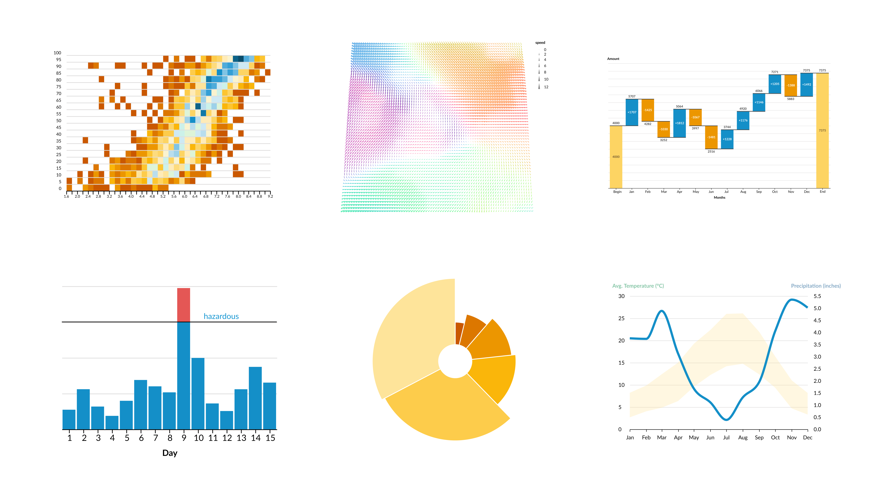
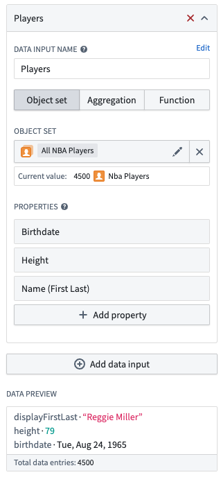
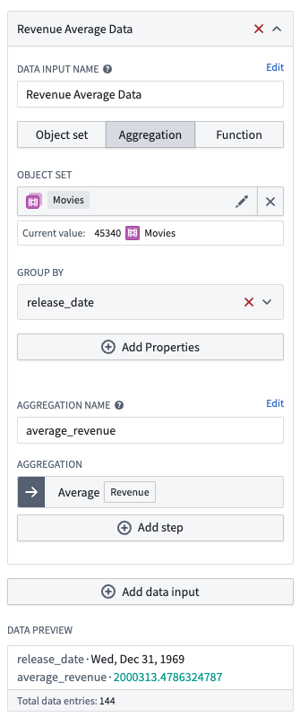
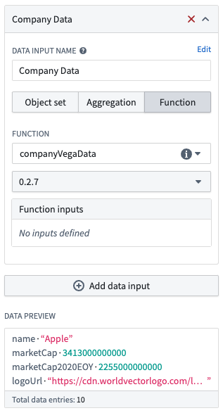
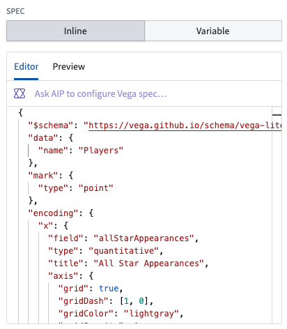
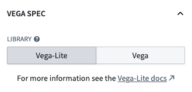
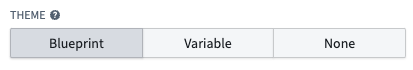
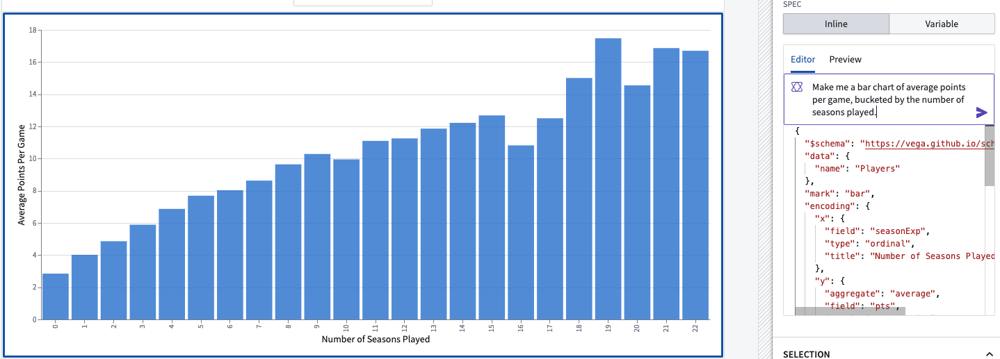
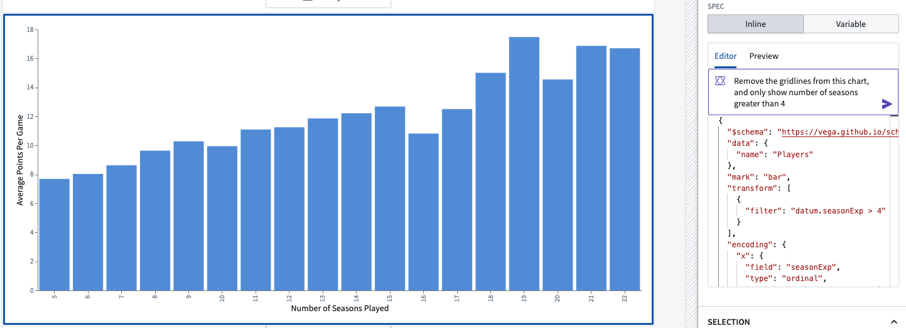
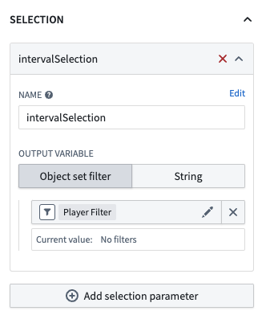

<!-- source: https://palantir.com/docs/foundry/workshop/widgets-vega-chart/ · mirrored 2026-08-18 from Palantir Foundry docs -->

# Vega Chart

The **Vega Chart** widget is used to create fully customizable and interactive visualizations in Workshop using the [Vega](https://vega.github.io/vega/) and [Vega-Lite ↗](https://vega.github.io/vega-lite/) grammars.

## What is Vega?

Vega allows you to create, save, and share interactive visualization designs in the form of a concise JSON spec that describes the appearance and behavior of the visualization.
[Vega is a higher-level visualization specification language built on top of D3 ↗](https://vega.github.io/vega/about/vega-and-d3/), and Vega-Lite is a higher-level language built on top of Vega that provides a more concise and convenient way to author common visualizations.

The Vega Chart widget offers more customizability than the standard [XY Chart widget](/docs/foundry/workshop/widgets-chart/), with support for visualizations such as those below, provided by the official [Vega-Lite Example Gallery ↗](https://vega.github.io/vega-lite/examples/).



## Vega data inputs

[Vega↗](https://vega.github.io/vega/docs/data/) data is a simple array of structs.

```json
"data": [
  {
    "name": "nba-player-data",
    "values": [
        { "name": "Michael Jordan", "height-in-inches": 78, "weight-in-lbs": 216, ... },
        { "name": "Stephen Curry", "height-in-inches": 74, "weight-in-lbs": 185, ... },
        ...
    ]
  }
]
```

In [Vega-Lite ↗](https://vega.github.io/vega-lite/docs/data.html) you can specify multiple datasets in the following way:

```json
"datasets": {
  "nba-player-data": [
    { "name": "Michael Jordan", "height-in-inches": 78, "weight-in-lbs": 216, ... },
    { "name": "Stephen Curry", "height-in-inches": 74, "weight-in-lbs": 185, ... },
    ...
  ],
  "nba-team-data": [
    { "name": "Toronto Raptors", "has-won-championship": true, ... },
    { "name": "Memphis Grizzlies", "has-won-championship": false, ... },
    ...
  ]
}
```

## Data configuration

The Vega Chart widget has three different configuration options which allow you to flexibly transform object data from your Ontology into the expected Vega and Vega-Lite formats, and then inject it into your JSON spec.

* **Object set:** Specify the object set and properties of that object that should be included in the data. <br><br>
   <br><br>

* **Aggregation:** Specify the object set, group by properties with bucketing strategy, and aggregation. Each data point will contain the value of each group by property, as well as the aggregation value keyed by the specified aggregation name. <br><br>
   <br><br>

* **Function:** Specify a function that returns a list of structs that will be directly used as the data.

  ```typescript
  interface CompanyData {
      name: string;
      marketCap: Long;
      logoUrl: string;
  }

  @Function()
  public companyVegaData(): CompanyData[] {...}
  ```

  <br><br>
   <br><br>

You can have multiple data inputs that can be referenced in the specification by their configured names. The data will be automatically injected into the JSON spec, which you can see in the [Preview tab](#inline-editor-preview) of the editor. Note than you can also inline data into the JSON spec by matching the [above data formats](#vega-data-inputs).

## Specification

The [spec ↗](https://vega.github.io/vega-lite/docs/spec.html) is the JSON that defines your visualization; the spec can be specified inline or by using a string variable.



### Vega vs. Vega-Lite

The widget allows you to specify whether you want to use Vega-Lite or Vega for your spec.



If you are making a common plot, we recommend using Vega-Lite for its more concise grammar, and support for [selection parameters](#selection-parameters-vega-lite-only). For more complex visualizations, you can use Vega. See the [Vega-Lite ↗](https://vega.github.io/vega-lite/examples/) and [Vega ↗](https://vega.github.io/vega/examples/) examples for an idea of what both can support.

### Theme configuration

For ease of reusability, you can configure a theme that will be injected into the spec. The default theme matches the Blueprint styling of the XY Charts widget, but you can also specify your own custom theme from a string variable, or turn off the theme entirely.



See the [vega-themes repository ↗](https://github.com/vega/vega-themes) for examples when building out your own custom themes.

:::callout{theme="neutral"}
If you want to modify our default Blueprint theme, you can find the config that is inserted in the **Preview Tab** of the Inline Editor and paste it directly to your spec with your changes.
:::

### Inline editor

You can use AIP to create the initial version of your Vega chart. With your given data input, you can provide a prompt to AIP such as:

`Make me a bar chart of average points per game, bucketed by the number of seasons played.`



This will create a chart which you can iterate on with additional AIP prompts:

`Remove the gridlines from this chart, and only show number of seasons greater than 4.`



If your AIP prompts do not provide the desired result, you can modify the spec directly. Refer to existing [Vega-Lite examples ↗](https://vega.github.io/vega-lite/examples/) and other Vega resources for guidance on how to modify the spec: for instance, you can start from an example and replace the example data with a reference to your input data.

### Inline editor: Preview

The **Preview** tab shows the complete spec with your data inputs and theme data injected into it. You are able to truncate the data for readability, and copy this complete spec to the clipboard. This allows your to verify that the data is in the expected format.

:::callout{theme="neutral"}
The online [Vega Editor ↗](https://vega.github.io/editor/#/) is a valuable tool for debugging your spec. You can move your spec to the editor by copying the JSON to the clipboard in the inline editor **Preview** tab. There is also the option to truncate your data to limit the scale and more easily replace any sensitive data.
:::

## Selection Parameters (Vega-Lite Only)

The primary reason that Workshop recommends using the Vega-Lite schema is because Vega-Lite supports [*selection parameters* ↗](https://vega.github.io/vega-lite/docs/selection.html). In the Vega Chart widget, you can configure multiple selection parameters, each of which has a name and an output variable. The output variable can be either an object set filter or a string.



Because selection can be specified in several different places in the spec, this configuration is not auto-injected into the spec. As a builder, you are responsible for including a selection parameter in the spec for each of the configured parameter names.

Here is an example selection parameter that would output range selections on the X-axis:

```json
...
"params": [{
  "name": "intervalSelection",
  "select": {
    "type": "interval",
    "encodings": [ "x" ]
  }
}]
...
```

:::callout{theme="neutral"}
Not all types of selections can be output to a Object Set Filter. If your data input is an object set with specified properties, or an Aggregation with a `group by`, this should translate easily, but otherwise you can use the string output variable, which is the selection returned in the JSON format used by Vega-Lite. You can manage this output with a function or variable transform.
:::
