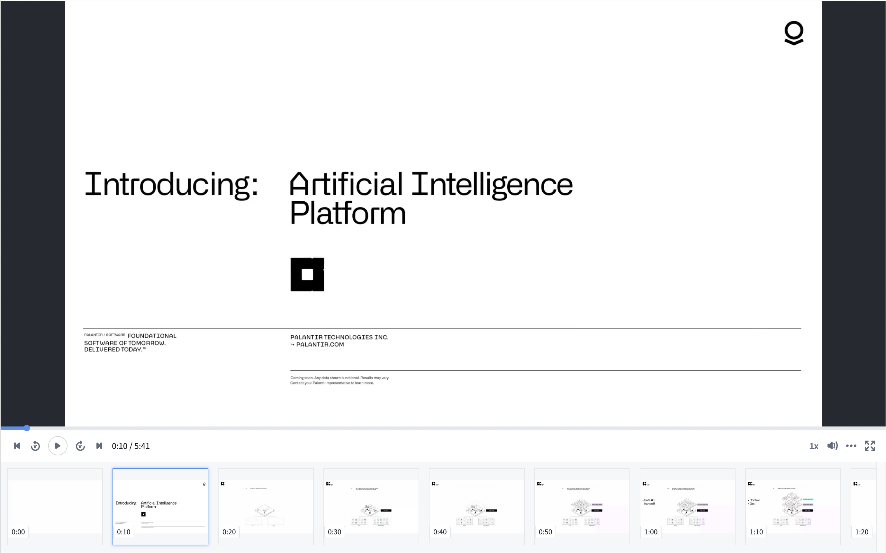
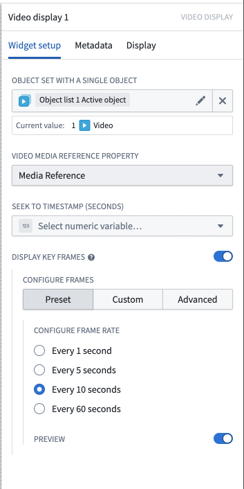
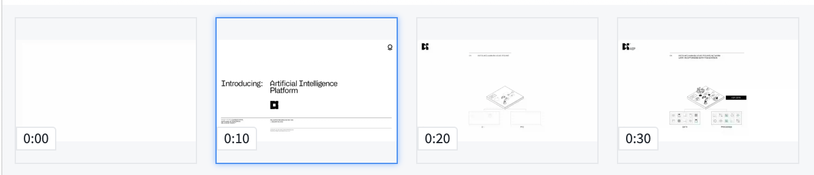

<!-- source: https://palantir.com/docs/foundry/workshop/widgets-video-preview/ · mirrored 2026-08-18 from Palantir Foundry docs -->

# Video Display widget

The video display widget displays video from a [media reference](/docs/foundry/media-sets-advanced-formats/media-overview/#media-references) property on an object.

In contrast to the [Media Preview Widget](/docs/foundry/workshop/widgets-media-preview/) the Video Display Widget provides additional video specific configuration options, such as displaying video frames, and providing timestamp driven behavior.

## Configuration options

* **Object set with a single object:** An object with a media reference property

* **Video media reference property:** [Media reference](/docs/foundry/media-sets-advanced-formats/media-overview/#media-references) object property that is a video media reference

* **Seek to timestamp (seconds):** Optional numeric variable that seeks the video to a specific timestamp
  * If the given number is greater than the length of the video, it will seek to the end of the video
  * If the given number is less than zero, it will seek to the beginning of the video
  * Playback will work as normal on user interaction

* **Display Key Frames:** Optionally display select frames below the video.

  

  * **Preset:** Creates a frame at the specified interval.
    * Every 1 second
    * Every 5 seconds
    * Every 10 seconds
    * Every 60 seconds
  * **Custom:** Creates a frame according to the provided Numeric Array variable.
    * Each number in the array should correspond to a time in seconds that represents the desired frame.
  * **Advanced:** Automatically find scene frames.
  * Frames are selected using intelligent video analysis to determine major scene changes. Available sensitivities include:
    * Less Sensitive
    * Standard
    * More Sensitive
